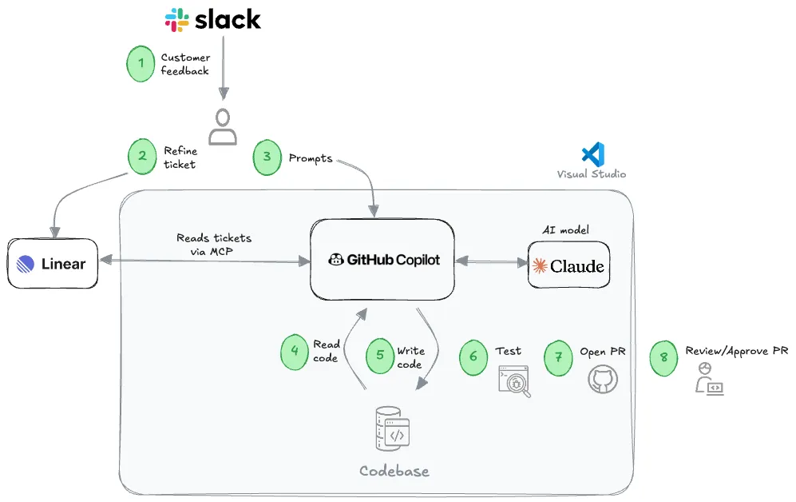
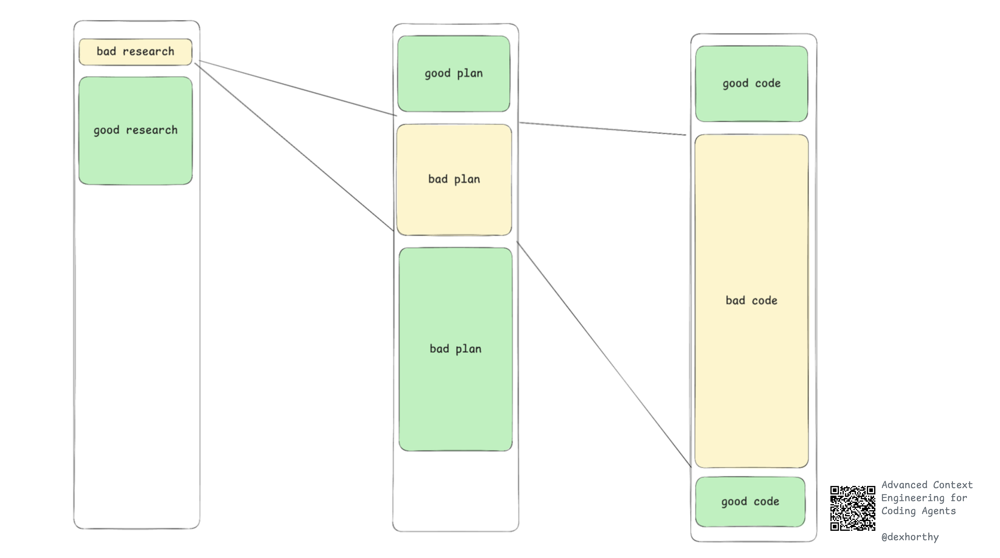
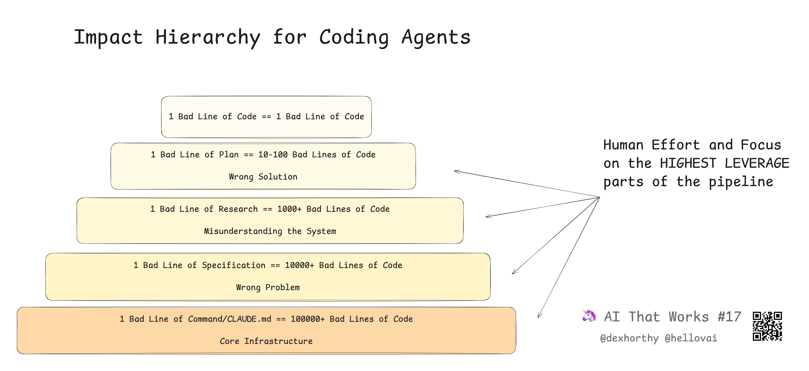
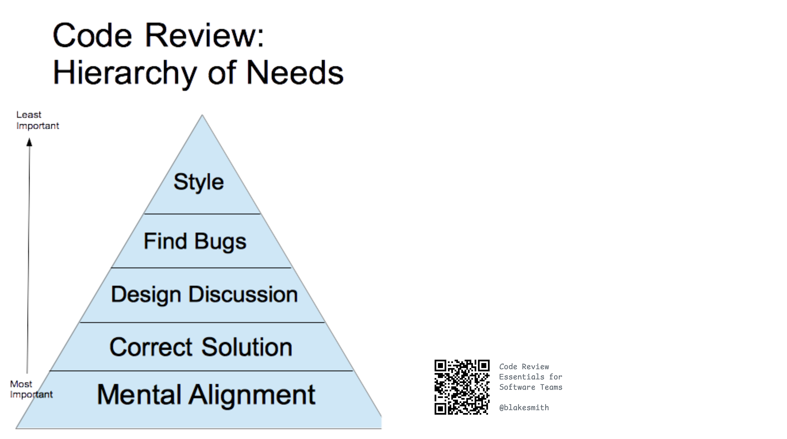

# Level 4: Team Development with Coding Agents

## Maintain Context, Not Code

> [Specs Are the New Source Code](https://blog.ravi-mehta.com/p/specs-are-the-new-source-code)

### Specs as the True Source of Truth

- **AI makes engineers much faster**, so the bottleneck shifts to deciding *what* to build.
- **Well-written specs** (prompts, tickets, product docs) are the true source of truth.
- **Code is a "lossy projection" of the spec** — the spec captures intent, values, and trade-offs.

Historically, specs were treated as disposable paperwork and code as sacred. In AI workflows, detailed specs can generate code, docs, tests, and more. The scarce skill is now clear communication and specification, not raw coding speed.

**The workflow has evolved:**

- **Old workflow:** Vague idea → wireframes → designs → MVP → customer feedback → painful spec rewrites
- **New workflow:** Vague idea → rapid AI-built prototype → customer feedback → crystal-clear spec → AI-assisted implementation

Prototypes are now the *input* to better specs, not a replacement for them.

### Context-as-Code

Key features of treating context like code:

- **Version Control** – Prompt files are managed by Git just like regular code, supporting branching, rollbacks, and collaborative development with full traceability of changes.
- **Type Safety** – Libraries like Pydantic are used to strictly validate and type-check LLM outputs, ensuring downstream programs don't break due to missing fields or type mismatches.
- **Automated Regression Testing** – Build an evaluation dataset and automatically run tests (accuracy, recall, etc.) after every prompt logic update. If prompt changes degrade performance, the system automatically alerts you.

When prompts are modularized and versioned, they transform from one-off instructions into maintainable components. Writing prompts will increasingly resemble software engineering: clear interfaces, verifiable outputs, and trackable changes.

---

## Team-Level Context Engineering

> [Getting AI to Work in Complex Codebases](https://github.com/humanlayer/advanced-context-engineering-for-coding-agents/blob/main/ace-fca.md)

### Core Principle

LLMs are stateless: output quality depends almost entirely on what's present in the context window. Your only real levers are what information you put in, in what form, and at what time.

**Optimize your context for:**

- **Correctness** – No wrong or misleading information
- **Completeness** – No missing key details
- **Low noise** – Exclude logs, junk, and irrelevant blobs
- **Trajectory** – Ensure the agent keeps progressing in the right direction

**Worst failure modes (in order):**
1. Wrong information
2. Missing information
3. Too much noise

### Intentional Compaction

As context fills, continually summarize and distill information into structured artifacts (such as `progress.md`, research notes, or concrete plans). Actively discard raw chat/tool noise and retain only:

- **Goal**
- **Current understanding**
- **Decisions made**
- **Open problems**
- **Next steps**

This resets context, preserves the important signal, and prevents drift and hallucinated direction changes.

### Subagents = Context Control, Not Roleplay

Subagents exist to search, read, and summarize. Their main job is to keep the main agent's context window clean. The ideal subagent output is a compact research brief — not raw logs. Avoid treating subagents as mere "multi-persona" roleplay.

### Frequent Intentional Compaction (FIC): The Workflow

**Core workflow:**
1. **Research** – Understand the codebase, relevant files, data flow, and root causes. Output: a compact research document.
2. **Plan** – Outline precise steps — what to change, where, and how to test/verify. Output: an implementation plan.
3. **Implement** – Execute steps methodically, compressing updates back into the plan as needed.

**Best practice:** Keep context window usage around 40–60% and continuously compress work state into durable, external artifacts.

### Real Results

Applied to a 300k LOC Rust codebase (BAML): fixed bugs in ~1 hour, built 35k LOC features in ~7 hours with high quality, and PRs were approved by maintainers. A well-researched plan outperforms an unresearched plan even if both technically "work" — only the researched plan aligns to codebase conventions and architecture.

> **Highest-leverage human review:** Focus on research and plan — not on the final code diff.
>
> - Bad research → thousands of bad lines of code
> - Bad plan → hundreds of bad lines of code
> - Bad code → just bad code

### Human-in-the-Loop Is Mandatory

You must read the research critically, reject bad/insufficient research, review and challenge plans, and stay mentally engaged throughout. Failures are often due to superficial research or hidden dependency chains derailing the project. This is an engineering discipline, not a prompt trick.

### Reframing Code Review

Traditional code reviews are overwhelmed at AI volume. The new goal is to keep the team aligned on *what's changing and why*.

- ✅ Read 200 lines of a good plan
- ❌ Skip 2,000 lines of generated code

Shift alignment to specs, research docs, and plans — instead of raw diffs.

### Strategic Insight

Coding agents will be commoditized. The true differentiators are workflow design, context management, and human leverage at the right points. Teams that do not redesign their process will get outpaced by teams that do.

---

## AI Testing, Security & Failure Modes

- How AI code breaks (prompt injection, exploits)
- SAST, DAST, vulnerability detection
- Generating tests with AI safely

### Why Teams Fail More Often

Team failures typically stem from common pitfalls across four layers: requirements, technology, use cases, and habits. To avoid these, teams can run a "Pre-mortem" analysis at project kickoff — using early warning signals and checklist-style self-assessment to surface hidden risks before they materialize.

**Requirements layer:** Failures often come from vague goals, over-engineering for feature coverage, or building things disconnected from actual tasks. Teams should make goals specific, focus on 3–5 core features, define measurable success criteria, and use the JTBD (Jobs To Be Done) framework to clarify the tool's mission. Avoid copying other products' feature lists or ignoring real user context.

**Technology layer:** Risks include choosing an inappropriate or too-bleeding-edge tech stack, blindly trusting AI, and thin technical foundations. Teams should default to mature, well-supported technology stacks, establish human review and automated testing processes, and understand basic security and performance principles — don't ship just because "it runs."

**Use case layer:** Failures show up as overly broad user groups and assumptions about user behavior that were never validated, as well as underestimating the stickiness of existing alternatives. Teams should research thoroughly, build specific user personas, validate key scenarios and assumptions, and analyze existing tool strengths and weaknesses — find the innovation that delivers a 10x advantage.

**Habits layer:** Problems commonly include overestimating sustained usage will and underestimating data migration and learning costs. Don't substitute team enthusiasm for real retention data. Design reasonable retention mechanisms, run small-scale user experiments, and observe real usage curves. Make the migration process and tool experience detailed and intuitive, and adjust continuously through real user testing.

To turn these lessons into lasting team assets, build a failure case library — regularly summarize root causes, symptoms, and improvements by project, and use checklists to guide future work. Pre-mortem analysis should: define failure scenarios in steps (pre-set failure situations and metrics), comprehensively list causes (multi-dimensional scan, open categorization), evaluate risks with a structured form (by type, severity, priority), define actionable preventive measures, and translate conclusions into concrete changes in requirements, planning, resources, and team assignments — ensuring action, not just paper analysis.

---

## AI-Assisted Support, Debugging & Code Review

- AI-powered code review
- Debugging with reasoning traces
- Generating and maintaining documentation

---

## Automated UI & Full-Stack App Generation

- Rapid UI/UX generation
- End-to-end app building with prompts
- Iteration loops for frontend + backend
