# Working with Brownfield Codebases

Last updated: 2026-08-05

> *On a greenfield project the bottleneck is what the agent can do. On a brownfield project the bottleneck is what you can transfer.*

Most advice about coding agents assumes a codebase you wrote, or one small enough to hold in your head. Real work is the opposite: a system that predates you, whose design decisions were made for reasons nobody wrote down.

Tools are not the point of this chapter. **Using tools to build context** is the point. So the structure is theory first, tools attached to it — each layer of control states the problem it solves before naming the tooling and prompts that serve it.

| Section | Theory | Attached tooling |
| --- | --- | --- |
| Why brownfield code is harder | The agent as an intern without context; three kinds of debt | — (mental model only) |
| The handover path | The nine-step human path; three tiers of division of labor | Responsibility table |
| Three layers of control | Comprehension → constraint → verification | The chapter skeleton |
| Comprehension layer | Eight steps to build context | Agent-assisted reading, diagram generation, interface and data-model assets, traditional IDEs, repository graphs, history tracing, MCP extensions |
| Constraint layer | Harness engineering | `AGENTS.md`, skills, lightweight spec-driven development |
| Verification layer | Building a baseline outside the agent | Characterization tests, seams, test frameworks, quality and security monitoring, CI gates, cross-model review |

---

## Why Brownfield Code Is Harder

### Greenfield, Brownfield, Legacy

Three terms, often used interchangeably, that mean different things:

**Greenfield** work starts on empty ground. **Brownfield** work starts on an occupied site — an existing system with existing constraints, callers, and data. **Legacy** is the subset of brownfield where the occupants left no map: no tests, no recorded rationale, and often nobody still around who knows why.

This chapter is about brownfield work generally. Most of it — building context, writing constraints, verifying output — applies to any system you inherited, including a well-tested one written last year. Where the distinction matters is the verification layer: with no tests to inherit, you have to manufacture the baseline yourself, which is why Layer 3 is the heaviest part of legacy work specifically.

### Faster Coding Makes Understanding More Important

In a brownfield codebase, an agent is not "a stronger developer." It is **an intern without context**. That intern may well out-code you — faster typing, sharper on algorithms, more open-source patterns memorized — with one fatal gap: it knows nothing about *this* system.

What works for an intern works here. Walk them through the project first. Tell them what must not be touched. Give small, explicit tasks. Review before continuing.

Which reframes the whole problem. The limit is not the agent's capability. The limit is **how much of your understanding you can transfer**.

Three named failure patterns describe why agent-assisted work on existing systems degrades in ways that greenfield work does not.

> [Comprehension Debt — Addy Osmani](https://addyosmani.com/blog/comprehension-debt/)
>
> [Sonar State of Code Developer Survey](https://www.sonarsource.com/state-of-code/)

| Debt | Meaning |
| --- | --- |
| **Comprehension debt** | The gap between how fast AI writes code and how fast the team actually understands it. The more the agent writes, the wider the gap. |
| **Verification debt** | Roughly 42% of code is AI-assisted, 96% of developers do not fully trust agent output, and only 48% review every time. The result: tests pass, the diff looks fine, production breaks. |
| **Brownfield tax** | Three ways agents specifically fail on existing systems — output quality degrades as the context window fills; decisions from yesterday's session are gone today; and because the agent cannot see *why* the old code is shaped that way, its "modern" suggestions are incompatible with the existing architecture. |

All three point at the same thing: **the hard part of brownfield work is not writing code, it is establishing and holding context.**

---

## Why Human-Agent Collaboration Matters

Before adding an agent, look at how a human actually takes over an unfamiliar system. The order never changes: **establish context, then modify.**

1. **Talk to people.** List the things in the code you cannot explain, then ask product, architects, and ops. Mark what stays unknown.
2. **Read what exists.** README, `docs/`, wiki, chat history, old tickets. Not to master it — to get a feel for the shape.
3. **Skim the structure.** Module layout, core versus utility, old code versus new. No line-by-line reading.
4. **Get it running.** Harder than expected — dependency versions, middleware, VPN, credentials. But breakpoints and logs are a different order of understanding.
5. **Call the core endpoints.** Prove it actually works, see real input and output, reproduce a real problem.
6. **Dig in with your open questions.** Now every file you read is read *for* something.
7. **Draw the core paths.** Entry to exit, table relationships, external dependencies. The system is not in your head until it is on paper.
8. **Change it in small steps.** One change, verify, confirm no side effects, next change.
9. **Accept.** Check the main flows, run the real business scenarios, get a human review.

Steps 1–6 are all comprehension; only 7–9 touch the system. **Roughly 70% of the time goes into understanding.** And steps 1–6 are exactly what gets skipped — open the agent, ask "what does this project do," accept the shallow answer, start editing. Then blame the tool when it breaks.

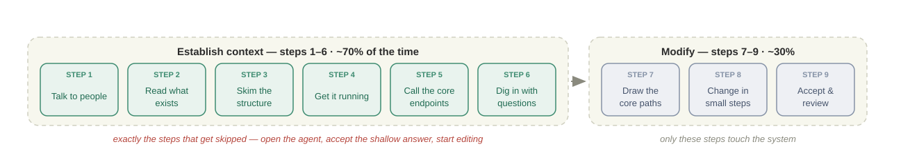

The boundary is not set by how much work the agent can finish. It is set by **whether the answer exists in information the agent can read.**

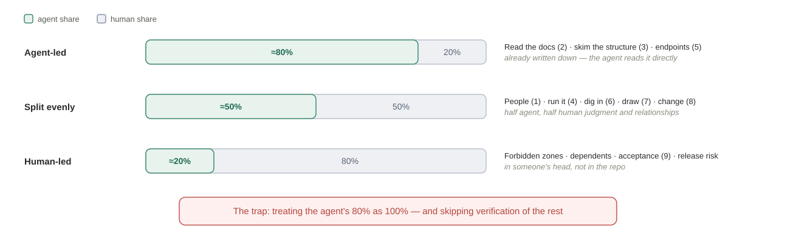

| Tier | Agent share | Steps | Common property |
| --- | --- | --- | --- |
| **Agent-led** | ~80% | Read the docs (2), skim the structure (3), enumerate the endpoints (5) | Written down in code or documentation — the agent can read it directly |
| **Split evenly** | ~50% | Talk to people (1), get it running (4), dig in (6), draw the paths (7), make the change (8) | The agent does half; the other half needs human judgment or human relationships |
| **Human-led** | ~20% or less | Decide what must not be touched, identify who depends on it, final acceptance (9), release-risk calls | The answer is in someone's head or in engineering judgment, not in the repo |

This mirrors the general split in [Human-Agent Collaboration Modes](../02-anatomy/human-agent-collaboration-modes.md); what changes in brownfield work is how large the third tier gets.

The dangerous failure is not that the agent finishes 80%. It is that **a human treats 80% as 100%** and skips verifying the rest.

A concrete shape this takes: point the agent at a scheduler service, have it read the README, map the structure, count the endpoints, list the tables — a complete project summary in half an hour. Then have it rewrite a batch job. Tests pass. Production breaks, on the branch guarded by a comment reading `// don't delete, the downstream integration needs this`.

Nothing was wrong with the 80%. What was wrong was forgetting the other 20% existed: history, tacit agreement, undocumented contracts. **A change that runs and passes tests can still violate a real business contract that was never written down.**

---

## Giving the Agent Context

Putting an agent into a brownfield system creates three specific problems:

1. **The agent only sees the files you give it.** Undocumented old endpoints and tacit conventions are invisible to it.
2. **The agent takes liberties.** You ask for a small change; it refactors adjacent old code on the way, because nobody told it what is off-limits.
3. **You cannot check the agent's output.** Is its architecture diagram right? On what basis would you believe it?

Three problems, three layers of control — and the order of the rest of this chapter:

| Layer | Solves | In one line | Artifacts and tools |
| --- | --- | --- | --- |
| **Comprehension** | The context problem | Make the agent **see** | `docs/`, architecture assets, traditional IDEs, repository graphs (CodeGraph, Graphify, Codemap), diagram generators, MCP extensions |
| **Constraint** | Taking liberties | Make the agent **obey** | `AGENTS.md`, skills, per-task instructions, lightweight specs (OpenSpec, Spec-Kit) |
| **Verification** | Untrustworthy output | Make the agent **checkable** | Characterization tests, seams, SonarQube/CodeQL, CI gates, cross-model review |

Claude Code, Cursor, Copilot, Cline, Aider, Windsurf, and the rest are entry points into these three layers, not a fourth layer beside them. IDE-shaped tools suit working next to the code; CLI-shaped tools suit large-repo and terminal workflows, and are the better fit for most brownfield work. **Pick one primary agent and move on** — the choice matters far less than the three layers you build around it, and comparing the field is [Chapter 1](../01-prompt/how-agents-change-dev.md)'s job, not this chapter's.

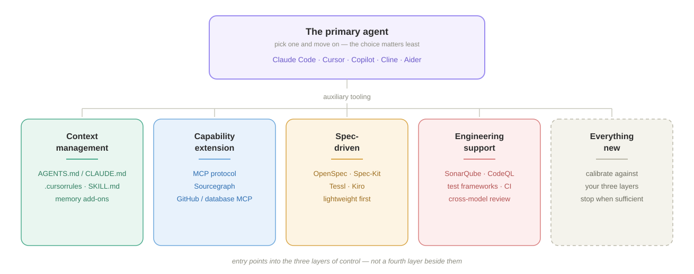

**The three layers form a chain.**

- **Comprehension determines constraint.** You can only write constraints as precise as your understanding. If you have not untangled the module graph, you cannot write "this module must not depend on that one."
- **Constraint determines verification.** If the constraint says "the response shape of the core endpoints must not change," verification will check response shapes. If it does not say that, verification will not look.
- **Verification feeds back into comprehension.** A regression in some corner case teaches you that this code also governs that scenario — which becomes a new line in `AGENTS.md`.

**If the comprehension layer is thin, the other two are built on air.**

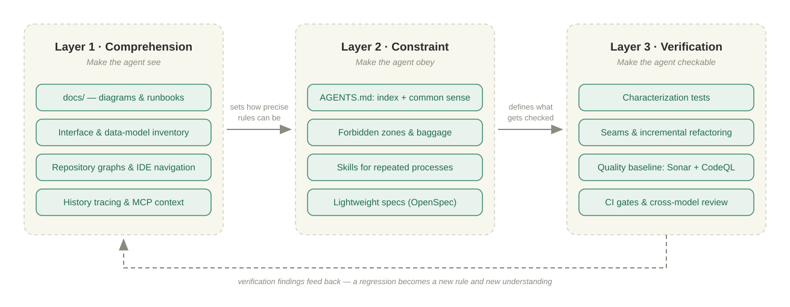

---

## Layer 1: Comprehension — Make the Agent See

The context of a brownfield system is more than its code: what the project is for, its core business scenarios, how the architecture is organized, the key modules, the external and internal interfaces, table relationships, field semantics — plus the conventions that live outside the code entirely ("don't touch this"). Some of that is in the repository, some in the README or wiki, and **some only in people's heads**.

Comprehension tooling widens what the agent can see. Code search and LSP cover the repository; Sourcegraph covers cross-repository symbols and references; GitHub/GitLab and database MCP servers pull history, data, and external systems into context. None of it substitutes for a human supplying the tacit rules.

### Eight Steps to Build Context

| Step | Action | Purpose | Where to look |
| --- | --- | --- | --- |
| 1 | Read the README and root docs | Not to understand — to get the coarsest outline: what it does, where it runs, what the core concepts are | — |
| 2 | Skim the project structure | Build a **module map**: how many pieces, what each does, which are core and which peripheral. No code detail | Java: modules in `pom.xml`. Go: `cmd/`, `internal/`. TypeScript: `packages/` or top-level `src/`. Or generate one — see *Mapping the Repository Automatically*, below |
| 3 | Find the core entry points | The entry point is the first contact between user and code — find it and you have an origin for the coordinate system | HTTP services: controllers and `main`. Scheduled jobs: where the schedule is registered. Queues: consumers and listeners |
| 4 | Draw the whole system | Turn scattered knowledge into a picture. Precision is not the point; **drawing it** is — you find out immediately where your thinking is fuzzy | See *Diagrams*, below |
| 5 | Map interfaces and data models | Interfaces are the **external contract**; the data model is the **internal skeleton** | See *Interfaces and Data Models*, below |
| 6 | Get an environment running | Running is the real test. Breakpoints, logs, and reproduction are a qualitative jump in understanding | — |
| 7 | Dig into the code with a task in hand | Stop reading broadly. Reading with a goal beats reading without one by a hundred to one | See *Traditional IDEs and Code Navigation*, *Repository Graphs*, and *History Tracing*, below |
| 8 | Write it down where the agent can read it | Your own clarity is not enough — the agent has to read it too | See *Layer 2*, below |

Eight steps, one job: **turn what is in your head into an asset the agent can see.**

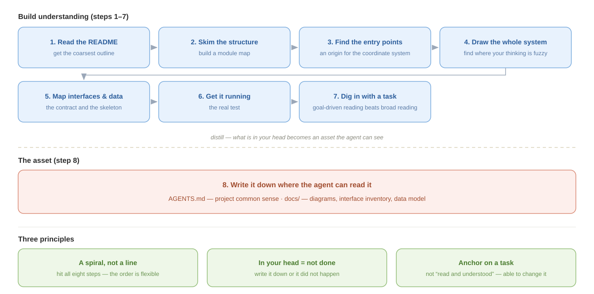

### Using an Agent to Build Understanding

Facing an unfamiliar open-source project, "understanding it" does not mean reading every line, and it certainly does not mean being ready to open a PR. The goal at this stage is the **top-level understanding sufficient to start decomposing requirements**: what the project is and is not for, what it does natively, how it extends, what its key runtime facts are — and which parts you will have to build yourself.

Two things make agent-assisted reading work:

1. **Bring your own decomposition framework.** It determines what you ask. The agent is good at retrieving evidence and filling in a framework; it cannot decide which judgments matter for your task.
2. **Ask with a concrete task attached.** It determines how you ask. The same question asked bare returns a feature tour; asked with a task, the agent filters, compares, and exposes gaps.

#### A Four-Dimension Framework

The minimum complete understanding an engineer needs of an unfamiliar project splits into four dimensions:

| Dimension | Question to answer | Output |
| --- | --- | --- |
| **Position and boundary** | What problem does it solve, what does it refuse to solve, and how does it relate to similar tools? | One-line positioning, applicable scenarios, explicit boundaries |
| **Native capability** | What ships in the box, what works without writing code, and how deep is the coverage? | Capability list, split into supported / partially supported / unsupported |
| **Extension model** | What is the extension mechanism, what do extension points look like, what is the development idiom? | Extension-point map, minimal skeleton, the kinds of code you must write |
| **Internal mechanics** | How does it start and run, how is state managed, what are the integration surfaces? | Process model, state model, configuration and integration |

These four are not the end of project knowledge — they are the scaffolding you need before decomposing requirements. Fill a first draft fast with the agent, then correct and complete it against the official documentation.

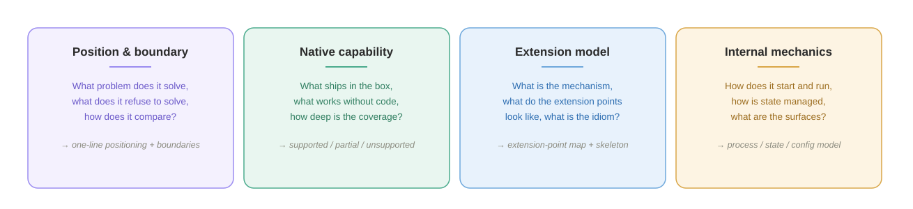

#### Ask With the Task Attached

The same question asked bare returns a feature tour. Asked with a concrete task in view, the agent filters, compares, and exposes gaps. Ask three questions in sequence, keeping the task fixed throughout:

1. **Position, boundary, and runtime.** "Here is my task. Read the README, the architecture doc, and the top level of `src/`. Tell me what this project is for in one sentence, what it deliberately does *not* solve, how it actually runs, and whether it points in the same direction as my task. Do not restate marketing copy."
2. **Native capability against your checklist.** "My task needs these seven capabilities. For each, tell me whether it is directly supported, half-supported with configuration, or unsupported and mine to build. Then estimate how much code I have to write."
3. **The real extension point.** "Is what I write mainly a `Skill`? If so, read the docs and examples, and give me the minimal skeleton so I can size the work."

Each question does a different job. The first builds a map before you dive into implementation — and the **boundary** matters more than the capability list, because it converts "usable / not usable" into something far more actionable: *the direction matches, but this project is only the skeleton; the real engineering sits in what it does not cover.*

The second forces trade-offs against your requirements instead of another feature list. A useful design rule tends to fall out of it: **generate structured data in code, leave narrative to the LLM.** If the model emits JSON that a downstream program parses, field names and nesting drift. Tools should own a stable schema; the LLM should own summaries and recommendations.

The third is the one people get wrong. Note that it is phrased as a *question*, not as the assumption "I need to write a Skill." That opening is what gives the agent room to correct your premise — and in the case this example is drawn from, it did: business capability belonged in **tools**, not skills. Had the work been decomposed as "write one big skill," the business logic would have had nowhere to live.

**Always leave the extension-point question open.** Assume the shape and you will decompose the work wrong before you write a line.

#### Return to the Official Documentation

Agent-assisted reading is fast but produces fragmented understanding, and loses detail when summarizing. Official documentation is systematic but is a poor first entry point to grind through cover to cover. A more effective order:

1. **Framework.** Use the four dimensions and a concrete task to have the agent build the top-level map — knowns, unknowns, and boundaries.
2. **Official docs.** Read systematically with that map in hand. The bar here is only "roughly understood, aware it exists."
3. **Back again after decomposition.** Once modules, interfaces, and effort are broken out, return to the relevant docs to confirm specific constraints and implementation details.

The value of three passes: the first indexes the documentation, the second fills in what the agent's summary dropped, the third turns knowledge into design decisions. The standard remains **enough to decompose the next requirement** — not pretending to mastery.

### Using Diagrams Effectively

A diagram is a checkable view of facts in the code. When taking over a brownfield system, draw these four first: **one diagram should answer one question, and every node and relationship must trace back to code, configuration, database, or runtime evidence.**

| Diagram | Question it answers | Watch for | Prompt |
| --- | --- | --- | --- |
| **Architecture diagram** | What is the system made of, and where is its boundary? | State whether this is a logical or deployment view. Keep only services, stores, external systems, and major data flows; split it if it exceeds one screen. | `Read the deployment configuration, service entry points, and infrastructure code. Draw the logical system architecture, distinguishing internal services, storage, and external systems. Show the main data flows; mark any unverified node or relationship as "unverified." Output an editable source file and SVG.` |
| **Module dependency graph** | Who breaks if I change this module? | Use build configuration and real imports as evidence. Exclude third-party libraries by default; highlight dependency direction and cycles. | `Read the build configuration and imports. Starting at [target module], trace one level of direct dependencies and dependents. Show internal modules only, point each arrow toward the dependency, highlight cycles, and do not infer relationships from directory names.` |
| **Sequence diagram** | How does one request or event flow through? | Fix the entry and exit points. Draw the main path first, then retries, async messages, and failure compensation. Use call names from code. | `Trace [entry point] to [end point] through the controller, services, clients, and message producer/consumer code. Draw calls in order using real class and method names. Distinguish synchronous and asynchronous calls, including retries and failure compensation.` |
| **ER diagram** | How is the data related? | Decide whether DDL, migrations, or the runtime schema is authoritative. Distinguish physical foreign keys from relationships maintained only in code. | `Treat [DDL/migrations/runtime schema] as authoritative and cross-check the ORM and query code. Draw the core-table ER diagram with primary keys, foreign keys, and cardinality. Use dashed lines for logical relationships; mark conflicts or uncertain relationships as "unverified."` |

Check only three things: whether the diagram answers its intended question, whether every element has evidence, and whether text, edges, and contrast remain clear after export. Store the editable source and export together in `docs/`, recording scope, evidence, and date.

#### Recommend Only Agent Skills and MCP Servers

Prefer a **Skill** when you want diagram selection, evidence gathering, generation, and validation encoded as one workflow. Use an **MCP server** when the agent needs an existing diagram ecosystem, interactive editor, or rendering backend.

**Agent Skills**

| Tool | Core capability | Output |
| --- | --- | --- |
| [**tt-a1i/archify**](https://github.com/tt-a1i/archify) | Architecture, workflow, sequence, data-flow, and lifecycle diagrams with visual presets, themes, and interaction | HTML / PNG / SVG / WebM |
| [**Agents365-ai/mermaid-skill**](https://github.com/Agents365-ai/mermaid-skill) | 11+ diagram types with a validation loop and visual checks using mmdc or Kroki | Mermaid / PNG / SVG / PDF |
| [**WH-2099/mermaid-skill**](https://github.com/WH-2099/mermaid-skill) | 23 Mermaid diagram types with automatically synchronized official documentation | Mermaid code block |
| [**mgranberry/mermaid-diagram-skill**](https://github.com/mgranberry/mermaid-diagram-skill) | Argument-driven diagrams, a visual validation loop, and customizable brand themes | HTML / SVG / PNG |

**MCP Servers**

| Tool | Core capability | Output |
| --- | --- | --- |
| [**excalidraw/excalidraw-mcp**](https://github.com/excalidraw/excalidraw-mcp) | Hand-drawn whiteboard diagrams, streaming rendering, and interactive editing | Excalidraw JSON / SVG |
| [**jgraph/drawio-mcp**](https://github.com/jgraph/drawio-mcp) | Official draw.io MCP with App, Tool, and Plugin modes | draw.io XML / PNG / SVG / PDF |
| [**likec4/likec4**](https://github.com/likec4/likec4) | C4 architecture as code with 20+ tools for querying the model | Interactive views / static exports |
| [**lgazo/drawio-mcp-server**](https://github.com/lgazo/drawio-mcp-server) | Programmatic draw.io control with browser editing, pages, and layers | draw.io XML / SVG / PNG |
| [**structurizr/mcp**](https://github.com/structurizr/structurizr) | C4 model validation, parsing, rendering, and export | Structurizr DSL / PlantUML / Mermaid |
| [**veelenga/claude-mermaid**](https://github.com/veelenga/claude-mermaid) | Live Mermaid preview, automatic reload, and multi-format export | SVG / PNG / PDF |
| [**infobip/plantuml-mcp-server**](https://github.com/infobip/plantuml-mcp-server) | PlantUML generation, encoding, and decoding | SVG / PNG URL |
| [**i2y/d2mcp**](https://github.com/i2y/d2mcp) | D2 diagram generation with an incremental editing API | SVG / PNG / PDF |
| [**h0rv/d2-mcp**](https://github.com/h0rv/d2-mcp) | D2 compilation, validation, and rendering for Docker-friendly environments | PNG / SVG / ASCII |
| [**aescanero/mcp-kroki**](https://github.com/aescanero/mcp-kroki) | One API for 27+ diagram types including PlantUML, Mermaid, Graphviz, D2, and BPMN | SVG / PNG / PDF / JPEG |

### Map Interfaces and Data Models: Find the Contract First

Interfaces are the **contract** the project promises the outside world; the data model is the **skeleton** that contract flows through and lands on. Map them together — an interface change usually moves DTOs, business logic, and the database at the same time.

| Asset | Content | Suggested artifact |
| --- | --- | --- |
| **Interface inventory** | Method, path, purpose, auth, main parameters, return shape, callers | `docs/api-list.md` |
| **Data model description** | Entities, DTOs, table columns, keys, enums, explicit and implicit relationships | `docs/data-model.md` plus the ER diagram source |

**Workflow.**

1. **Fix the evidence.** For interfaces: OpenAPI and route registration first, then controllers, DTOs, auth, and middleware. For data: database schema and migrations first, then ORM definitions, DTOs, and query code.
2. **Draft the inventory.** Group interfaces by business module, separating external REST, internal RPC, and admin endpoints. Record persistence entities and transport DTOs separately — do not merge them into one object.
3. **Diff the sources.** Mark where OpenAPI disagrees with code, and where DDL disagrees with the ORM. The physical schema is authoritative for columns; runtime verification is authoritative for whether an endpoint works.
4. **Add the implicit relationships.** Recover logical associations without foreign keys from query methods, message handlers, and business code — plus the callers and compatibility constraints that never made it into a spec.
5. **Spot-check.** Compare route counts per module, actually call the core endpoints, sample key columns and joins. Only then commit to `docs/`.

**Prompts and pitfalls.**

```text
Map this project's interfaces and data model. First list the modules and
evidence sources you will scan, then start generating.

Interfaces: scan OpenAPI, routes, controllers, DTOs, and auth code, grouped by
business module. Separate external REST, internal RPC, and admin endpoints.
List method, path, purpose, auth, main parameters, and return shape.

Data: treat the actual schema and migrations as authoritative, cross-checked
against the ORM, DTOs, and query code. List primary keys, foreign keys, enums,
and logical associations, flagging anything inconsistent or unconfirmable.

Do not infer from naming. Output docs/api-list.md, docs/data-model.md, and an
editable ER diagram source file.
```

- **Make it declare the scan scope first.** Missed modules are the most common failure in multi-module projects. Before generating, have the agent report which modules, route entry points, and migration directories it found.
- **Keep the contract layers distinct.** External interfaces, internal RPC, DTOs, entities, and database tables have different jobs and do not belong in one description.
- **Preserve discrepancies; do not unify them.** The document should expose the gaps between OpenAPI, code, and the database, not silently "fix" them on the project's behalf. The gaps are real: an ORM may declare a field the table does not have (JPA's `@Transient`), and the table may have columns nothing maps to.
- **Control column granularity.** The interface inventory lists main parameters and return shapes only; full column detail belongs in the data-model document, not both. "Returns a `Prompt` object" is too coarse to be useful — at minimum say whether it is one or a list, and whether it is wrapped in the standard response envelope.
- **Runtime results win.** Static scanning produces the draft; actual routes, responses, and database metadata are the final check.

#### Choosing Tools

Combine tools by evidence reliability: **runtime and the real schema establish facts, code scanning fills in relationships, documentation tools present the result.**

| Tool or source | Best for | Strength | Watch out |
| --- | --- | --- | --- |
| **OpenAPI / Swagger UI** | The first source for the interface inventory | Structured; paths, parameters, responses, and auth are directly visible | The spec may be stale; still cross-check against routes and runtime |
| **Agent + `rg` / LSP** | Scanning controllers, DTOs, call chains, and implicit relationships across modules | Turns scattered information into a business-level view | Easily misses dynamic routes or infers from naming; always specify scan scope |
| **Bruno / Postman / `curl`** | Verifying core endpoints and saving repeatable requests | Inspects real runtime behavior | Only covers what you actually called; no substitute for a full inventory |
| **Database metadata / schema dump** | Confirming the real table structure | Closest to database fact — `pg_dump --schema-only`, `mysqldump --no-data` | Physical structure only; code-maintained logical relationships are invisible |
| **SchemaSpy** | Reverse-generating ER and column docs from a live database | Highly automated, good for large existing databases | Needs a database connection; implicit relationships still need a human |
| **DBML / dbdiagram** | Maintaining a readable, diffable ER source file | Concise text, versions alongside code | Usually needs importing from the real schema or manual syncing |
| **DBeaver / DataGrip** | Human inspection of schema, data, and relationships | Convenient browsing and querying, good for cross-checking | Output does not necessarily belong in Git; no substitute for a Markdown description |

No single tool recovers the API contract, runtime behavior, and data relationships at once. The workable combinations are **OpenAPI + agent code scan + endpoint spot-checks**, and **schema dump + SchemaSpy/DBML + a human adding implicit relationships**.

### Understand Code in Layers: Navigation, Graphs, and History

At step 7 — digging into code with a task in hand — separate three kinds of question. **Traditional IDEs and code navigation** answer "where are the definition and references?" **Repository graphs** answer "what is related across a wider area?" **History tools** answer "why did the system end up this way?" Each expands the context, but none proves the code is correct.

SonarQube, CodeQL, Coverity, and similar tools answer a different question: did a change introduce a quality, security, or standards regression? They belong in verification, not in a deeper tier of code comprehension.

#### Traditional IDEs and Code Navigation Provide the Closest Evidence

> [Understand (SciTools) overview](https://blog.csdn.net/haiyyang/article/details/6573544)

Traditional tooling should not be ignored because it lacks an "AI" label. For one symbol or one call chain, a language-aware IDE index is usually more direct than an agent-generated graph and easier to verify against source.

| Tool | Best for | Strength | Limitation |
| --- | --- | --- | --- |
| **JetBrains IDEs** | Tracing definitions, references, types, and call hierarchies inside one repository | `Find Usages`, call and type hierarchies, UML, dependency analysis, database tools, and OpenAPI in one workspace | Limited cross-repository reach; results are primarily for humans, not continuous agent queries |
| **VS Code + language extensions / LSP** | Lightweight symbol navigation, reference search, and debugging | Broad language coverage and easy reuse of the project's existing environment; GitLens adds line-level history | Depth depends on the language server and plugins; architectural views are weaker |
| **Understand (SciTools)** | Static structural analysis of large, multilingual legacy systems | Generates UML, call graphs, and dependency graphs; reports complexity, coupling, and cohesion | Commercial; its metrics still need interpretation in the context of a concrete task |

Use definition jumps, reference search, and call hierarchies to establish local facts before widening the scope with a repository graph. **A graph should tell you what to read next, not replace reading the code.**

#### Repository Graphs Expand Scope, Not Evidence Depth

Repository graphs compress directories, imports, symbols, calls, or surrounding documents into queryable derived context. They cover more ground than file-by-file browsing, but the information is shallower than an IDE index, source code, runtime behavior, or a quality gate. They answer "what may be related," not "is this behavior correct?"

Three open-source tools are often mentioned together and are easy to confuse because of their similar names:

| Tool | Granularity | Updates | Covers | Use it for |
| --- | --- | --- | --- | --- |
| **[CodeGraph](https://github.com/CodeGraphContext/CodeGraph)** | Function level | Incremental, watches files | Code only | The graph an agent queries *continuously* while working. First choice for a large repo you are actively changing |
| **[Graphify](https://github.com/safishamsi/graphify)** | Symbol and concept level | Batch rebuild | Code **plus** documents, PDFs, images | One-time reconnaissance of an unfamiliar system, and finding coupling nobody documented |
| **[Codemap](https://github.com/JordanCoin/codemap)** | File and module level | On demand | Directory structure, imports, diffs | Fast orientation, and blast-radius checks before an edit |

**Codemap** answers structural questions from the command line: where code lives, how files connect, which files import a given target, what changed against a ref.

```bash
codemap --importers path/to/file .   # who breaks if I edit this
codemap --json --diff --ref main .   # what this branch actually touched
```

The `--importers` query is the cheapest blast-radius check available before a risky edit, and it belongs in step 7. Dependency-edge mode needs `ast-grep` on `PATH`; without it you still get structure and diff maps. It also emits a handoff payload — a practical answer to the cross-session amnesia named in the brownfield tax, since a fresh session starts from the map instead of from zero. The limit is real, though: it stops at the file level. It will not tell you which *function* calls which.

**CodeGraph** is the one to reach for when the agent needs to keep asking. It builds a local, function-level knowledge graph with tree-sitter, watches the filesystem, and updates incrementally — then exposes it over MCP so the agent queries the graph instead of re-reading files. On a large repository that is the difference between a context window that fills up on file reads and one that spends its budget on the actual task. It is code-only and pure local, with no document ingestion.

**Graphify** goes wider instead of deeper: a persistent, queryable graph spanning code **and** the surrounding corpus — design docs, PDFs, diagrams. Code is parsed locally with tree-sitter so source never leaves the machine; the non-code material is extracted semantically with an LLM. The properties that earn the setup cost:

| Property | Why it matters on a brownfield project |
| --- | --- |
| **Confidence labels** | Every node and edge is marked `EXTRACTED`, `INFERRED`, or `AMBIGUOUS` — you can tell the agent's facts from its guesses, which is exactly the discipline the review step demands |
| **Multi-modal corpus** | The design doc explaining *why* a module is shaped that way is usually not in the code. This is the only tool here that reads both |
| **God nodes** | Automatically flags over-connected central nodes — usually the highest-risk code to touch |
| **Surprising connections** | Surfaces relationships nobody expected, which is where undocumented coupling hides |
| **MCP server** | The agent queries the graph directly, keeping context spend flat as the repo grows |

The trade-off against CodeGraph is update model: Graphify rebuilds in batches, so it is reconnaissance rather than a live index.

**Graphify and CodeGraph are the automated form of this whole layer's thinking.** Where this chapter teaches you to have an agent draw the architecture, module, and dependency views step by step, they do it in one pass and leave something you can keep interrogating. The confidence labels are the part to internalize even if you install none of them: **an agent's map should tell you which edges are fact and which are inference.**

The caveat applies to all three. A graph is derived context, not runtime truth. Read the source before asserting behavior, and treat these as ways to find the code worth reading — not substitutes for reading it.

#### History Tracing Explains Why the Code Looks This Way

`git log` is one command; its real "competitors" are **history visualization and analysis tools**:

- **GitLens (VS Code)** — shows who changed a line, when, and with what commit message, inline. Fastest way to reach historical context.
- **GitKraken / SourceTree** — graphical Git clients; branch topology makes project evolution legible.
- **`git blame` / `git rebase -i`** — finer-grained tracing of changes and ownership.
- **Gitql** — SQL-style queries over Git history, for custom analysis.

The real value of history tooling on a brownfield project: **the strange commits in `git log` are the raw material for the "historical baggage" section** described below.

#### Do Not Look for an All-in-One Repository Graph

**No single tool does code, API, ER, runtime, docs, and graph well at the same time.** These views come from different data sources; no one parser produces them all.

| Graph | Data source |
| --- | --- |
| Call graph | AST / LSP |
| Dependency graph | Imports / packages |
| API graph | OpenAPI / framework routes |
| ER graph | Database schema / ORM |
| Runtime graph | Traces / logs |
| Ownership graph | Git / `CODEOWNERS` |
| Knowledge graph | All of the above, fused |

Several approaches come close to all-in-one. None arrives:

| Approach | Covers | Missing |
| --- | --- | --- |
| **[CodeGraph](https://github.com/CodeGraphContext/CodeGraph)** | Function-level code graph, incremental, MCP-native — the closest thing to a live index an agent can query | Code only: no docs, no ER, no runtime, no service catalog |
| **Sourcegraph** | Symbols, call graph, references, cross-repo, docs, search, embeddings, AI. Answers "who calls X," "where is this API," "which table does it touch" much of the time | ER diagrams; architecture diagrams are mediocre; no runtime |
| **[Graphify](https://github.com/safishamsi/graphify)** | Code plus documents fused into one queryable graph, with confidence labels and an MCP server | Batch rebuilds rather than a live index; no service catalog or runtime view |
| **Backstage** | Enterprise service catalog: repo → service → API → database → dashboard → owner. Strong architectural view | Not a code graph; not fine-grained enough at code level |
| **Neo4j + a custom code graph** | Repo → parser → Neo4j → graph → AI. Best results | Highest maintenance cost |

Pick by the shape of your problem, not by feature count:

- **One symbol or call chain to verify** → JetBrains IDE. Use the language index directly; do not build a graph first.
- **A quick directory, diff, or file-level blast-radius view** → Codemap. Run it on demand at the lowest cost.
- **One large repo an agent works in daily** → CodeGraph. Live, function-level, queried over MCP.
- **An unfamiliar system you need to understand before touching** → Graphify. It reads the design docs too.
- **More than one repo** → Sourcegraph. Nothing else does cross-repo well.
- **An organization that has lost track of which service owns what** → Backstage, which is a catalog problem, not a code problem.

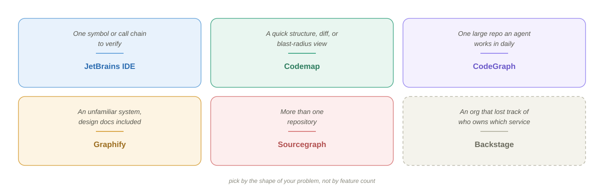

**The better path is a unified data layer**, not an all-in-one tool:

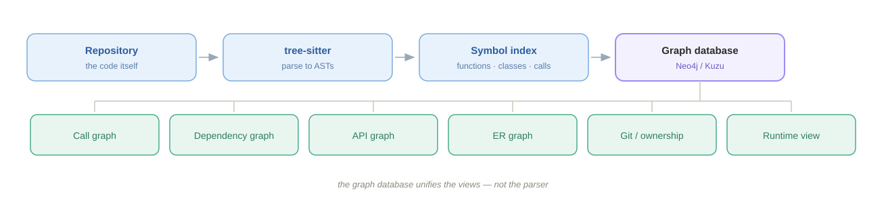

What unifies these views is **the graph database, not the parser.**

For agent-assisted coding specifically, only a handful of tools earn permanent residence:

| Tool | Why |
| --- | --- |
| **CodeGraph** | The live graph the agent queries while it works — the single biggest lever on context spend in a large repo |
| **Graphify** | Reconnaissance across code *and* documents, confidence-labelled |
| **Codemap** | Cheap structural queries and blast-radius checks (`--importers`) before an edit |
| **Sourcegraph** | Cross-repository symbols and references, once one repo is not enough |
| **tree-sitter** | ASTs — the foundation under nearly every tool above |
| **SchemaSpy or DBML** | Automatic database ER diagrams, the one thing the code-graph tools do not cover |

Everything else — OpenAPI generators, Madge, ctags, Doxygen, dependency-cruiser, Graphviz — can be run on demand.

**The end state is a single `repo-intelligence` entry point.** The goal is one interface for the agent, not a drawer of six tools it has to be told about individually. On first entry into a repository it would:

1. Build a **symbol index** (functions, classes, interfaces).
2. Construct the **call graph** and module dependencies.
3. Parse **OpenAPI** and the ORM to derive API and ER information.
4. Emit architecture diagrams as validated HTML or Mermaid.
5. Cache all of it, shared across every agent — debug, review, refactor, architecture.

CodeGraph or Graphify over MCP, plus a diagram generator, is the closest thing available off the shelf today; the gap is mainly the database side. Either way the principle holds: **one entry point for the agent, with tree-sitter, LSP, and SchemaSpy called underneath.** That is a better bet than searching for a universal tool that does not exist.

### Using MCP

Repository graphs cover the code. The rest of a brownfield system's context lives in systems the agent cannot see by default, and **MCP** is the standard for connecting them. It is worth understanding as infrastructure rather than as a feature — see [Tools, MCP, CLI and More](../02-anatomy/MCP.md) for the mechanics.

| Extension | Brings into context | Why it matters here |
| --- | --- | --- |
| **GitHub / GitLab MCP** | PRs, issues, review history, branch state | The *why* behind strange code is usually in a PR discussion or a ticket, not a comment |
| **Database MCP** | Live schema, controlled queries | Settles the DDL-versus-ORM disagreements the data-model step keeps surfacing |
| **Sourcegraph** | Cross-repository symbols, references, definitions | Necessary the moment the brownfield system is more than one repo |
| **Zoekt** | Fast trigram code search | Sourcegraph's search engine, usable standalone when you want speed without the platform. No symbol-level analysis |

Grant these deliberately. A database connection with write access, handed to an agent working on unfamiliar code, is a much larger blast radius than a wrong refactor.

---

## Layer 2: Constraint — Make the Agent Obey

The comprehension layer makes the agent see the project, but **seeing is not obeying**. The agent writes code according to the best practices it knows; a brownfield system is full of things that exist for historical reasons. The constraint layer writes down what not to change, how to change it, and what the result should look like — so the agent works inside the lines you drew.

Constraints come in two kinds:

| Type | Lives in | Example | Character |
| --- | --- | --- | --- |
| **Static** | `AGENTS.md`, `SKILL.md` | "This class is a compatibility layer — any change must preserve method signatures." "When editing, touch only the files in scope." | Long-term investment; write once, reuse |
| **Dynamic** | The instruction you give this time | "Change only these three files." "Confirm the approach with me before editing." "Stop and ask if you are unsure." | Required every time; cannot be skipped |

Anthropic calls this discipline of building constraints for an agent **harness engineering** — *harness* as in tack for a horse.

### Static Constraints

Every agent reads a different file, which matters more on a brownfield project than a new one: the rules you spent a month excavating should not be locked to whichever tool you happened to start with.

| File | Read by | Scope |
| --- | --- | --- |
| **`AGENTS.md`** | Cline, Aider, and a growing set of others; the emerging cross-tool convention | Portable project rules. Start here if more than one agent touches the repo |
| **`CLAUDE.md`** | Claude Code | The de-facto standard in the Claude ecosystem; same content, tool-specific filename |
| **Cursor rule files** | Cursor | Native and zero-setup, but Cursor-only |
| **`SKILL.md`** | Claude Code and compatible agents | Not project facts — a procedure. One per repeated workflow |

Practically: **keep one source of truth and make the others point at it.** The content is the expensive part; the filename is not. Details of the format and the layered-memory model are in [The Agent Memory File](../01-prompt/agents-md.md).

One gap none of these files closes is **cross-session memory** — the second failure in the brownfield tax. A rules file is reloaded every session, but the decisions you reached *during* a session are not. Persistent-memory add-ons exist (Cline's memory bank is the common one), and Codemap's handoff payload serves a similar purpose. The low-tech version works too and is the one this chapter keeps returning to: **write the decision into `docs/` or the rules file before the session ends**, or it did not happen.

#### When to Use SDD

Spec-driven development belongs to this layer too. But a brownfield project rarely has a complete spec, and **writing one for the whole system just to satisfy a tool is not worth it** — write a lightweight spec for the change at hand instead.

| Tool | Weight | Fits |
| --- | --- | --- |
| **OpenSpec** | Lightest | Local brownfield changes; extends an existing OpenAPI setup rather than replacing it. The default for brownfield work |
| **Spec-Kit** | Medium | Open-source and unopinionated about vendor, but you assemble the pipeline yourself. Heavier process, better suited to zero-to-one |
| **Tessl** | Medium | Contract-first: interface spec generates both sides. Good where the brownfield pain is API-boundary churn |
| **Kiro (AWS)** | Heaviest | End-to-end spec → code → test, tightly bound to AWS. A standardization decision, not a per-change tool |

The order in that table is roughly the order to try them on an existing system. Spec coding in depth is a separate chapter in this level.

> The `AGENTS.md` and skills material in this section draws on 《Claude Code 企业级老项目改造实战》, lectures 10–11: [老项目的 CLAUDE.md 怎么写？从五份资产到一份项目常识](https://time.geekbang.org/column/article/976338)

### `AGENTS.md` for a Brownfield Project: Index Plus Common Sense

Writing an agent memory file for a new project is easy: you wrote the code and you set the rules. A brownfield project is different. You inherited it, and you have not yet worked out the reasons behind many of its design decisions. Written from scattered impressions, the file comes out vacuous, wrong, or incomplete.

**The right move on a brownfield project is not to write it from scratch but to distill it from assets you already have.** The five assets from the comprehension layer — architecture diagram, module graph, dependency graph, interface inventory, data model — are not just notes. They are the **precondition** for this file.

The most common mistake is writing too much: prose versions of the architecture diagram, the whole interface inventory, every table and every column. Thousands of lines, loaded on every startup, pushing the agent into the dumb zone. **On a brownfield project, the file's job is "index plus common sense"** — the index points at the detail in `docs/`, the common sense is what the agent must know the moment it starts. Past 300 lines you have written too much.

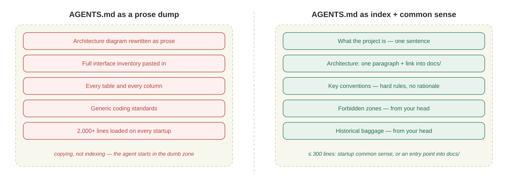

For the general principles of writing this file — progressive disclosure, specificity, hierarchical files — see [The Agent Memory File](../01-prompt/agents-md.md). What follows is brownfield-specific.

| Include (6 kinds) | How to write it |
| --- | --- |
| **What the project is** | One sentence |
| **Core architecture** | One paragraph plus a link to `docs/architecture.svg`. Do not rewrite the diagram as prose |
| **Key modules** | A small table, one sentence of responsibility per module; detailed dependencies live in `module-deps.svg` |
| **Key conventions** | Hard rules, no rationale. "All REST responses are wrapped in `Result`." "Database columns are snake_case, Java fields camelCase" |
| **How to run it** | One sentence plus a link to the runbook in `docs/` |
| **Forbidden zones** and **historical baggage** | The soul of a brownfield project — see below |

**Leave out (5 kinds):** full architecture detail (that is what `architecture.svg` is for), the full interface inventory (`api-list.md` is already in `docs/`), the full data model (likewise), generic coding standards (not specific to your project — they only dilute), and background story (the agent does not need the project's origin myth to work).

**The rule:** every line in the file is either "common sense the agent must have at startup" or "an entry point into `docs/`." Anything else, delete.

**Prompt for the first draft:** read every asset under `docs/` and generate a draft containing what the project is, the core architecture, key modules, key conventions, and how to run it — plus two empty sections: forbidden zones and historical baggage. Do not copy the detail of the architecture diagram, interface inventory, or data model; link into `docs/` instead.

Three things make that prompt work. "Read every asset under `docs/`" makes the agent distill from real output rather than invent. "Link into `docs/`" stops it from turning diagrams into prose. And **"two empty sections" is the key move** — the agent leaves room but does not fill it, because it cannot produce the real content and would either fabricate or generalize.

Three pitfalls in the generated draft:

- The agent describes `architecture.svg` in prose and puts it under "core architecture." When you see long module descriptions, say "compress to one sentence plus a link."
- "Key conventions" comes out generic ("code should have comments"). Have the agent infer the project's actual hard rules from its code style rather than copying a generic handbook.
- The agent helpfully fills in the two empty sections. "Leave forbidden zones and historical baggage for me — do not guess."

### Recover Business Context

An agent-generated memory file never contains the genuinely valuable forbidden zones and historical baggage, because **that information is not in the code, not in `docs/`, and only in your head.** These two sections are what distinguishes a brownfield project's memory file from a new project's.

**Forbidden zones** — which code cannot move, which columns have external dependents, which config changes cause incidents:

- The `external_key` column on `server-core/PromptEntity`: an SDK customer uses it as a cache key. Dropping or renaming it breaks that SDK outright. Do not refactor.
- The default value of `nacos.server-addr` in `application.yml`: some enterprise users rely on it for staged rollout. Changing it requires an announcement.
- The path `POST /api/prompts/search` was published to the community once. Changing it breaks external callers. Adding a synonym endpoint is fine; deleting the original is not.

**Historical baggage** — things that look wrong but have a reason:

- The `Dataset` and `DatasetItem` tables look redundant. They are left over from an experimental feature from 2024; the feature is retired but the data is retained. Do not drop them.
- The frontend `PromptTemplate.vue` is Vue, not React. Early legacy; the rest of the admin is React. This is the exception — do not "helpfully" unify it.
- `LegacyEvaluatorAdapter` looks like a mess because it supports three old APIs at once. Post-1.0 code goes through `EvaluatorV1`.

**Why these two sections are worth a hundred times their length:** every line is something the agent could never infer — you learn it by talking to the original authors or by getting burned. With forbidden zones written down, the agent routes around them. With historical baggage explained, it does not convert the Vue component to React out of tidiness.

How good a brownfield project's memory file is comes down to how deep these two sections go. **If you cannot list a few of each right now, that is a signal: your understanding is not deep enough yet.** Go dig, talk to the people who were there, and read the strange commits in `git log`.

**Three review checks:**

1. **Are forbidden zones and historical baggage present?** If not, something is missing — every brownfield project has them. List one or two now and add more as you hit them.
2. **Is it too long?** Past 300 lines you have packed in detail. Find the paragraphs that can move down into `docs/` and leave one sentence plus a link.
3. **Does it duplicate `docs/`?** If `architecture.svg` has been rewritten as prose, you are copying, not indexing.

### Skills: Capture Repeated Processes

**Brownfield projects and skills are a natural match.** On a new project, everything is being done for the first time; writing a skill barely changes the outcome. A brownfield project's defining property is "many things done repeatedly, every time from memory" — skipping or misordering a step is normal. A skill turns a repeated but uncaptured process into an asset the agent can execute, which **pulls the whole team's floor up to its ceiling.**

For skill mechanics — frontmatter, `description` writing, tool restriction — see [Agent Skills](../02-anatomy/skills.md). What matters here is which processes are worth capturing.

**Skills start with excavation, not design.** Do not begin by studying the file format. Begin by identifying "I keep doing this." A skill written without a real repeated process is code nobody runs.

**Three tests — all three must hold:**

| Property | Meaning |
| --- | --- |
| **Repeatable** | The same action sequence runs again and again. Not "occasionally," but "five times this month" |
| **Parameterizable** | Only a few variables change; the skeleton is identical. "Add an endpoint" — different names and payloads, same process |
| **Automatable** | A clear trigger and a clear artifact, not "I kept editing until it felt done" |

**Four process families worth mining on a brownfield project:**

1. **Keeping technical docs current.** The interface inventory, data model, and architecture diagrams in `docs/` drift with every code change; without active syncing the documentation rots. **The single most common brownfield pain point.**
2. **Pre-change health check.** Before editing: are the tests green, does it compile, is the middleware reachable?
3. **Pre-PR checklist.** Tests run, formatted, changelog updated, related docs changed, reviewer identified.
4. **Pre-endpoint alignment.** Before adding an endpoint, check existing path style, the standard response envelope, and error-code rules — so endpoints do not diverge per author.

**How many skills a brownfield project needs:** 5–10 is plenty, 5 or fewer is the recommendation depending on system complexity, and fewer than 3 is possible. Too many and one sentence matches several skills, leaving the agent unsure which to trigger. Skill count is not a measure of capability — **precision and use frequency are.** Suggested pace: mine the three highest-frequency processes, use them for a month, expand only if they proved useful.

**Have the agent mine them, in three steps:**

1. **Analyze repeated processes.** Have the agent scan the project — `git log`, the memory file, `docs/`, README, CONTRIBUTING, `.github/` — and use the three tests to list candidates (process name, why it recurs, the parameterizable parts, trigger and artifact).
2. **Get a top-3 recommendation.** From the candidate list, pick the three highest-priority ones and write `name`, `description`, expected steps, and allowed tools for each. Priority criteria: frequency, depth of pain, automation payoff.
3. **Generate the full skill.** Require the allowed-tools list be minimal, and insist on "report discrepancies only; do not edit files automatically; let a human decide."

**Test that it actually triggers** — three tests, all three must pass:

- **Should match.** Say something that ought to match ("I just changed a batch of controllers, check whether the docs still line up"). The skill should load and run its steps.
- **Should not match.** Say something deliberately off ("take a look at this snippet"). The skill should not load. If it does, the `description` is too broad.
- **Run it for real.** Check the output: did it follow the steps, did it list concrete discrepancies, did it edit files on its own initiative?

**Division of labor:** the memory file tells the agent **what this project is** (static knowledge). A skill tells it **how to do a specific thing** (a procedure).

---

## Layer 3: Verification — Make the Agent Trustworthy

The agent can see and it obeys, and the output still is not directly usable. **Agents are strong at generating code and much weaker at judging whether code is correct.** The function may match the requirement perfectly and ignore a boundary condition; the main path may be right while concurrency is not; the tests may all pass, and **the agent wrote the tests.**

The verification layer builds a **baseline outside the agent's output** and checks the agent against it.

**This is where legacy diverges from brownfield generally.** A well-tested system you inherited already has most of this layer: the baseline exists, and your job is to keep the agent inside it. On a legacy system there is nothing to inherit — no tests, no documented expected behavior — so the baseline has to be manufactured from what the code currently does before any change is safe. That is what the rest of this section is about.

| Practice | When | Key point |
| --- | --- | --- |
| **Integration tests** | Before editing anything | Have the agent write tests covering the core paths to pin current behavior, then re-run after the change |
| **Characterization tests** | For old code with no documented, articulable logic | Have the agent write tests from **actual current behavior**, so before and after match |
| **Static analysis and quality monitoring** | Before and after the change | Record existing findings and reject only new quality, security, and standards regressions |
| **Independent review** | After the agent produces something | Beyond your own reading, have an agent review its own output from another angle (attacker's view, for instance) |
| **`curl` comparison** | After changing an endpoint | Run a few scenarios and compare responses before and after |

**Verification is not a receipt filed afterward. It is a safety net built before you start. The denser the net, the more you can let the agent do.**

### Static Analysis and Continuous Monitoring Belong in Verification

> [sourcefare overview](https://cloud.tencent.com/developer/article/2586478) · [COBOT overview](https://blog.csdn.net/chengoodflower/article/details/146412329)

Repository graphs describe structure and relationships. The tools below turn rules, vulnerabilities, and code smells into repeatable checks. Run them before a change to establish the baseline, run them again afterward, and let CI reject new findings.

| Type | Tool | Role in verification |
| --- | --- | --- |
| Open core | **SonarQube / SonarCloud** | Continuously detects standards violations, vulnerabilities, code smells, and duplication, with a quality gate that connects to CI. Start here unless you have a reason not to; self-hosting is the cost |
| Commercial | **CAST** | Assesses technical debt and architectural risk across large enterprise systems |
| Commercial | **Coverity** | Static analysis plus security scanning, common in DevOps teams |
| Commercial | **CodeQL (GitHub)** | Models code as a database and detects vulnerabilities by query; strong for semantic security analysis and integrated with GitHub Actions. It pairs with Sonar rather than replacing it: deeper security analysis, weaker general standards coverage |
| SaaS | **Codacy** | Connects to GitHub/GitLab PR flows and continuously reports quality changes |
| SaaS | **Code Climate** | Reports maintainability and quality changes on pull requests |
| Open source | **sourcefare** | Covers vulnerabilities, defects, duplication, and complexity without requiring a database |
| Regional | **COBOT** | Developed by Peking University and PKU Software, CWE-conformance certified; covers quality defects, vulnerabilities, and architectural issues |

On a brownfield project, run the tools once and preserve the current state, then configure the gate to reject new findings. Requiring every historical warning to disappear at once buries real regressions under inherited debt. **SonarQube plus CodeQL** gives broad coverage: Sonar for standards and rot, CodeQL for semantic security.

### Agent-Assisted Testing

Test frameworks, static analysis, CI, and cross-model review are not peripheral tooling — they *are* the external baseline. Agents write code far faster than humans review it, and human reading alone cannot keep up with the output rate.

| Tool | Role in the baseline | Note for brownfield work |
| --- | --- | --- |
| **The language's standard test framework** (pytest, Jest, JUnit, …) | Where characterization tests actually live | Use whatever the project already uses. A second framework is a tax, not an improvement |
| **Playwright** | End-to-end verification through the real UI | The only way to pin behavior in an old system whose logic sits in the frontend. Cypress is the main alternative |
| **Approval / snapshot testing** | Golden-record baselines for complex output | The right tool when the output is too large to assert inline — see the characterization section below |
| **GitHub Actions / GitLab CI** | Enforcement | A prompt asking the agent to be careful is a suggestion; a failing gate is a constraint |
| **Cross-model review** | Catching single-model blind spots | Have a *different* provider's model review the output. Costs no new software, just orchestration, and defeats the failure mode where a model cannot see its own bias |

The ordering principle: **a check the agent cannot satisfy by rewriting the check is worth more than three it can.** That is why the gate belongs in CI and the baseline belongs in tests written before the change.

### Characterization Test → Seam → Incremental Refactor

Three concepts form the standard workflow for changing old code, from Michael Feathers' *Working Effectively with Legacy Code*:

> [Working Effectively with Legacy Code — Michael Feathers](https://www.oreilly.com/library/view/working-effectively-with/0131177052/)

> **Pin behavior with a characterization test, isolate with a seam, then refactor.**

| Step | Question it answers | Output |
| --- | --- | --- |
| Characterization test | What does the system actually do right now? | An executable behavioral baseline |
| Seam | Where can behavior be controlled safely? | A substitutable boundary |
| Incremental refactor | How do I improve structure without changing behavior? | Small, revertible changes |

The order is **survey the site, put up the safety tape, then start work.** Agents change old code far faster than humans can understand and review it. The answer is not a weaker model; it is making behavior observable, changes bounded, and regressions detectable.

#### Characterization Tests Pin Down the Facts

Old code hides behavior that never made it into documentation but that production genuinely depends on: odd rounding, fallback values, a discount that applies to one grandfathered account, a misnamed field external callers already rely on.

A characterization test asks what the system **actually does**, not what it **should do**:

```python
def test_discount_for_legacy_account() -> None:
    assert calculate_price(account="legacy", amount=100) == 89.99
```

`89.99` may well be wrong. The test does not endorse it — it writes current behavior down explicitly. That is what separates an **intentional fix** from an **accidental regression**. Change the assertion only once the business confirms the new value. **Behavior change and refactoring are two independent decisions; do not mix them into one commit.**

When the output shape is too complex to assert inline, keep an approval or snapshot baseline and diff it after every change. Cover the high-risk paths first:

- Billing and revenue rules
- Data transformation and serialization
- External API contracts
- Error and fallback behavior
- Date, locale, and rounding edge cases

#### Seams Create Control Points

When code reaches directly for the clock, the network, the database, global state, or environment config, tests get slow and flaky:

```python
def calculate_price(order):
    now = datetime.now()                          # real clock
    rate = requests.get(EXCHANGE_RATE_API).json() # real network
    account = database.query(order.account_id)    # real database
    # the logic you actually want to test is buried under all three
```

**A seam is a place where you can change the system's behavior without editing the code at that place.** The move is to put each unstable dependency behind an explicit boundary — a constructor parameter, in the simplest case:

```python
class Pricing:
    def __init__(self, accounts, rates, clock): ...

# production: the real thing.  tests: something you control.
Pricing(accounts=FakeAccounts(...), rates=FixedRates(1.2), clock=FixedClock("2026-07-25"))
```

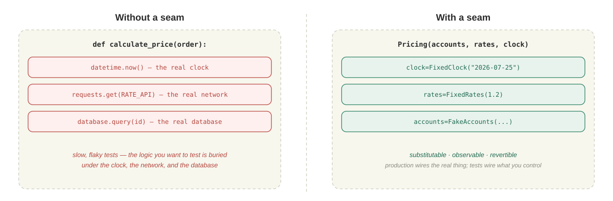

The point is not "decoupling" in the abstract. A useful seam gives you three things:

- **Substitutable** — swap the database, the API, the clock, or the implementation.
- **Observable** — record calls, arguments, and outputs.
- **Revertible** — shift traffic between old and new behavior with a flag or an adapter.

**Use the smallest seam that creates a control point.** It might be a function parameter; it might be an interface, adapter, repository, feature flag, proxy, or API boundary. Do not redesign the system to make one path testable.

#### Incremental Refactoring: One Change at a Time

Refactoring improves internal structure while externally observable behavior stays fixed. With tests defining behavior and a seam isolating dependencies, have the agent make exactly one structural change per step:

```text
Extract discount calculation      → run the targeted tests
Extract currency conversion       → run the targeted tests
Move coupon rules behind the seam → run the targeted tests
Delete the now-duplicate branch   → run the full suite
```

Every change must be:

- Small enough to review
- Covered by a behavioral baseline
- Revertible through version control or a runtime switch
- Separate from functional and behavioral changes

For high-risk migrations, keep both implementations for a while, compare outputs with shadow traffic, ramp gradually, watch production monitoring, and only then delete the old path.

#### Recommended Workflow

**Why the order matters.**

| Shortcut | How it fails |
| --- | --- |
| Refactor first | No reliable signal that behavior is unchanged |
| Seam first, tests later | The extraction itself may have changed hidden behavior |
| Tests without a seam | Feedback is still slow and flaky, still coupled to external systems |
| One big migration | Failures are hard to localize; reverting is expensive |

The safe loop:

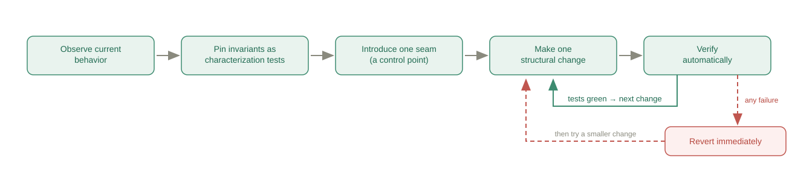

**Running it with an agent.**

1. **Map the change surface first.** Have the agent find entry points, dependencies, callers, existing tests, and externally visible output. **Do not authorize any edits at this step.** On a large system, `codemap --importers` and a repository graph surface relationships plain text search will not.
2. **Pin current behavior.** Add characterization tests around typical and boundary inputs, run them against the unmodified system, and record the real output.
3. **Introduce exactly one seam.** Isolate the dependency blocking deterministic tests, running the characterization tests before and after the extraction.
4. **Refactor in small diffs.** Give the agent a narrow goal and explicit invariants:

   ```text
   Extract discount calculation out of the Pricing class.
   Do not change the public interface or any observable output.
   Run tests/pricing/test_characterization.py when you are done.
   Stop if any snapshot changes.
   ```

5. **Widen verification in stages.** Targeted tests first, then integration tests, CI gates, output diffs, performance checks, and staged rollout as risk warrants.

**This workflow is the control system.**

| Mechanism | Role in the control system |
| --- | --- |
| Characterization test | Executable contract, and the regression criterion |
| Seam | Action boundary that limits blast radius |
| Incremental refactor | Bounded agent action |
| CI and staged rollout | Feedback and recovery loop |

Prompts like "be careful here" are **suggestions**. Tests and release gates are **enforceable constraints**. The larger the change volume the agent produces, the less a human should spend attention on line-by-line reading and the more on defining intent, boundaries, and contracts.

In one line:

> **Make the unknown observable, make coupling controllable, make every change verifiable.**

## Summary

This chapter is about **how to let coding agents work safely in brownfield codebases**. The core problem is not that agents cannot write code, but that they lack context about the specific system: they cannot see historical decisions or tacit business contracts, they may change things outside the intended scope, and they cannot independently prove that their output is reliable. The real bottleneck in brownfield work is therefore whether human understanding can be turned into engineering assets that an agent can read and obey and that the team can verify its work against.

The argument follows one continuous control chain:

1. **Comprehension: make the agent see.** Build context from documentation, project structure, the running environment, interfaces, data models, code history, and repository maps. The agent extracts readable evidence; humans supply the tacit rules that exist only in experience and organizational memory.
2. **Constraint: make the agent obey.** Encode that understanding in `AGENTS.md`, specifications, and skills. State architecture boundaries, forbidden zones, historical baggage, and the scope of the current task so a local change does not expand into an incompatible refactor.
3. **Verification: make the agent trustworthy.** Establish a behavioral baseline outside the agent's output. Use the characterization test → seam → incremental refactor sequence to limit the blast radius, then close the feedback and recovery loop with CI, independent review, and staged rollout.

The layers cannot be skipped. Without comprehension, constraints will be inaccurate; without explicit constraints, verification will not know what to check; and facts discovered through verification feed back into comprehension. The same logic defines the responsibility boundary: agents can lead work whose answers already exist in code and documentation, while humans must own historical rationale, tacit contracts, forbidden zones, final acceptance, and risk decisions.

The right approach is not to have an agent understand and refactor the entire system in one pass. **Build context first, define the boundaries next, then make observable, revertible changes in small steps.** The goal is not to make the agent omniscient. It is to make the unknown observable, the boundaries enforceable, and every change verifiable.

## References

> [Comprehension Debt — Addy Osmani](https://addyosmani.com/blog/comprehension-debt/)
>
> [Sonar State of Code Developer Survey](https://www.sonarsource.com/state-of-code/)
>
> [Working Effectively with Legacy Code — Michael Feathers](https://www.oreilly.com/library/view/working-effectively-with/0131177052/)
>
> [How to Refactor Legacy Code — Augment Code (guide)](https://www.augmentcode.com/learn/how-to-refactor-legacy-code)
>
> [How to Refactor Legacy Code — Augment Code (article)](https://www.augmentcode.com/blog/how-to-refactor-legacy-code)
>
> [Chain of Understanding: Supporting End-user Developers' Code Understanding with Large Language Models](https://arxiv.org/abs/2504.04553)
>
> [Using GenAI to Understand Legacy Codebases — Thoughtworks](https://www.thoughtworks.com/radar/techniques/generative-ai-for-legacy-code-comprehension)
>
> [AI-Assisted Legacy Code Modernization Guide — Cleveroad](https://www.cleveroad.com/blog/ai-assisted-legacy-code-modernization)
>
> [The State of AI-Native Engineering in 2026 — Augment Code](https://www.augmentcode.com/resources/state-of-ai-native-engineering-2026)
>
> [Veracode State of Software Security 2025](https://www.veracode.com/research/state-of-software-security-report-2025)
>
> [Army of Juniors — OX Security](https://www.ox.security/research/army-of-juniors/)
>
> [《Claude Code 企业级老项目改造实战》— 极客时间](https://time.geekbang.org/column/article/976338)
