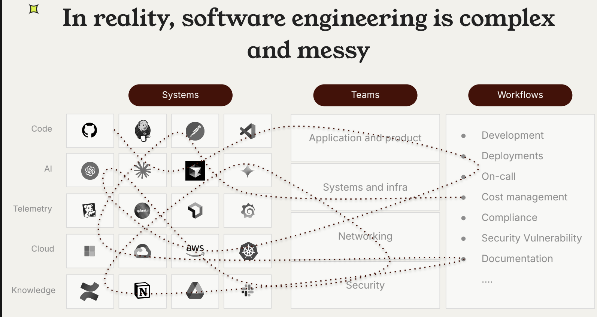

# Builder's Mindset

Last updated: 2026-07-05

The shift to Software 3.0 demands a new mindset: engineers become architects of AI-powered systems rather than solely writers of explicit code. The builder's role evolves toward defining intent, constraints, and evaluation criteria — and orchestrating agents to execute.

    1. 三层方法论
    * 第一层，必须你做的。产品边界、架构决策、技术取舍、跨模块一致性。
        * Claude Code 可以给你方案对比（后面第 04 讲你会看到这个过程），但拍板的必须是你。
    * 第二层，AI 做你验收的。
        * 业务代码、接口开发、前端页面、测试用例、文档。这是工作量的大头。
        * 有一个硬标准：任何一行代码你都要能说清楚它在干什么。说不清楚，就不能用。
    * 第三层，AI 全权处理的。
        * 格式化、样板代码、简单重构、启动脚本、Makefile。扫一眼没问题就行。