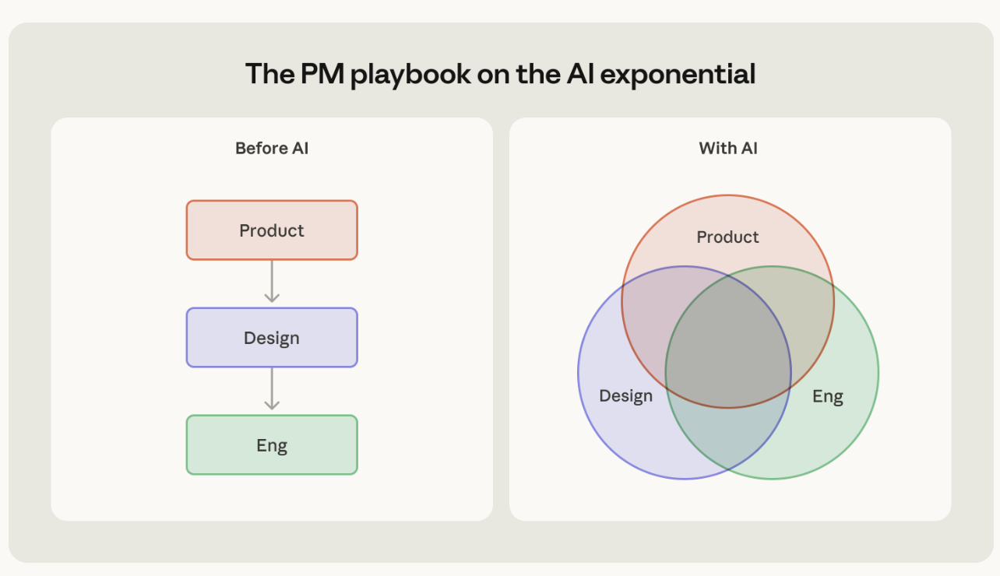

# Product Management in the AI Era

Last updated: 2026-08-06

> [Product management on the AI exponential](https://claude.com/blog/product-management-on-the-ai-exponential) — Cat Wu, Head of Product, Claude Code

> *Traditional product method assumes: what is technically impossible at the start of a project is still impossible at the end of it.*

Once that assumption breaks, the whole method built on top of it breaks with it.

Models are now improving faster than most teams ship. The workaround you carefully designed at kickoff may be dead weight before the project lands. The feature you ruled out as "technically not there yet, not this cycle" may work on the first try after the next model release.

The curve has a measurable magnitude. METR scores models by how long the same task takes a human: tasks Sonnet 3.5 (new) could complete reliably sat around the 21-minute mark; Opus 4.6 is close to 12 hours — **roughly 41× in 16 months**.

Cat Wu measured that curve against one fixed benchmark: have Claude Code add a table tool to Excalidraw. Sonnet 3.5 (new) couldn't. Opus 4 sometimes could, which is why the launch demo had to be a pre-recorded video. By Opus 4.6 it was stable enough to demo live. Same task, same person, three different answers — the task never changed. The ground did.

Rising ground changes two things, and this chapter takes them in order: how a product **gets built**, and — once building it is something anyone can do — what makes it **survive**.

---

## Role Boundaries Dissolve, and the PM Becomes an AI Builder

Before AI, product development was an assembly line: product defines the requirement, hands it to design, design hands it to engineering. Every handoff is a queue, and every layer owns only its own segment.

Now the three circles overlap: **designers ship code, engineers make product calls, PMs build their own prototypes and write their own evals**.

Vibe coding has become the mainstream way to produce, though **vibe working** is the more accurate name — a PM no longer just writes the PRD, but turns ideas directly into pages, prototypes, scripts, and internal tools, wiring up front and back end and deploying them. That is the path from PM to **AI builder**: engineering, product, and design increasingly land on the same person.

The overlap holds together not through process control but through shared strategy and goals. Everyone knows where they're going, so they can judge priority themselves instead of waiting for a meeting to assign work. When data science, finance, marketing, legal, and design all pick up these tools, the whole organization moves at one speed instead of stalling in handoff queues.

None of this means the PM role disappears. What's left of it is harder to replace:

- **Creating clarity out of ambiguity** — the goal, the boundary, what counts as "done."
- **Pushing the team toward bigger ideas**, rather than splitting existing ideas into smaller tasks.
- **Clearing obstacles off the delivery path** so the people who can build just build.

What you lose is control over execution detail. What you keep is judgment.

That's the hard part. If everything has to pass through the PM's hands, the team drops straight back into the handoff queue and the speed the overlap bought you disappears. Anyone used to tight control has to actively let go: identify the few lines that genuinely cannot be ceded, hand over the rest, and stay on the wave.

---

## Don't Freeze Today's Model Limits Into Your Product

The exponential doesn't change the purpose of product work, but it does swap out the specific moves. The four swaps below share one discipline; the last column is what breaking it looks like.

| Old move | Why it breaks | New move | What going wrong looks like |
| --- | --- | --- | --- |
| Lock the quarterly roadmap | The constraint disappears mid-execution | Short planning cycles + self-initiated side quests | The constraint is gone and the plan is still running |
| Documents first | Writing docs costs more than building a prototype | Prototypes and evals first | The spec gets thicker and nobody has seen the real thing |
| Shipped means done | A new model raises the ceiling on old features | Re-examine shipped features at every model release | Cutting capability to save tokens |
| Elaborate workarounds for model gaps | The workaround becomes dead weight one version later | Do the simplest thing that works | The codebase is stacked with patches for last-generation models |

### Replace the Locked Roadmap With Short Cycles and Side Quests

Trade the locked roadmap for short planning cycles, and leave the team room for **side quests**: short, self-initiated experiments that sit outside the official scope.

Claude Code's desktop version, the `AskUserQuestion` tool, and the todo-list feature all grew out of side quests. This isn't a benevolent allowance for a little slack — in an environment where capability keeps climbing, the thing that never made the roadmap is exactly the thing most likely to become the next main line.

### Replace Documents-First With Prototypes and Evals

Prototype first, don't document first. Demos replace daily standups, and real internal usage decides which feature is worth polishing. When prototypes are cheap enough, betting on the wrong direction is cheap too.

One concrete practice: **hand your spec straight to Claude Code and see what it builds**. Handed the spec for the plugin feature, it returned an implementation close to shippable. That's both the fastest way to prototype and the harshest test of the spec itself — every vague passage shows up in the thing it builds.

Evals do something similar. An eval set you write by hand turns an abstract feature into concrete samples, and surfaces failure modes earliest. Both practices replace the function of a document: **they move the object of discussion from description to artifact**.

### Re-Examine Shipped Features at Every Model Release

Treat every model release as a prompt to look at old features again. Three ways to do it:

1. **Be a daily active user of your own product.** Judgment comes from using it, not from reading dashboards.
2. **Go try the things you filed under "too hard, can't be done."** That call held last time. It doesn't follow that it holds this time.
3. **Treat manual user workarounds as signal.** Someone repeatedly hand-carrying content between Claude Code and Chrome — that motion *is* the requirements doc. It became Claude Code with Chrome.

One more principle that's easy to violate: **optimize capability first, and let tokens run**. Squeeze cost too early and you ship something weaker — cost falls on its own as models iterate, while the compromise on capability stays in the product.

### Do the Simplest Thing That Works

An elaborate scheme written to route around a current model defect turns into dead weight the version after next.

The todo-list feature originally needed periodic system reminders to keep the agent working; the next generation didn't need reminding, so the patch was deleted. In the same direction, prompts and tool descriptions have gotten shorter every generation — Opus 4.6 cut another 20% or so.

The test is direct: **is this thing you're writing solving a product problem, or patching a model's shortcoming?** If it's the latter, its shelf life is one version.

---

## Building It Is Only the Start: the Contest Moves Outside the Product

Rebuilding how you produce solves "how do we build it." Once anyone can build it, building it stops being the moat — **whether you can make the product is fully under your control; whether you can sell it is not**. Behind every business story sits a founder's long stretch of obscurity and failure.

Four stages, all outside the product itself:

| Stage | Question it answers | Case |
| --- | --- | --- |
| Pick the arena | Where you compete, and whether the starting line is level | Peec AI, Profound |
| Win traffic | How the product gets seen | Photo AI |
| Hold retention | Why users keep coming back | Claude vs ChatGPT vs Doubao |
| Find revenue | Who will actually pay | Synthesia |

In real work these four don't happen in sequence. They run in parallel and feed each other.

---

## Pick the Arena: New Arenas Start Everyone Level

When users start asking questions inside Doubao and Perplexity instead of typing keywords into a search box, a batch of **new and durable** industries appears alongside. **GEO (generative engine optimization)** is the clearest of them: how a brand earns favorable exposure inside a question-answering engine's response — a problem that simply did not exist in the search era. New arenas are relatively level for everyone; having no history behind you isn't necessarily a disadvantage.

Two examples:

- **Peec AI**: started in 2025, reached $4M ARR about 10 months after launch, serving 1,300 companies and agencies. It shows how a brand is described across ChatGPT, Perplexity, Gemini and other AI search surfaces — frequency of appearance, sentiment, and source influence. CEO Marius Meiners stresses that they don't only track ranking; they filter for the real questions people ask about brands, purchases, products, and services.
- **Profound**: processes over 100 million AI search queries a month, helping brands see how often they appear in AI answers. Early customers raised that share by 25% to 40% within 60 days.

Get the arena right and the other three stages start to matter. For an individual or a small team, "pick the arena" is really "pick a direction" — and that's where people most often get stuck.

### Three Traps, Three Conditions

| Common approach | The trap | The condition that improves your odds |
| --- | --- | --- |
| Build what you need | Worry that it's self-indulgent | And you'll need it **repeatedly, long-term** |
| Build what others need | Too little feedback nearby, and people may only be talking | And they'll **actually pay** |
| Chase the hype | The heat is gone by the time you ship | And it **still exists** after the heat dies |

Those three conditions map onto the three approaches below.

### Build What You Need, If You'll Need It Repeatedly for Years

> *Ideally you are the target user yourself; failing that, you know the target user extremely well.* — Sam Altman

A product born from your own need — don't doubt that it has value. But run the self-check first: is this for money, or to solve a problem? Will you still need it in six months? Will you actually use it often? Does it get more valuable as it accumulates?

**Case: Xunji (a fitness-logging app).** The developer is a fitness enthusiast who turned years of accumulated training method into an app. Average revenue is around ¥60,000/month (roughly 3,800 downloads a month, ¥88 one-time for Pro, about 18% conversion). Four things made it work:

1. **Persistence** — six years, from 2019 to today;
2. **Content aimed at users** — the public account publishes training guides, not technical write-ups;
3. **Viral growth** — coaches use it to track their trainees' progress, which pulls trainees into downloading it, a 1:10 spread;
4. **Sensible pricing** — ¥88, paid once.

A need of your own still has to survive two more tests: **how many people need this long-term, and how crowded is the field — can you differentiate?** Those aren't answered by intuition. They're answered by keyword analysis:

| Tool | What it's for |
| --- | --- |
| Ahrefs keyword difficulty tool | Search traffic and ranking difficulty; competitor analysis |
| Semrush | Extending and expanding keyword data, expanding GEO-adjacent question traffic, competitor analysis |
| Google search itself | Which sites rank, their monthly visits, when the domain was created |

The same toolkit gives opposite verdicts for two directions. AlphaWiseWin, an AI stock-analysis tool, faces "nvda stock" at 8.4 million searches — but 94% keyword difficulty, against giants like Yahoo Finance. Textbook red ocean. book2skills is the reverse: even keyed to *Common Stocks and Uncommon Profits*, the classic Buffett recommends, difficulty stays low, and Agent Skills is on the way up. A far better seed.

### Build What Others Need, If They'll Actually Pay

"Other people need this" can't be established by asking. It has to come from signal. Three kinds, in increasing order of how real they are:

1. **Search signal** — follow the thread through keyword analysis.
2. **Social signal** — posts where users pile into the comments, especially comments expressing a strong need rather than comments just joining the fun.
3. **Transaction signal** — the most real, and the hardest to get.

A social-signal example: a friend's company, bidding on overseas contracts, needed hundreds of translated documents. Existing tools either couldn't preserve the original layout or couldn't run in bulk. They found an overseas tool that handled it, posted about it on Xiaohongshu, collected a flood of comments the same day, and started taking orders directly. The differentiation came down to two things: **preserving the original layout** and **bulk translation**. Before the product existed, the comment section had already validated the need.

For transaction signal, go here:

| Tool | Notes |
| --- | --- |
| TrustMRR | Built by indie developer Marc Louvion; listing a product requires supplying a Stripe API key, so the numbers are real |
| Starter Story | Similar to TrustMRR; shows application revenue |
| Qimai | Incubated by Sinovation Ventures in 2013; tracks mobile app data |
| Sensor Tower | App data tracking; the free tier is limited |

It also pays to window-shop regularly: the YC company list, Product Hunt, G2's AI category. None of them show payment directly, but the comment sections and product descriptions are full of ideas.

### Ride the Hype, but Only Bet on Trends

Hype comes in two kinds, worth entirely different amounts:

| | Event hype | Trend hype |
| --- | --- | --- |
| Example | The Claude Code source leak; Claude blocking access from China | OpenClaw/Hermes open-source frameworks, the Skills standard |
| Character | Very specific | Abstract, broadly applicable |
| After it passes | Value goes to zero, no compounding | Falls back, then enters normal growth — it compounds |
| Lifespan | Extremely short | Clearly longer |

Checking which one you have is easy: look at the lifespan on Google Trends. The advice: **borrow the momentum, but don't build the foundation of a product on a one-time event.** Only long trends are worth turning into an asset.

### Validate the Direction Before You Build

Once you've chosen a direction, don't go straight to development. Three cheap ways to validate:

- **Don't ship a product, ship the result.** Post a user-facing demonstration of the outcome on social media or a forum — not a status report, not a humblebrag. Headline style: for translation, "Translation that keeps the original layout perfectly, I love it"; for fitness, "Getting back into training — here's how to plan it"; for animation, "How to make animation that feels alive."
- **Deliver the service first, build nothing.** Like the translation example above — start with manual work plus existing tools.
- **Build a landing page first.** Lean on a vertical traffic platform and let interested users leave contact details.

Rank signal by what it costs the user: someone willing to **pay** (highest cost, strongest signal), someone willing to **leave contact details**, someone willing to **upload their own material**. The more it costs them, the more likely the need is real.

---

## Win Traffic: SEO as the Floor, GEO as the New Door

> *Success is 10% product, 90% distribution.* — Pieter Levels

Indie developer Pieter Levels took Photo AI to roughly $130,000 in monthly revenue over 18 months (his portfolio clears $3M a year). That didn't come only from his existing following. What mattered more was the volume of **scenario photography** in the product interface — travel shots, Christmas photos, fashion, street style, cosplay characters — content matched to Google's search seasons, which keeps the product findable nearly year-round.

Two practices, one foundation:

- **SEO builds scenes around keywords** — study what users actually type into Google, then build pages and images against those keywords.
- **GEO builds content around users' questions** — users are asking "how do I create a Christmas atmosphere," so create content on that, and let them know your product makes it easy.

The two don't conflict: SEO is the foundation GEO stands on. GEO may simply be the SEO of 20 years ago — eventually a required skill for getting into a new traffic entrance.

---

## Hold Retention: Win the Occasion, Win Everything

Products with comparable traffic can end up with completely different retention. Compare three: Anthropic (Claude), OpenAI (ChatGPT), and ByteDance (Doubao).

In April 2026, multiple outlets reported Anthropic's annualized revenue run rate passing $30B (roughly $2.5B/month), ahead of the $2B monthly revenue OpenAI had previously disclosed. Leading on revenue is not the same as leading on retention — but the three products have genuinely separated along one dimension: **whether the user knows when to open it**.

- **Claude is focused on an occasion.** From the start it targeted relatively serious work, shipping Artifacts, Projects, Cowork, Claude Code, and Claude Design in turn — the product names themselves tell you when to use it.
- **ChatGPT wavers on positioning.** It started aimed at individuals, then shipped GPTs, Plugins, and Operator — terms only the very online can parse. Canvas and DeepSearch lean toward work again, while the entertainment needs of individual users never got focused development.
- **Doubao is the clearest of the three on consumer.** Positioned as a "life assistant": no project management, no Code, no GPTs or Operator. Voice conversation and multimodal input/output, solving everyday problems quickly.

The conclusion: **product competition isn't about who has more features, it's about who sits closest to the user's actual occasion.** OpenAI's positioning has been sharpening recently, pushing into work scenarios (precise text rendering in image2, the Codex coding tool). This one isn't settled.

---

## Find Revenue: Sell to Customers Far Below Your Capability

**Case: Synthesia.** Founded in 2017, doing "early-stage AI video generation" — synthesizing text, a human likeness, voice, and picture, with lip sync matched to another language. Early customers were Hollywood dubbing work and ad agencies; it hit $1M in revenue in 18 months.

Then the problem surfaced. Hollywood and advertising clients compared Synthesia's video against real film production and premium commercials — not human enough, not Hollywood enough, just not good enough. This is the pit AI products fall into most easily: **sell your technology to the people who understand technology best, and you get measured against the highest standard there is.**

The pivot was to change the customer, not the technology: enterprise HR, training, sales, and internal communications teams. They don't need cinematic quality. They need training documents, sales scripts, and product explainers turned quickly into videos employees will actually watch. The competition changed with them — from professional cameras, editing teams, and VFX houses to **PDFs, slide decks, and text documents**.

The product capability didn't fundamentally change. The paying occasion changed completely. That turn put Synthesia on a much wider commercial path: past $100M ARR in 2025, and a $4B valuation in 2026.

The principle: **if your capability is roughly equal to your customer's, they're more likely a partner than a customer.** Only when you're far beyond them — able to do what they can't do, can't do well, or can't do economically — will they pay.

---

## From Executor to Product CEO

Only once the direction is validated do you move into design and development. That process for delivering an idea into a product — spec document, design standards, architectural blueprint, tasks and progress written to disk — is essentially harness engineering applied to a personal project, and it belongs to Level 3 rather than this chapter.

A PM's center of gravity has moved outside that process. Four questions worth asking on a regular cadence:

1. **Is the arena right?** With a solid existing customer base you can grow new branches on the old trunk. Without one, consider a genuinely new arena rather than starting out behind players with incumbency.
2. **Does the product have enough vertical or enough total organic traffic?** Put content inside the product so it can be searched and shared, and keep building the brand's authority in its domain.
3. **Does the product keep customers?** Users need a clear occasion to come back to. Define the product in users' language rather than engineers' — it closes the distance to the user, and it forces the team to organize capability around real occasions instead of stacking features around technical nouns.
4. **Could the product be sold to someone better suited?** Equal capability makes a partner. Far greater capability makes a customer.

Last, the mindset. You don't find a need on a journey with a fixed destination; you run into it while wandering — keep planting seeds so opportunity has somewhere to land. The first attempt at commercializing anything is grinding and disorienting. When you can't yet gather enough real feedback, pick the idea you believe in most and start.

---

## Exercise

> Take an AI product you follow or are building, and examine it through the four stages — arena, traffic, retention, revenue. Which stage is strongest? Which one still needs work? If it were yours, what would you change?

---

## Summary

Traditional product method rests on an assumption nobody writes down: that the technical ceiling holds still for the length of a project. Model capability rose roughly 41× in 16 months, so the assumption collapsed, and the moves resting on it collapsed with it — the locked roadmap, the document written first, the feature considered done at ship, the elaborate workaround for a model gap. They fail for one shared reason: **each of them freezes a current model limit into a product or a plan.**

Their replacements share one discipline. Commit only in short cycles, replace description with prototypes and evals, look back at shipped work at every model release, and always do the simplest thing that works. Role boundaries dissolve along the way — the PM gives up execution detail and becomes an AI builder.

But rebuilding production only settles whether you *can* build it. Once anyone can, that stops being a moat, and the contest moves to four stages outside the product: the arena decides whether the starting line is level, traffic decides whether you're seen, occasion decides whether users return, and the capability gap decides who is willing to pay. They run in parallel, and a hole in any one of them keeps the other three from paying out.

Both halves describe the same change in the role: hand over control of execution detail, and take up judgment over arena, traffic, occasion, and business model — **much closer to being the CEO of a product.**

---

## Reference

> [Product management on the AI exponential](https://claude.com/blog/product-management-on-the-ai-exponential) — Cat Wu, Head of Product, Claude Code
