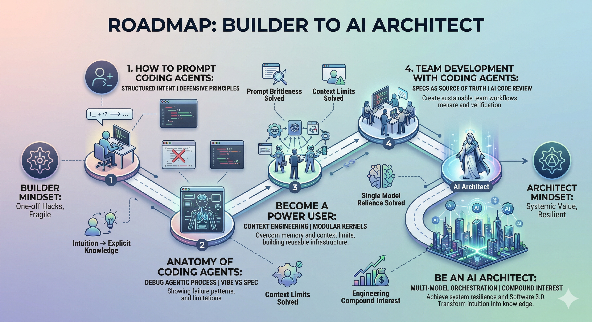

# Coding with Agents

Last updated: 2026-07-27

A course on how software engineers work effectively in the age of AI coding agents.

## Course Notes

| #   | Module                                                                 | Topics                                                                                                                                           |
| --- | ---------------------------------------------------------------------- | ------------------------------------------------------------------------------------------------------------------------------------------------ |
| 1   | [How to Prompt Coding Agents](01-prompt/README.md)                     | How AI changes the dev workflow · Prompting principles · Defensive prompting · AGENTS.md · Time management                                       |
| 2   | [Anatomy of Coding Agents](02-anatomy/README.md)                         | How agents work · Autonomy levels · Collaboration modes · Claude Code architecture · Context management · Sub-agents & agent teams · Skills, hooks, MCP · Systematic thinking |
| 3   | [Become a Power User (planned)](03-power-user/README.md)                | Orchestration layer · Engineering frameworks · Spec coding · Legacy codebases                                                                     |
| 4   | [Team Development with Coding Agents (draft)](04-team/README.md) | Specs as source of truth · Team-level context engineering · Intentional compaction · Code review at AI scale · Testing & security                |
| 5   | [Be an AI Architect (planned)](05-architect/README.md)             | Software 3.0 · Builder's mindset · Future of software engineering                                                                                |

**Module 4** is a **draft**; **modules 3 and 5** are planned but not yet written. See [`ROADMAP.md`](https://github.com/XinheLIU/Coding-with-Agents/blob/main/ROADMAP.md) in the repository for per-chapter status.

## Resources

See [RESOURCEs.md](RESOURCEs.md) for curated reading lists, papers, and links.
