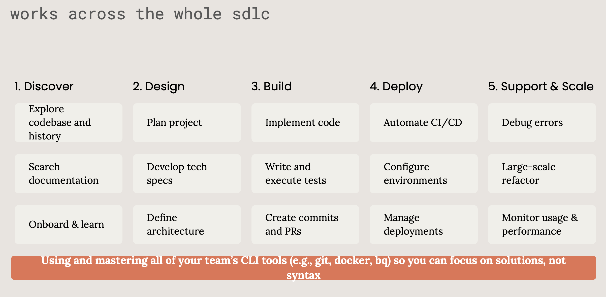

# 如何与编程智能体协作

Last updated: 2026-07-05

---

将 AI 视为简单代码补全工具的时代已经过去。当今的编程智能体，无论是 Anthropic 的 Claude Code 还是 OpenAI 的 Codex，都不只是提供逐行建议的引擎。它们能读取文件、执行命令、修改代码、运行测试、提交 PR，可以在云端沙箱里工作，也可以直接驻留在你的终端中。

这从根本上改变了协作问题。问题不再是"AI 能写代码吗？"，而是：**如何与一个能够自主写代码的智能体分工？**

一句话先说结论：**AI 拉高下限，人拉高上限。**

AI 很擅长把大量明确、重复、可验证的工作做完。但它不知道这次产品到底要什么，不知道哪些历史包袱不能碰，也不能替你承担上线后的责任。所以，人机协作的核心不是"让 AI 写更多代码"，而是建立一套责任分工：**人负责判断，AI 承担工作量，机械层交给 AI 自动化。**

> - [OpenAI 如何使用 Codex](https://cdn.openai.com/pdf/6a2631dc-783e-479b-b1a4-af0cfbd38630/how-openai-uses-codex.pdf)
> - [Anthropic 团队如何使用 Claude Code](https://www-cdn.anthropic.com/58284b19e702b49db9302d5b6f135ad8871e7658.pdf)



OpenAI 和 Anthropic 的实践有参考价值，不是因为它们给出了某种权威答案，而是因为它们反复验证了同一个工程规律：**越接近判断，越需要人；越接近重复劳动，越应该交给 AI。**

---

## 总纲：三层分工

把研发工作粗分成三层，很多协作问题会立刻变清楚。

| 层级 | 归属 | 典型任务 | 工作模式 |
| --- | --- | --- | --- |
| **决策层** | 人拍板，AI 辅助分析 | 产品边界、架构决策、技术取舍、系统一致性 | AI 给选项，人做裁决 |
| **主工作量层** | AI 起草，人验收 | 业务代码、前端页面、测试、文档、代码库探索 | AI 做主体，人审 diff 和行为 |
| **机械层** | AI 全权处理，人快速扫一眼 | 格式化、样板代码、重命名、迁移、脚手架、简单 CI | 异步批处理，最少干预 |

这三层不是按"难不难"分，而是按**判断含量和出错代价**分。

有些代码很简单，但它决定产品边界，那就是决策层。有些代码很多，但只是把旧 API 批量替换成新 API，那就是机械层。真正重要的问题不是"AI 能不能写"，而是：**这件事错了以后，谁能判断、谁能兜底、谁必须负责？**

Anthropic 和 OpenAI 的核心原则可以压缩成一句话：

> **对低风险、重复性、边缘性的工作授予高度自主权；对核心业务、架构、安全和高爆炸半径变更保持严格人工监督。**

大多数人的错误恰好相反：对简单的样板代码过度干预，却因为 AI 看起来很自信，就草草批准复杂的架构变更。正确模型是一条渐变的光谱，不是"全信"或"全不信"的开关。

---

## 第一层：决策层，只能你做

决策层是产品和架构的方向盘。AI 可以帮你算，但**拍板的只能是你**。

这一层包括：

- **产品边界**：这次解决什么问题，更重要的是，不解决什么问题。
- **架构决策**：微服务还是模块化单体？要不要引入 RAG 知识库？数据模型边界怎么切？
- **技术取舍**：选哪种数据库、哪种消息队列、要不要缓存、并发策略怎么定。
- **系统级一致性**：跨模块的错误码规范、日志规范、接口风格、权限模型。
- **风险承受能力**：哪些变更可以快速试错，哪些变更必须保守推进。

拿 Hify 这类应用层项目举例，决策层要回答的是"做不做知识库""系统形态怎么选""线程池参数设多少""哪些功能本期不做"。Claude Code 或 Codex 能做的是列方案、找先例、生成 pros/cons、指出不可逆风险；但它给不了你上下文里那个"这次到底要什么"的答案。

### 哪些事不能交给 AI 拍板

"渐进式自主权"框架在这里仍然成立。以下任务里，智能体只能做草稿提案者、结对编程伙伴或设计探索助手，不能成为最终决策者：

- **核心业务逻辑**：定义产品到底做什么的算法、规则和约束。
- **安全敏感路径**：身份验证、授权、数据处理、加密、删除和审计。
- **架构决策**：系统边界、数据模型设计、API 契约、长期依赖关系。
- **高爆炸半径变更**：任何代价高昂、难以察觉或难以回滚的改动。
- **关键用户流程**：影响信任、营收、合规和核心体验的路径。

Anthropic 明确强调，处理核心业务逻辑时，预期模式是**同步结对**：智能体负责探索和提案，人类负责决策和验证。这个原则不是保守，而是责任归属清晰。

### 决策层怎么用 AI

正确用法不是让 AI 替你拍板，而是让它把你的判断材料准备好：

- 让它列出 3 种可行方案，并明确每种方案的代价、收益、迁移成本。
- 让它在代码库里找相似实现，说明当前项目更接近哪种模式。
- 让它做 pre-mortem：假设这个方案半年后失败，最可能失败在哪里。
- 让它标出不可逆决策：数据模型、外部 API、权限边界、持久化格式。
- 让它起草 ADR 或技术方案，但最终结论由你改写和确认。

OpenAI 的实践也支持这个模式：先请求一份**实施计划**，再把计划作为代码生成的输入。这样可以防止智能体在还没理解范围时就开始写一个"很完整但解决错问题"的方案。

### 人工介入的关键时机

如果智能体负责处理"怎么做"，人类就必须把握"为什么"和"什么重要"。决策层至少有三个介入点：

1. **规划与范围界定**：目标、范围、约束、验收标准和风格期望必须先说清。你的提示词应像一份写得好的 GitHub Issue。
2. **核心逻辑与高风险变更**：进入核心路径后，协作模式要从"委托"切回"结对"，仔细看每一个 diff，而不是只看总结。
3. **不确定性与设计权衡**：让 AI 提供选项、找先例、压测假设；但哪条路径契合产品路线、团队能力和风险承受能力，必须由你决定。

这一层有个隐含前提：**你的技术判断力不能缺席。** 你至少要能看懂代码、理解实现，才能给出精准任务，才能对 AI 的产出做真正的判断。技术能力是入场券，不是可选项。

### 不必完全想清楚才开始

一个常见误区是：必须先把需求和架构完全想清楚，才能让 AI 参与。

不是这样。混沌阶段也可以用 AI，但它的角色是**帮你想清楚**，不是替你决定。你可以让它梳理基础组件、可能的架构选型、需要澄清的问题、风险清单，然后由你做判断和取舍。

协作模式可以是"它帮你想，你做裁决"，而不是只能"你想清楚再让它干"。

---

## 第二层：主工作量层，AI 做，你验收

主工作量层是 AI 最能释放价值的地方。

这一层包括：

- 业务代码实现：Controller、Service、DAO、DTO、Facade。
- 前端页面开发：表单、表格、状态展示、错误兜底。
- 测试用例：单测、集成测试、边界场景覆盖。
- 文档撰写：API 文档、设计说明、迁移说明、README。
- 代码库探索：追踪数据流、解释模块依赖、定位相关文件。
- 内部工具：仪表盘、运营工具、一次性分析脚本、团队自动化。

OpenAI 和 Anthropic 的大量案例都落在这一层。OpenAI 报告 Codex 承担了大量内部应用代码编写，新工程师入职第一天就能和 Codex 结对交付生产代码。Anthropic 团队用 Claude Code 生成研究人员通常会跳过的边界测试，报告研究时间因此显著缩短；数据科学家也能在不熟悉 JavaScript 的情况下构建数千行 TypeScript 仪表盘。

这些例子说明的不是"AI 可以替代工程师"，而是：**当目标、边界和验收标准已经明确，AI 可以承担大部分体力活。**

### 主工作量层的硬标准

这一层只有一条硬标准：

> **任何一行你最终接受的代码，你都要能说清它在干什么。**

如果说不清楚，只有两种可能：要么需求本身没想清楚，要么实现已经超出了你的控制范围。这两种情况下都不该点"接受"。这不是代码有没有 bug 的问题，而是你已经失去了对系统的掌控。

### 验收不是看摘要

主工作量层最危险的失败方式，是把 AI 的"完成总结"当成验收。

正确的验收要看三个东西：

1. **行为是否符合目标**：它解决的是不是你要解决的问题，而不是一个看起来相似的问题。
2. **diff 是否能解释**：新增文件、删除逻辑、数据结构变化、错误处理路径，你是否都能讲清楚。
3. **测试是否证明关键行为**：不仅 happy path 能跑，边界、异常、权限、并发或空数据也要覆盖。

如果某个 diff 你只能说"AI 说这里没问题"，那它就还没有通过验收。

### 主工作量层的协作模式

OpenAI 和 Anthropic 实践中反复出现的模式，在这里可以收敛成 5 个高频动作：

- **先规划，再生成**：从对话开始，界定范围，就方案达成共识，之后再让 AI 批量改代码。
- **小任务，频繁检查点**：把任务拆到人能审的粒度，避免几千行 diff 一次性砸过来。
- **持久化上下文**：维护 `AGENTS.md` 或 `Claude.md`，把项目约定、测试要求、架构边界和术语写进去。Anthropic 数据团队甚至用 `Claude.md` 取代部分传统数据目录和可发现性工具。
- **Best-of-N 综合**：对存在多种合理方案的问题，让 AI 生成多个版本，人比较权衡并融合最好的部分。
- **智能体不是神谕**：打断它，要求更简洁的版本，要求它解释权衡，在方案过度设计时把它拉回来。

OpenAI 内部团队常同时运行多个独立 Codex 任务，每个任务产出可检查的结果。Anthropic 的 Boris Cherny 还提出过审查子智能体：一个检查风格，一个追踪项目历史，一个找缺陷，再让其他智能体反驳这些发现以过滤误报。核心仍然是同一件事：**AI 扩大产出，人负责筛选和验收。**

### 横向能力层

主工作量层还有一个容易被低估的影响：它不只提升工程师效率，也扩展了"谁能构建软件"。

Anthropic 的报告里，设计师可以做大规模状态管理变更，市场人员生成广告变体，数据科学家用不熟悉的语言搭仪表盘。OpenAI 也构建了跨工程、产品、设计、数据、运营的可复用技能。这里的关键不是让非工程师越过工程规范，而是让领域专家在明确边界内更快得到可用工具。

换句话说，编程智能体不只是开发者生产力工具，也是组织能力层。但只要产物会进入真实系统，最终验收仍然需要落回工程责任。

---

## 第三层：机械层，AI 全权处理

机械层没有多少判断含量，应该尽量交给 AI 自动化。

这一层包括：

- 代码格式化、lint 修复、import 排序。
- 样板代码、目录结构、模块桩代码、API 路由骨架。
- 简单重命名、提取方法、跨文件 API 替换、废弃调用迁移。
- 基础 CI 脚手架、发布脚本、配置文件、遥测钩子。
- 重复性运维工作：Terraform 计划、K8s 日志分析、CI/CD 调试、基础设施即代码的安全检查。
- 低风险测试补齐：根据函数签名补单测、扩展边界覆盖、生成集成测试草稿。

OpenAI 工程师会把大型迁移任务拆给多个 Codex 实例并行处理：列出所有需要修改的文件，让智能体批量处理。Anthropic 团队在常规数据管道搭建、运维排查和重复性脚手架上也有类似模式。

这类任务的共同特点是：范围明确、规则强、容易验证、容易回滚。它们很适合让智能体异步跑，人最后抽查 diff、跑测试、确认没有越界。

### 机械层要设护栏

你不应该在机械层消耗太多注意力。盯着 AI 写样板代码，和自己手敲样板代码一样浪费。你的职责是把护栏设好：

- 范围明确：只改哪些文件，不碰哪些模块。
- 验证明确：跑哪些测试、检查哪些命令、输出什么结果。
- 回滚容易：小步修改，保持 diff 可读。
- 权限受限：不要让机械任务顺手改架构、改契约、改业务语义。

机械层的验收标准不是"逐行理解每个字符"，而是**快速确认没有越界**。

---

## 三层边界是弹性的

三层分工不是死表格，要按任务和项目类型调整。"自主权级别"可以落到下面这张表。

| 任务特征 | 所在层级 | 自主权级别 | 工作模式 |
| --- | --- | --- | --- |
| 机械性、重复性、易于回滚 | 机械层 | 高 | 异步循环、批量处理、最少监督 |
| 目标明确、实现量大、可测试 | 主工作量层 | 中高 | AI 实现，人审 diff、跑测试、验收行为 |
| 探索性、设计导向、多条可行路径 | 决策层 + 主工作量层 | 中 | Best-of-N，AI 枚举，人选择 |
| 核心逻辑、生产关键、安全敏感 | 决策层 | 低 | 同步结对、逐行 diff 审查 |

项目类型也会改变分工重心：

| 项目类型 | 分工重心 | 人的介入方式 |
| --- | --- | --- |
| 应用层项目、管理后台、SaaS 功能 | 主工作量层占大头 | 明确需求和验收，放心让 AI 写主体代码 |
| 老项目改造 | 决策层和主工作量层并重 | 先让 AI 读约束和历史，再小步改造 |
| 基础设施、存储引擎、分布式系统 | 决策层占大头 | 核心算法和关键路径要自己写或深度参与 |
| 安全、权限、计费、数据删除 | 决策层高度介入 | AI 可起草，人必须逐行审查和补测试 |
| 批量迁移、格式整理、脚手架 | 机械层占大头 | 异步批处理，跑测试后抽查 |

判断某个任务落在哪一层，可以问三个问题：

1. **它是否包含产品或架构取舍？** 如果是，进入决策层。
2. **它错了是否难发现、难回滚、影响核心用户？** 如果是，提高人工介入级别。
3. **它是否规则明确、重复性高、容易验证？** 如果是，交给机械层处理。

同一项需求也可能跨三层。比如"新增版本对比接口"：

- 是否做行级 diff、是否支持跨 key 对比，是决策层。
- Controller、Service、DTO、测试，是主工作量层。
- API 文档格式、样板测试、字段重命名，是机械层。

高效协作不是把整件事一股脑交给 AI，而是**先拆层，再委托**。

---

## 把三层分工落到一次任务里

每次把任务交给 AI 前，先写一张很短的任务卡。

```markdown
目标：实现 prompt 版本对比接口，支持两个版本的内容和元信息对比。
层级：主工作量层；产品边界和 diff 粒度属于决策层，不能自行扩展。
范围外：不做 N 版本对比，不做导出，不改现有版本列表接口。
验收：新增接口契约、单测覆盖空值/版本不存在/内容相同/软删除场景。
权限：可以新增 DTO 和 Service 方法，不允许修改全局错误码语义。
```

这张卡的价值，是把人必须做的判断先钉住。AI 读到它之后，才有轨道可跑。

接下来的协作顺序可以固定为：

1. **让 AI 调研**：读取相关代码、文档、约束，列出实现路径和风险。
2. **你做裁决**：确认范围、接口契约、边界策略和不做什么。
3. **让 AI 实现**：按层推进，小步生成代码和测试。
4. **你做验收**：读 diff、跑测试、检查行为是否符合任务卡。
5. **让 AI 收尾**：补文档、整理格式、更新样板、总结变更。

这就是"AI 拉高下限，人拉高上限"的实际形态：AI 不会疲劳地完成大量明确工作，人把注意力留给判断和验收。

---

## 常见失败模式

三层分工真正有价值，是因为它能提前暴露失败模式。常见的需求、技术、推广三类失败，本质上都可以映射到"责任分错层"。

### 需求层失败：把决策层外包给 AI

**需求不清晰。** 让智能体构建"好用且高效"的东西，却不提供具体场景或验收标准，是白白浪费资源。使用 Jobs-to-Be-Done 框架：用户是谁、他们想完成什么、你如何判断是否成功？

**功能复杂度爆炸。** 一开始就要求十几个功能，而不是专注的 MVP。智能体非常愿意构建你要求的一切，这让人很容易要求太多。把核心功能控制在 3-5 个，验证之后再扩展。

**功能脱离真实任务。** 从"全面功能清单"出发，而不是分析真实用户工作流和现有替代方案。AI 可以构建任何东西；问题在于它是否应该这样做。

解决方式：凡是涉及"要不要""取舍什么""以后怎么演进"的问题，都必须由人确认。任务卡里必须写清目标、验收和范围外。

### 技术层失败：把主工作量层当机械层

**技术选型不当。** 追逐新奇或"酷炫"技术，而成熟、文档完善、对智能体友好的技术栈本可以更好地满足需求。智能体在主流框架上表现更稳定，小众工具更容易导致 API 幻觉和隐蔽缺陷。

**过度依赖而不验证。** "AI 说没问题就没问题"是最常见的失败模式。OpenAI 和 Anthropic 的实践都指向同一个操作原则：信任但核实。运行测试，阅读 diff，建立自己的判断框架。

**忽视基本功。** 只检查代码是否能运行，不看安全性、性能或可维护性。智能体可能产出通过所有测试、但存在 SQL 注入、O(n²) 复杂度或半年后难维护的架构模式。

解决方式：主工作量层可以让 AI 写，但不能让 AI 自证正确。你要用 diff、测试和行为验收把控制权拿回来。

### 推广层失败：把组织判断当成实现问题

**目标用户过宽。** "所有人都会用这个"不是用户细分。先服务好一个小群体，再考虑扩展。

**低估迁移成本。** 技术上更好不等于用户会切换。现有工具有工作流、集成、肌肉记忆和团队培训成本。每一个迁移步骤都要明确写出来。

**高估持续参与度。** 你在蜜月期觉得工具好用，不代表用户会长期使用。要在真实工作流中与真实用户测试足够长时间。

解决方式：推广、迁移、采纳都是决策层问题。AI 可以帮你列路径、写材料、做对比，但不能替你判断组织是否真的愿意换。

### 注意力错配：把机械层当决策层

还有一种反向失败：过度干预低价值任务。盯着格式化、样板、重命名、脚手架不放，不是严谨，是注意力错配。你把最稀缺的判断力花在最低价值的地方，反而没有精力审核心逻辑。

解决方式：机械层只设规则和验证，不逐字符陪跑。

---

## 入门实践

如果你第一次采用编程智能体，可以按四周路径推进，并用三层分工理解每一步。

**第一周：探索与学习。** 在对话模式下使用智能体理解代码库。提出你在入职时会向资深工程师请教的问题：依赖关系是什么，数据流怎么走，核心模块在哪里，历史架构决策是什么。这主要是在为决策层补上下文。

**第二周：委托边缘工作。** 从测试生成、重构、文档编写、样板代码和脚手架开始。这些是高价值、低风险任务，能训练你读 diff 和跑验证的能力。

**第三周：建立持久化上下文。** 编写或维护 `AGENTS.md` / `Claude.md`。把编码规范、测试要求、架构边界、领域术语、禁区和验收规则写进去。这是把个人判断沉淀成 AI 可读的项目规则。

**第四周起：扩展到并行工作流。** 开始同时运行多个智能体任务。机械层和清晰的主工作量层可以异步跑；核心逻辑、架构和高风险路径保留同步结对。

贯穿整个过程：频繁检查点、仔细审查，并始终保持对代码做了什么、为什么这样做的独立理解。智能体是你判断力的倍增器，但前提是你持续发挥这种判断力。

---

## 展望未来

OpenAI 设想实时结对与异步委托会逐渐融合成统一工作流，让开发者能够大规模指导、监督和协作智能体。Anthropic 的团队也已经看到智能化编程超越传统开发范畴，演变成一种组织级能力层。

在这种环境中脱颖而出的工程师，不会只是那些最会写提示词的人，而是那些培养出强烈品味的人：能够快速评估、筛选和打磨智能体输出；能够清晰思考需求、约束和权衡；能够根据任务重要程度调整介入深度，而不是事无巨细地干预一切，也不是盲目信任一切。

智能体负责苦活累活，你负责判断。

**AI 拉高下限，人拉高上限。** 这就是人机协作做研发的核心。

---

*参考来源：[How OpenAI Uses Codex](https://openai.com/business/guides-and-resources/how-openai-uses-codex/)，[How Anthropic Teams Use Claude Code](https://claude.com/blog/how-anthropic-teams-use-claude-code)，[Claude Code Best Practices](https://code.claude.com/docs/en/best-practices)，[OpenAI Codex Best Practices](https://developers.openai.com/codex/learn/best-practices)，[Introducing Codex](https://openai.com/index/introducing-codex/)，[How Codex Is Built](https://newsletter.pragmaticengineer.com/p/how-codex-is-built)*
