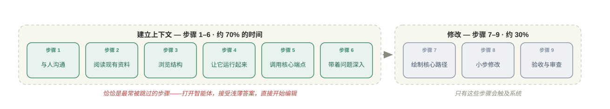
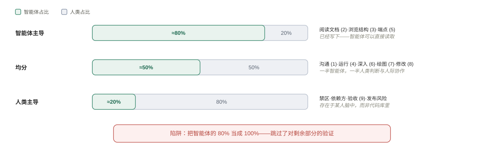
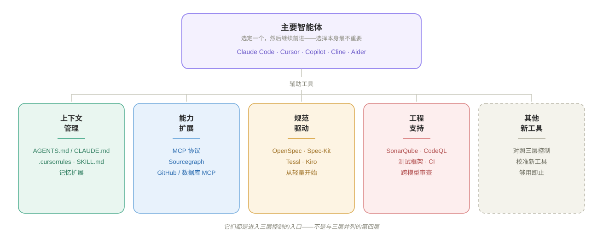
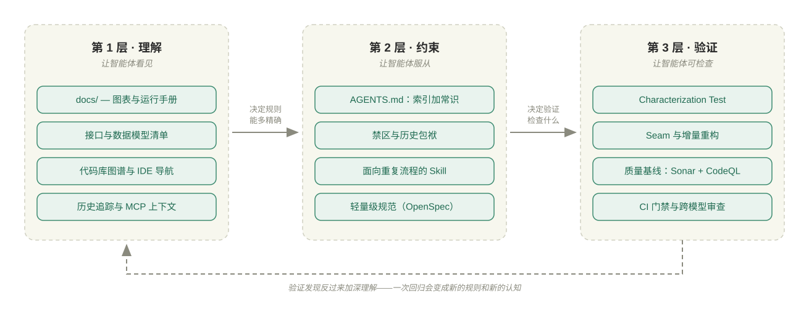
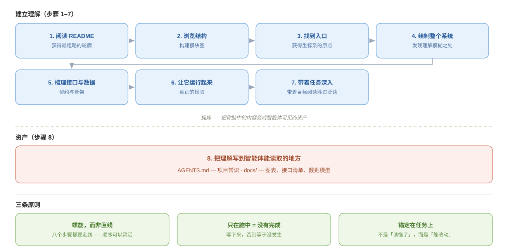
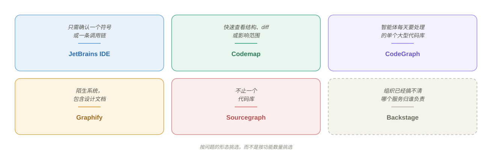
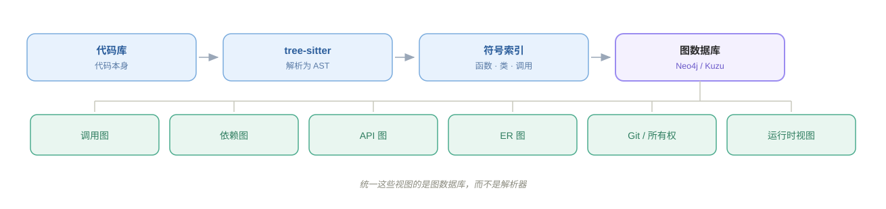
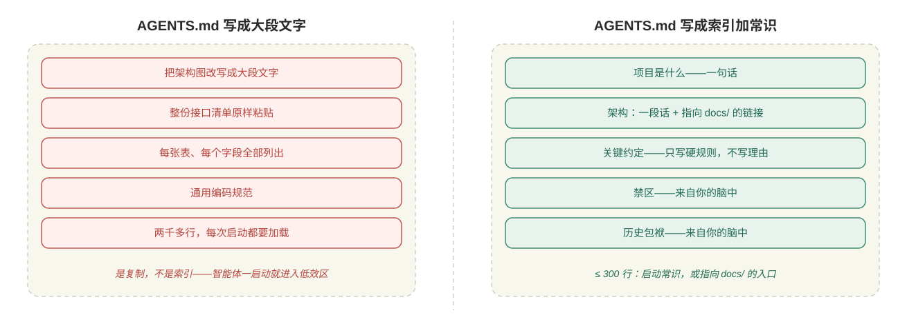
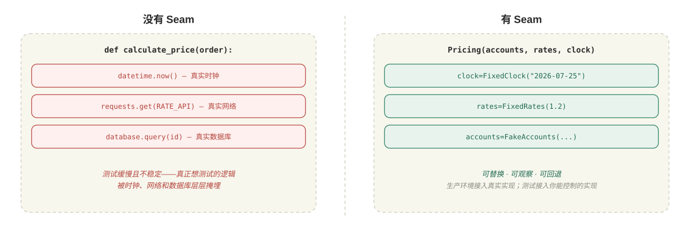
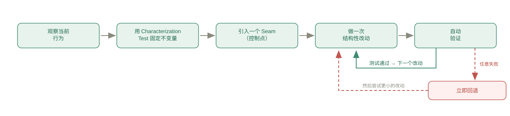

# 接手老代码库

Last updated: 2026-07-28

> *在新项目中，瓶颈在于智能体能做什么。在老项目中，瓶颈在于你能传递什么。*

大多数关于编程智能体的建议，都假设代码库是你亲手编写的，或者规模小到足以装进脑中。真实工作却恰恰相反：系统早于你存在，其中的设计决策源自无人记录的理由。

工具不是本章的重点。重点是**借助工具构建上下文**。因此，本章先讲理论，再将工具附着其上：每一层控制都先说明它要解决的问题，再介绍为其服务的工具和提示词。

| 章节 | 理论 | 配套工具 |
| --- | --- | --- |
| 为什么老代码更难处理 | 把智能体视为缺少上下文的实习生；三种债务 | —（仅作为心智模型） |
| 交接路径 | 人类接手系统的九个步骤；三档分工 | 职责表 |
| 三层控制 | 理解 → 约束 → 验证 | 本章框架 |
| 理解层 | 构建上下文的八个步骤 | 智能体辅助阅读、图表生成、接口与数据模型资产、传统 IDE、代码库图谱、历史追踪、MCP 扩展 |
| 约束层 | Harness engineering | `AGENTS.md`、Skill、轻量级规范驱动开发 |
| 验证层 | 在智能体输出之外建立基线 | Characterization Test、Seam、测试框架、质量与安全监测、CI 门禁、跨模型审查 |

---

## 为什么老代码更难处理

### 智能体编程更快，理解代码更加重要

在老代码库中，智能体不是「更强的开发者」，而是**缺少上下文的实习生**。这名实习生的编码能力或许远胜于你：打字更快、算法更强、记住的开源模式更多。但它有一个致命缺口：对*这个*系统一无所知。

适用于实习生的做法同样适用于这里。先带它熟悉项目，告诉它哪些地方绝不能碰，交给它小而明确的任务，每一步都审查后再继续。

这会重新定义整个问题。限制因素不是智能体的能力，而是**你能传递多少自己的理解**。

如果把复杂系统完全交给智能体开发，理解债务只会越积越多，其他债务也会随之而来。

| 债务 | 含义 |
| --- | --- |
| **理解债务** | AI 编写代码的速度与团队真正理解代码的速度之间的差距。智能体写得越多，差距就越大。 |
| **验证债务** | 约 42% 的代码由 AI 辅助编写，96% 的开发者并不完全信任智能体输出，而每次都做审查的只有 48%。结果是：测试通过，diff 看起来没问题，生产环境却崩了。 |
| **棕地税** | 智能体在老系统上特有的三种失败方式：上下文窗口越满，输出质量越差；昨天会话中的决策到今天已经消失；由于智能体看不到旧代码*为何*形成现在的样子，它提出的「现代化」建议与现有架构并不兼容。 |

三者都指向同一件事：**老系统工作的难点不在于编写代码，而在于建立并维持上下文。**

> [理解债务 — Addy Osmani](https://addyosmani.com/blog/comprehension-debt/)
> [Sonar 代码现状开发者调查](https://www.sonarsource.com/state-of-code/)

---

## 人机协作的重要性

在引入智能体之前，先看看人类究竟如何接手一个陌生系统。顺序从来不变：**先建立上下文，再修改。**

1. **与人沟通。** 列出代码中所有你无法解释的内容，然后询问产品、架构师和运维人员。标出仍然未知的部分。
2. **阅读现有资料。** README、`docs/`、wiki、聊天记录、旧工单。目的不是掌握一切，而是感受系统的大致轮廓。
3. **快速浏览结构。** 模块布局、核心与工具模块、旧代码与新代码。不要逐行阅读。
4. **让系统运行起来。** 这往往比预想中更难：依赖版本、中间件、VPN、凭证。但断点和日志带来的理解完全是另一个量级。
5. **调用核心端点。** 证明系统确实能工作，观察真实输入输出，复现一个真实问题。
6. **带着未解问题深入代码。** 此时你读的每个文件都是*带着目的*读的。
7. **绘制核心路径。** 从入口到出口、表关系、外部依赖。只有画到纸上，系统才真正进入你的脑中。
8. **小步修改。** 做一次改动，验证，确认没有副作用，再做下一次。
9. **验收。** 检查主流程，运行真实业务场景，请人类审查。

步骤 1–6 全都属于理解；只有 7–9 会触及系统。**大约 70% 的时间都花在理解上。** 而最常被跳过的恰恰是步骤 1–6：打开智能体，问一句「这个项目是做什么的」，接受一个浅薄的答案，然后开始编辑。等系统出问题后，再把责任归咎于工具。



边界不取决于智能体能完成多少工作，而取决于**答案是否存在于智能体能够读取的信息中。**



| 档位 | 智能体占比 | 步骤 | 共同特征 |
| --- | --- | --- | --- |
| **智能体主导** | ~80% | 阅读文档（2）、浏览结构（3）、枚举端点（5） | 已写入代码或文档，智能体可以直接读取 |
| **均分** | ~50% | 与人沟通（1）、运行系统（4）、深入代码（6）、绘制路径（7）、实施改动（8） | 智能体完成一半；另一半需要人类判断或人际协作 |
| **人类主导** | ~20% 或更少 | 决定哪些地方绝不能碰、识别依赖方、最终验收（9）、判断发布风险 | 答案存在于某个人的脑中或工程判断里，而不在代码库中 |

这与[人机协作模式](../02-anatomy/human-agent-collaboration-modes.md)中的通用分工相呼应；老系统工作的不同之处，在于第三档所占比例大得多。

危险的失败并不是智能体只完成了 80%，而是**人类把 80% 当成 100%**，跳过了对其余部分的验证。

一个具体例子是：让智能体查看一个调度服务，阅读 README、梳理结构、统计端点、列出数据表，半小时内便得到一份完整的项目摘要。然后让它重写一个批处理任务。测试通过，生产环境却在一个分支上崩溃了，那个分支旁的注释写着 `// don't delete, the downstream integration needs this`。

那 80% 本身没有问题。问题在于忘记了另外 20% 的存在：历史背景、默契、未记录的契约。**一项改动即使能够运行并通过测试，仍可能违反一份从未写下的真实业务契约。**

---

## 为智能体引入上下文

将智能体引入老系统会产生三个具体问题：

1. **智能体只能看到你交给它的文件。** 未记录的旧端点和默认约定对它完全不可见。
2. **智能体会擅自发挥。** 你要求做一个小改动，它却顺手重构邻近的旧代码，因为没人告诉它哪些地方禁止触碰。
3. **你无法检查智能体的输出。** 它画的架构图正确吗？你凭什么相信它？

三个问题对应三层控制，也决定了本章其余内容的顺序：

| 层 | 解决的问题 | 一句话概括 | 产物与工具 |
| --- | --- | --- | --- |
| **理解** | 上下文问题 | 让智能体**看见** | `docs/`、架构资产、传统 IDE、代码库图谱（CodeGraph、Graphify、Codemap）、图表生成器、MCP 扩展 |
| **约束** | 擅自发挥 | 让智能体**服从** | `AGENTS.md`、Skill、单次任务指令、轻量级规范（OpenSpec、Spec-Kit） |
| **验证** | 输出不可信 | 让智能体**可检查** | Characterization Test、Seam、SonarQube/CodeQL、CI 门禁、跨模型审查 |

Claude Code、Cursor、Copilot、Cline、Aider、Windsurf 等工具都只是进入这三层的入口，并不是与它们并列的第四层。IDE 形态的工具适合贴着代码工作；CLI 形态的工具适合大型代码库和终端工作流，也更契合多数老系统工作。**选定一个主要智能体，然后继续向前**。工具选择远不如围绕它构建的这三层重要；比较不同工具是[第 1 章](../01-prompt/how-agents-change-dev.md)的任务，不是本章的任务。



**三层形成一条链**

- **理解决定约束。** 约束的精确程度不会超过你的理解程度。如果你还没理清模块图，就无法写出「这个模块不得依赖那个模块」。
- **约束决定验证。** 如果约束写明「核心端点的响应结构不得改变」，验证就会检查响应结构。如果没有写，验证就不会关注。
- **验证反过来加深理解。** 某个边界场景出现回归，说明这段代码还负责那个场景，于是它会成为 `AGENTS.md` 中的新规则。

**如果理解层过于薄弱，另外两层就建立在空气上。**



---

## 第 1 层：理解——让智能体看见

老系统的上下文远不止代码：项目的用途、核心业务场景、架构组织方式、关键模块、内外部接口、表关系、字段语义，以及那些完全存在于代码之外的约定（「这里不要动」）。其中一些在代码库里，一些在 README 或 wiki 中，**还有一些只存在于人的脑中**。

理解工具扩大了智能体的视野。代码搜索和 LSP 覆盖单个代码库；Sourcegraph 覆盖跨代码库的符号与引用；GitHub/GitLab 和数据库 MCP 服务器则把历史、数据与外部系统带入上下文。但这些都无法取代人类提供默认规则。

### 构建上下文的八个步骤

| 步骤 | 行动 | 目的 | 去哪里查找 |
| --- | --- | --- | --- |
| 1 | 阅读 README 和根目录文档 | 不是为了理解，而是获得最粗略的轮廓：系统做什么、在哪里运行、核心概念有哪些 | — |
| 2 | 浏览项目结构 | 构建一张**模块图**：有多少部分、各自做什么、哪些是核心、哪些是外围。不要深入代码细节 | Java：`pom.xml` 中的模块。Go：`cmd/`、`internal/`。TypeScript：`packages/` 或顶层 `src/`。也可以自动生成，参见下文的*自动绘制代码库地图* |
| 3 | 找到核心入口 | 入口是用户与代码首次接触的位置；找到它，就有了坐标系的原点 | HTTP 服务：控制器和 `main`。定时任务：注册调度的位置。队列：消费者和监听器 |
| 4 | 绘制整个系统 | 把零散知识变成一张图。重点不在精确，而在于**动手画出来**，因为你会立刻发现自己在哪些地方理解模糊 | 参见下文的*图表* |
| 5 | 梳理接口与数据模型 | 接口是**外部契约**；数据模型是**内部骨架** | 参见下文的*接口与数据模型* |
| 6 | 让环境运行起来 | 运行才是真正的检验。断点、日志和复现会让理解产生质的跃升 | — |
| 7 | 带着具体任务深入代码 | 停止泛读。有目标地阅读，比没有目标地阅读高效百倍 | 参见下文的*传统 IDE 与代码导航*、*代码库图谱*与*历史追踪* |
| 8 | 把理解写到智能体能读取的地方 | 仅仅自己想清楚还不够，智能体也必须能够读取 | 参见下文的*第 2 层* |

八个步骤只有一个目的：**把你脑中的内容转化为智能体可见的资产。**



### 如何用智能体辅助理解

面对一个陌生的开源项目，「理解它」并不意味着逐行阅读，更不意味着已经准备好提交 PR。现阶段的目标是获得**足以开始拆解需求的顶层理解**：项目解决什么、不解决什么；原生具备哪些能力；如何扩展；关键运行机制是什么；以及哪些部分必须由你自己构建。

让智能体辅助阅读真正奏效，需要两件事：

1. **带上你自己的拆解框架。** 它决定你问什么。智能体擅长检索证据并填充框架，却无法替你判断哪些结论对当前任务重要。
2. **提问时附上具体任务。** 它决定你如何发问。同一个问题孤立地问，只会得到功能导览；结合任务来问，智能体才会筛选、比较并暴露缺口。

#### 四维框架

工程师对陌生项目所需的最低限度完整理解，可以拆成四个维度：

| 维度 | 要回答的问题 | 输出 |
| --- | --- | --- |
| **定位与边界** | 它解决什么问题、明确拒绝解决什么问题、与同类工具是什么关系？ | 一句话定位、适用场景、明确边界 |
| **原生能力** | 开箱即用的内容有哪些、无需编写代码即可使用什么、覆盖深度如何？ | 能力清单，分为支持 / 部分支持 / 不支持 |
| **扩展模型** | 扩展机制是什么、扩展点是什么样、开发范式是什么？ | 扩展点地图、最小骨架、必须编写的代码类型 |
| **内部机制** | 如何启动和运行、如何管理状态、有哪些集成面？ | 进程模型、状态模型、配置与集成 |

这四个维度并不是项目知识的终点，而是拆解需求前所需的脚手架。先让智能体快速填出初稿，再根据官方文档纠正和补全。


#### 结合任务提问

同一个问题孤立地问，只会得到功能导览；带着具体任务来问，智能体才会筛选、比较并暴露缺口。

例如，围绕同一个任务，依次提出三个问题：

1. **定位、边界与运行机制。** 「这是我的任务。请阅读 README、架构文档和 `src/` 顶层目录，用一句话说明这个项目的用途、它明确*不*解决什么、它实际如何运行，以及它的方向是否与我的任务一致。不要复述营销文案。」
2. **对照清单判断原生能力。** 「我的任务需要这七项能力。请逐项说明它是直接支持、通过配置可部分支持，还是不支持而需要我自行构建。然后估算我需要编写多少代码。」
3. **真正的扩展点。** 「我主要要编写的是 `Skill` 吗？如果是，请阅读文档和示例，给出最小骨架，以便我估算工作量。」

每个问题承担不同职责。第一个问题在深入实现前建立地图，其中**边界**比能力清单更重要，因为它把「能用 / 不能用」转化为更可执行的判断：*方向一致，但这个项目只是骨架；真正的工程工作位于它未覆盖的部分。*

第二个问题迫使智能体对照需求作出取舍，而不是再次罗列功能。由此往往能得出一条实用的设计规则：**在代码中生成结构化数据，把叙述交给 LLM。** 如果模型生成的 JSON 要由下游程序解析，字段名和嵌套结构就会漂移。工具应负责稳定的 schema；LLM 应负责摘要和建议。

第三个问题最容易被问错。注意，它采用的是*问题*形式，而不是「我需要编写一个 Skill」这一假设。正是这种开放式问法，让智能体有机会纠正你的前提。在这个例子的真实出处中，业务能力应该放在**工具**里，而不是 Skill 里。如果把工作拆成「写一个庞大的 Skill」，业务逻辑就无处安放。

**扩展点问题始终要保持开放。** 一旦先入为主地假设了形态，你甚至会在写第一行代码之前就把工作拆错。

#### 回到官方文档

智能体辅助阅读速度快，但理解零散，并会在总结时丢失细节。官方文档系统完整，却不适合作为首次接触时从头到尾啃完的入口。更有效的顺序是：

1. **框架。** 使用四个维度和一个具体任务，让智能体建立顶层地图，标出已知、未知与边界。
2. **官方文档。** 带着地图系统阅读。此时的标准只是「大致理解，知道它存在」。
3. **拆解后再次返回。** 模块、接口和工作量拆清后，再回到相关文档确认具体约束与实现细节。

三轮阅读的价值在于：第一轮为文档建立索引；第二轮补上智能体摘要遗漏的内容；第三轮把知识转化为设计决策。标准始终是**足以拆解下一个需求**，而不是假装自己已经精通。

### 用好图表

图表是对代码事实的可检查视图。接手老系统时，优先画下面四张图；**一张图只回答一个问题，每个节点和关系都必须能追溯到代码、配置、数据库或运行时证据。**

| 图 | 回答的问题 | 注意点 | 提示词（怎么画） |
| --- | --- | --- | --- |
| **架构图** | 系统由什么组成，边界在哪里？ | 先说明是逻辑视图还是部署视图；只画服务、存储、外部系统和主要数据流，超过一屏就拆图 | `阅读部署配置、服务入口和基础设施代码，画系统逻辑架构图。区分内部服务、存储与外部系统，标出主要数据流；无法验证的节点或关系标为 unverified。输出可编辑源文件和 SVG。` |
| **模块依赖图** | 修改这个模块会影响谁？ | 以构建配置和真实 import 为准；默认排除第三方库；突出依赖方向与循环依赖 | `阅读构建配置和 import，从 [目标模块] 向外追踪一层直接依赖和被依赖关系。只画内部模块，箭头指向被依赖方，突出循环依赖；不要根据目录名猜测。` |
| **时序图** | 一次请求或事件如何流转？ | 明确入口与终点；先画主路径，再补重试、异步消息和失败补偿；调用名称必须来自代码 | `从 [入口] 追踪到 [终点]，阅读控制器、服务、客户端及消息生产/消费代码。按调用顺序画时序图，用真实类名和方法名标注调用，区分同步与异步，并保留重试和失败补偿。` |
| **ER 图** | 数据之间如何关联？ | 先确定 DDL、迁移或运行时 schema 中谁是权威来源；区分物理外键与代码维护的逻辑关系 | `以 [DDL/迁移/运行时 schema] 为权威来源，结合 ORM 和查询代码，画核心表 ER 图。标出主键、外键、基数；逻辑关系使用虚线，来源冲突或无法确认的关系标为 unverified。` |

通用检查只有三项：图是否回答了预定问题，所有元素是否有证据，导出后的文字、连线和对比度是否清晰。将可编辑源文件与导出文件一起放入 `docs/`，并记录范围、证据和日期。

#### 只向 Agent 推荐 Skill 与 MCP

优先选择 **Skill**：它把选图、取证、生成和检查固化成完整流程。需要接入既有画图生态、交互式编辑器或渲染后端时，再选择 **MCP Server**。

**Agent Skill**

| 工具 | 核心能力 | 输出 |
| --- | --- | --- |
| [**tt-a1i/archify**](https://github.com/tt-a1i/archify) | 生成架构、工作流、时序、数据流和生命周期图；支持视觉预设、主题与交互 | HTML / PNG / SVG / WebM |
| [**Agents365-ai/mermaid-skill**](https://github.com/Agents365-ai/mermaid-skill) | 支持 11+ 图类型，包含验证循环与视觉自检，可使用 mmdc 或 Kroki | Mermaid / PNG / SVG / PDF |
| [**WH-2099/mermaid-skill**](https://github.com/WH-2099/mermaid-skill) | 支持 23 种 Mermaid 图类型，并自动同步官方文档 | Mermaid 代码块 |
| [**mgranberry/mermaid-diagram-skill**](https://github.com/mgranberry/mermaid-diagram-skill) | 强调论证结构、视觉验证循环和品牌主题 | HTML / SVG / PNG |

**MCP Server**

| 工具 | 核心能力 | 输出 |
| --- | --- | --- |
| [**excalidraw/excalidraw-mcp**](https://github.com/excalidraw/excalidraw-mcp) | 手绘风格白板图、流式渲染和交互式编辑 | Excalidraw JSON / SVG |
| [**jgraph/drawio-mcp**](https://github.com/jgraph/drawio-mcp) | 官方 draw.io MCP，支持 App、Tool 和 Plugin 三种模式 | draw.io XML / PNG / SVG / PDF |
| [**likec4/likec4**](https://github.com/likec4/likec4) | C4 架构即代码，通过 20+ 工具查询模型 | 交互式视图 / 静态导出 |
| [**lgazo/drawio-mcp-server**](https://github.com/lgazo/drawio-mcp-server) | 程序化控制 draw.io，支持浏览器编辑、多页和图层 | draw.io XML / SVG / PNG |
| [**structurizr/mcp**](https://github.com/structurizr/structurizr) | C4 模型的 DSL 验证、解析、渲染与导出 | Structurizr DSL / PlantUML / Mermaid |
| [**veelenga/claude-mermaid**](https://github.com/veelenga/claude-mermaid) | Mermaid 实时预览、自动刷新与多格式导出 | SVG / PNG / PDF |
| [**infobip/plantuml-mcp-server**](https://github.com/infobip/plantuml-mcp-server) | PlantUML 生成、编码与解码 | SVG / PNG URL |
| [**i2y/d2mcp**](https://github.com/i2y/d2mcp) | D2 图表生成，支持增量编辑 API | SVG / PNG / PDF |
| [**h0rv/d2-mcp**](https://github.com/h0rv/d2-mcp) | D2 编译、验证与渲染，适合 Docker 环境 | PNG / SVG / ASCII |
| [**aescanero/mcp-kroki**](https://github.com/aescanero/mcp-kroki) | 通过统一 API 渲染 PlantUML、Mermaid、Graphviz、D2、BPMN 等 27+ 图表类型 | SVG / PNG / PDF / JPEG |

### 梳理接口与数据模型：先找到契约

接口是项目向外界承诺的**契约**；数据模型则是这份契约流经并最终落地的**骨架**。二者应一起梳理，因为一次接口变更通常会同时影响 DTO、业务逻辑与数据库。

| 资产 | 内容 | 建议产物 |
| --- | --- | --- |
| **接口清单** | 方法、路径、用途、认证、主要参数、返回结构、调用方 | `docs/api-list.md` |
| **数据模型说明** | 实体、DTO、表字段、键、枚举、显式与隐式关系 | `docs/data-model.md` 加 ER 图源文件 |

 操作流程

1. **确定证据。** 对于接口：先看 OpenAPI 和路由注册，再看控制器、DTO、认证与中间件。对于数据：先看数据库 schema 和迁移，再看 ORM 定义、DTO 与查询代码。
2. **起草清单。** 按业务模块组织接口，分开记录外部 REST、内部 RPC 与管理端端点。持久化实体和传输 DTO 也要分开记录，不要合并成一个对象。
3. **对比各个来源。** 标出 OpenAPI 与代码不一致之处，以及 DDL 与 ORM 不一致之处。字段以物理 schema 为准；端点是否可用以运行时验证为准。
4. **补充隐式关系。** 从查询方法、消息处理器和业务代码中恢复没有外键的逻辑关联，也要补上从未写入规范的调用方与兼容性约束。
5. **抽查。** 对比每个模块的路由数量，实际调用核心端点，对关键字段和 join 进行抽样检查。完成后才能提交到 `docs/`。

提示词与陷阱

```text
Map this project's interfaces and data model. First list the modules and
evidence sources you will scan, then start generating.

Interfaces: scan OpenAPI, routes, controllers, DTOs, and auth code, grouped by
business module. Separate external REST, internal RPC, and admin endpoints.
List method, path, purpose, auth, main parameters, and return shape.

Data: treat the actual schema and migrations as authoritative, cross-checked
against the ORM, DTOs, and query code. List primary keys, foreign keys, enums,
and logical associations, flagging anything inconsistent or unconfirmable.

Do not infer from naming. Output docs/api-list.md, docs/data-model.md, and an
editable ER diagram source file.
```

- **先让它声明扫描范围。** 在多模块项目中，遗漏模块是最常见的失败。生成内容之前，让智能体报告它发现了哪些模块、路由入口和迁移目录。
- **区分不同契约层。** 外部接口、内部 RPC、DTO、实体和数据库表承担不同职责，不应混在同一份描述中。
- **保留差异，不要统一。** 文档应暴露 OpenAPI、代码与数据库之间的缺口，而不是擅自代表项目「修复」它们。这些缺口可能完全真实：ORM 可能声明数据库表中不存在的字段（JPA 的 `@Transient`），而数据库表也可能包含没有任何映射的字段。
- **控制字段粒度。** 接口清单只列主要参数和返回结构；完整字段细节属于数据模型文档，不要两边都写。「返回一个 `Prompt` 对象」粗略到毫无用处，至少要说明返回单个还是列表，以及是否套在标准响应 envelope 中。
- **运行时结果优先。** 静态扫描生成初稿；实际路由、响应和数据库元数据才是最终检查依据。

#### 选择工具

应按证据可靠程度组合工具：**运行时和真实 schema 确立事实，代码扫描补充关系，文档工具负责呈现结果。**

| 工具或来源 | 最适合 | 优势 | 注意事项 |
| --- | --- | --- | --- |
| **OpenAPI / Swagger UI** | 接口清单的首要来源 | 结构化；路径、参数、响应与认证一目了然 | 规范可能过时；仍需对照路由和运行时检查 |
| **智能体 + `rg` / LSP** | 跨模块扫描控制器、DTO、调用链与隐式关系 | 将零散信息整理为业务层视图 | 容易漏掉动态路由或根据命名推断；务必明确扫描范围 |
| **Bruno / Postman / `curl`** | 验证核心端点并保存可重复请求 | 检查真实运行时行为 | 仅覆盖实际调用过的内容；无法替代完整清单 |
| **数据库元数据 / schema dump** | 确认真正的表结构 | 最接近数据库事实，如 `pg_dump --schema-only`、`mysqldump --no-data` | 仅含物理结构；看不到由代码维护的逻辑关系 |
| **SchemaSpy** | 从运行中的数据库反向生成 ER 图和字段文档 | 自动化程度高，适合大型现有数据库 | 需要数据库连接；隐式关系仍需人工补充 |
| **DBML / dbdiagram** | 维护可读、可 diff 的 ER 源文件 | 文本简洁，可与代码一起版本管理 | 通常需要从真实 schema 导入或手工同步 |
| **DBeaver / DataGrip** | 检查schema、数据与关系 | 浏览查询方便，适合交叉核对 | 输出不一定适合纳入 Git；无法替代 Markdown 说明 |

没有一个工具能同时恢复 API 契约、运行时行为和数据关系。可行的组合是 **OpenAPI + 智能体代码扫描 + 端点抽查**，以及 **schema dump + SchemaSpy/DBML + 人工补充隐式关系**。

### 由浅入深理解代码：导航、图谱与历史

在第 7 步，也就是带着任务深入代码时，应先区分三类问题：**传统 IDE 与代码导航**回答「定义和引用在哪里」，**代码库图谱**回答「较大范围内有哪些关系」，**历史工具**回答「为什么会形成现在的结构」。它们依次扩大上下文，但都不直接证明代码正确。

SonarQube、CodeQL 和 Coverity 等工具回答的是另一类问题：变更是否引入质量、安全或规范回归。它们已经属于验证层，而不是更深一档的代码理解工具。

#### 传统 IDE 与代码导航提供最直接的证据

> [Understand (SciTools) 概览](https://blog.csdn.net/haiyyang/article/details/6573544)

传统工具不应因为缺少「AI」标签而被忽略。对于单个符号或一条调用链，IDE 的语言索引通常比智能体生成的图谱更直接，也更容易回到源代码核对。

| 工具 | 最适合 | 优势 | 局限 |
| --- | --- | --- | --- |
| **JetBrains IDEs** | 在单个代码库中追踪定义、引用、类型和调用层级 | `Find Usages`、调用层级、类型层级、UML、依赖分析、数据库和 OpenAPI 工具集中在同一工作区 | 跨代码库能力有限；结果主要供人阅读，不适合智能体持续查询 |
| **VS Code + 语言扩展 / LSP** | 轻量级符号导航、引用查找和调试 | 语言覆盖广，容易沿用项目已有开发环境；GitLens 可补充逐行历史 | 深度取决于语言服务器和插件质量；架构视图较弱 |
| **Understand (SciTools)** | 对大型多语言遗留系统做静态结构分析 | 生成 UML、调用图和依赖图，并报告复杂度、耦合度与内聚度 | 商业工具；生成的指标仍需结合具体任务解释 |

先用 IDE 的定义跳转、引用查找和调用层级确认局部事实，再用代码库图谱扩大范围。**图谱适合告诉你下一步该读哪里，不适合替你读代码。**

#### 代码库图谱扩大范围，却不增加证据深度

代码库图谱把目录、import、符号、调用关系或周边文档压缩为可查询的派生上下文。它比逐文件浏览覆盖得更广，但信息通常比 IDE、源代码、运行时和质量门禁更浅；它回答的是「哪里可能相关」，不是「行为一定正确」。

下面三种开源工具经常被并列提及，也容易因名称相似而混淆：

| 工具 | 粒度 | 更新方式 | 覆盖范围 | 用途 |
| --- | --- | --- | --- | --- |
| **[CodeGraph](https://github.com/CodeGraphContext/CodeGraph)** | 函数级 | 增量更新，监控文件 | 仅代码 | 智能体在工作中*持续*查询的图谱。正在改动大型代码库时的首选 |
| **[Graphify](https://github.com/safishamsi/graphify)** | 符号与概念级 | 批量重建 | 代码**加**文档、PDF、图像 | 一次性侦察陌生系统，以及发现无人记录的耦合 |
| **[Codemap](https://github.com/JordanCoin/codemap)** | 文件与模块级 | 按需 | 目录结构、import、diff | 快速定位，以及编辑前检查影响范围 |

**Codemap** 从命令行回答结构问题：代码位于何处、文件如何连接、哪些文件 import 了指定目标、相对某个 ref 发生了哪些变更。

```bash
codemap --importers path/to/file .   # who breaks if I edit this
codemap --json --diff --ref main .   # what this branch actually touched
```

`--importers` 查询是风险编辑前成本最低的影响范围检查，应放在第 7 步中。依赖边模式要求 `ast-grep` 位于 `PATH` 中；即使没有它，仍能得到结构图和 diff 图。它还可以生成交接 payload，从实际层面解决棕地税中提到的跨会话遗忘：新会话可以从地图开始，而不必从零开始。但它的限制也很明确：只到文件级，无法告诉你哪个*函数*调用了哪个函数。

当智能体需要持续提问时，应选择 **CodeGraph**。它使用 tree-sitter 在本地构建函数级知识图谱，监控文件系统并增量更新，然后通过 MCP 暴露图谱，让智能体查询图谱而不是重复读取文件。对于大型代码库，这意味着上下文窗口不再被文件读取塞满，而能把预算花在实际任务上。它只处理代码，完全在本地运行，不摄取文档。

**Graphify** 追求的是更广而非更深：它构建一个持久、可查询的图谱，覆盖代码**以及**周边语料，如设计文档、PDF、图表。代码使用 tree-sitter 在本地解析，源代码不会离开机器；非代码材料则由 LLM 进行语义提取。以下特性使其值得付出设置成本：

| 特性 | 为什么对老项目重要 |
| --- | --- |
| **置信度标签** | 每个节点和每条边都标记为 `EXTRACTED`、`INFERRED` 或 `AMBIGUOUS`，让你能区分智能体的事实与猜测，这正是审查步骤所要求的纪律 |
| **多模态语料库** | 解释模块*为何*形成当前结构的设计文档通常不在代码中。这是此处唯一能同时读取二者的工具 |
| **上帝节点** | 自动标记连接过多的中心节点，通常也是修改风险最高的代码 |
| **意外连接** | 揭示无人预料的关系，而未记录的耦合往往就藏在这里 |
| **MCP 服务器** | 智能体直接查询图谱，使上下文消耗在代码库增长时保持平稳 |

与 CodeGraph 相比，它的取舍在于更新模型：Graphify 采用批量重建，所以适合侦察，而不是实时索引。

**Graphify 和 CodeGraph 是这一整层思维方式的自动化形态。** 本章教你如何让智能体逐步绘制架构、模块和依赖视图，而它们一次性完成这些工作，并留下可持续查询的结果。即使一个工具都不安装，也应内化置信度标签背后的原则：**智能体绘制的地图应明确哪些边是事实，哪些是推断。**

三者都适用同一个警告：图谱是派生上下文，而不是运行时事实。在断言行为前阅读源代码；把这些工具当作寻找值得阅读代码的手段，而不是阅读代码的替代品。

#### 历史追踪解释代码为何如此

`git log` 只是一条命令；它真正的「竞品」是**历史可视化与分析工具**：

- **GitLens (VS Code)**——在行内展示某一行由谁、何时、通过哪条提交信息修改。它是进入历史上下文最快的方式。
- **GitKraken / SourceTree**——图形化 Git 客户端；分支拓扑让项目演变清晰可读。
- **`git blame` / `git rebase -i`**——更细粒度地追踪变更与所有权。
- **Gitql**——用 SQL 风格查询 Git 历史，适合自定义分析。

历史工具在老项目中的真正价值是：**`git log` 中那些奇怪的提交，正是下文「历史包袱」章节的原材料。**

#### 不要寻找一体化的代码库图谱

**没有任何一个工具能同时把代码、API、ER、运行时、文档和图谱都做好。** 这些视图来自不同数据源，没有一种解析器能全部生成。

| 图谱 | 数据源 |
| --- | --- |
| 调用图 | AST / LSP |
| 依赖图 | import / package |
| API 图 | OpenAPI / 框架路由 |
| ER 图 | 数据库 schema / ORM |
| 运行时图 | trace / 日志 |
| 所有权图 | Git / `CODEOWNERS` |
| 知识图谱 | 以上全部融合 |

有几种方案接近一体化，但没有一种真正到达：

| 方案 | 覆盖范围 | 缺失 |
| --- | --- | --- |
| **[CodeGraph](https://github.com/CodeGraphContext/CodeGraph)** | 函数级代码图谱、增量更新、MCP 原生，是最接近智能体可查询实时索引的方案 | 仅代码：没有文档、ER、运行时和服务目录 |
| **Sourcegraph** | 符号、调用图、引用、跨代码库、文档、搜索、embedding、AI。多数时候能回答「谁调用 X」「这个 API 在哪里」「它会碰哪张表」 | 无 ER 图；架构图质量一般；无运行时 |
| **[Graphify](https://github.com/safishamsi/graphify)** | 将代码与文档融合为一张可查询图谱，带有置信度标签和 MCP 服务器 | 批量重建而非实时索引；没有服务目录或运行时视图 |
| **Backstage** | 企业服务目录：代码库 → 服务 → API → 数据库 → 仪表盘 → 所有者。架构视图强大 | 不是代码图谱；代码级粒度不够细 |
| **Neo4j + 自定义代码图谱** | 代码库 → 解析器 → Neo4j → 图谱 → AI。效果最佳 | 维护成本最高 |

应根据问题的形态选择，而不是根据功能数量选择：

- **只需确认一个符号或一条调用链** → JetBrains IDE。直接使用语言索引，不必先构建图谱。
- **需要快速查看目录、diff 或文件级影响范围** → Codemap。按需运行，成本最低。
- **智能体每天都要处理的单个大型代码库** → CodeGraph。实时、函数级、通过 MCP 查询。
- **动手前需要理解的陌生系统** → Graphify。它也会读取设计文档。
- **多个代码库** → Sourcegraph。没有其他工具擅长跨代码库。
- **不知道每个服务由谁负责的组织** → Backstage。这是目录问题，不是代码问题。



**更好的路径是统一数据层**，而不是一体化工具：



统一这些视图的是**图数据库，而不是解析器。**

对于智能体辅助编码，只有少数工具值得长期保留：

| 工具 | 原因 |
| --- | --- |
| **CodeGraph** | 智能体工作时查询的实时图谱，是大型代码库中降低上下文消耗的最大杠杆 |
| **Graphify** | 跨代码*与*文档的侦察，带置信度标签 |
| **Codemap** | 编辑前进行低成本结构查询和影响范围检查（`--importers`） |
| **Sourcegraph** | 当一个代码库不够时，提供跨代码库的符号与引用 |
| **tree-sitter** | AST，几乎所有上述工具的底层基础 |
| **SchemaSpy 或 DBML** | 自动生成数据库 ER 图，这是代码图谱工具没有覆盖的部分 |

其他所有工具，如 OpenAPI 生成器、Madge、ctags、Doxygen、dependency-cruiser、Graphviz，都可以按需运行。

**最终状态是一个统一的 `repo-intelligence` 入口。** 目标是为智能体提供一个接口，而不是装着六种工具、每次都要逐个告诉它的抽屉。首次进入代码库时，它会：

1. 构建**符号索引**（函数、类、接口）。
2. 构建**调用图**和模块依赖。
3. 解析 **OpenAPI** 与 ORM，推导 API 和 ER 信息。
4. 输出经过验证的 HTML 或 Mermaid 架构图。
5. 缓存所有结果，供每个智能体共享，包括调试、审查、重构与架构工作。

目前最接近开箱即用方案的是通过 MCP 使用 CodeGraph 或 Graphify，再加一个图表生成器；缺口主要在数据库侧。无论如何，原则都成立：**为智能体提供一个入口，在底层调用 tree-sitter、LSP 和 SchemaSpy。** 这比寻找并不存在的万能工具更可靠。

### 使用 MCP

代码库图谱覆盖代码。老系统的其余上下文存在于智能体默认无法看到的系统中，而 **MCP** 是连接这些系统的标准。应把它理解为基础设施，而不是一项功能；机制详见[工具、MCP、CLI 等](../02-anatomy/MCP.md)。

| 扩展 | 带入上下文的内容 | 为什么在这里重要 |
| --- | --- | --- |
| **GitHub / GitLab MCP** | PR、issue、审查历史、分支状态 | 奇怪代码背后的*原因*通常在 PR 讨论或工单里，而不在注释中 |
| **数据库 MCP** | 实时 schema、受控查询 | 解决数据模型步骤中反复出现的 DDL 与 ORM 分歧 |
| **Sourcegraph** | 跨代码库符号、引用、定义 | 老系统一旦超过一个代码库，就不可或缺 |
| **Zoekt** | 快速三元组代码搜索 | Sourcegraph 的搜索引擎；若只需要速度而不需要整个平台，也可独立使用。没有符号级分析 |

应审慎授予这些权限。把具有写权限的数据库连接交给一个正在处理陌生代码的智能体，其影响范围远大于一次错误重构。

---

## 第 2 层：约束——让智能体服从

理解层让智能体看见项目，但**看见不等于服从**。智能体会按照自己知道的最佳实践编写代码，而老系统中充满了因历史原因而存在的内容。约束层写明哪些不能改、应该如何改，以及结果应是什么样，让智能体在你划定的边界内工作。

约束分为两类：

| 类型 | 存放位置 | 示例 | 特点 |
| --- | --- | --- | --- |
| **静态** | `AGENTS.md`、`SKILL.md` | 「这个类是兼容层，任何改动都必须保留方法签名。」「编辑时只修改任务范围内的文件。」 | 长期投入；编写一次，反复使用 |
| **动态** | 本次任务给出的指令 | 「只修改这三个文件。」「编辑前先向我确认方案。」「不确定时停止并提问。」 | 每次都需要，不能省略 |

Anthropic 将这种为智能体构建约束的实践称为 **harness engineering**，其中 *harness* 指马具。

### 静态约束

不同智能体读取不同文件，这一点在老项目中比在新项目中更重要：你花一个月挖掘出的规则，不应被锁死在碰巧最先使用的某个工具里。

| 文件 | 读取方 | 范围 |
| --- | --- | --- |
| **`AGENTS.md`** | Cline、Aider 及越来越多的其他工具；正在形成的跨工具约定 | 可移植的项目规则。如果多个智能体都会接触代码库，从这里开始 |
| **`CLAUDE.md`** | Claude Code | Claude 生态中的事实标准；内容相同，只是文件名针对特定工具 |
| **Cursor 规则文件** | Cursor | 原生、零配置，但仅限 Cursor |
| **`SKILL.md`** | Claude Code 及兼容智能体 | 不是项目事实，而是一套流程。每个重复工作流对应一个文件 |

实际操作中：**只维护一个事实来源，让其他文件指向它。** 内容才是昂贵的部分，文件名不是。格式细节与分层记忆模型详见[智能体记忆文件](../01-prompt/agents-md.md)。

这些文件都没有解决一个缺口：**跨会话记忆**，也就是棕地税中的第二种失败。规则文件会在每次会话重新加载，但会话*期间*得出的决策不会保留。已有持久记忆扩展（常见的是 Cline 的 memory bank），Codemap 的交接 payload 也承担类似作用。低技术含量的办法同样有效，也是本章反复强调的做法：**在会话结束前，把决策写入 `docs/` 或规则文件，否则就等于没有发生。**

#### 什么时候使用 SDD

规范驱动开发也属于这一层。但老项目很少拥有完整规范，**仅仅为了满足工具而给整个系统补写规范并不值得**，应只为当前变更编写轻量级规范。

| 工具 | 重量 | 适用场景 |
| --- | --- | --- |
| **OpenSpec** | 最轻 | 局部棕地变更；扩展现有 OpenAPI 设置，而不是取代它。老系统工作的默认选择 |
| **Spec-Kit** | 中等 | 开源且不绑定厂商，但需要自行组装流水线。流程较重，更适合从零到一 |
| **Tessl** | 中等 | 契约优先：接口规范生成两端。适合遗留问题集中在 API 边界频繁变化的系统 |
| **Kiro (AWS)** | 最重 | 端到端规范 → 代码 → 测试，与 AWS 深度绑定。这是标准化决策，而不是单次变更工具 |

该表的顺序大致就是在现有系统中尝试它们的顺序。本级别另有一章会深入讨论规范编码。

> 本节的 `AGENTS.md` 和 Skill 内容参考《Claude Code 企业级老项目改造实战》第 10–11 讲：[老项目的 CLAUDE.md 怎么写？从五份资产到一份项目常识](https://time.geekbang.org/column/article/976338)

### 老项目的 `AGENTS.md`：索引加常识

为新项目编写智能体记忆文件很容易：代码由你编写，规则也由你制定。老项目则不同。你继承了它，许多设计决策背后的原因尚未厘清。如果根据零散印象编写，文件要么空泛，要么错误，要么不完整。

**对于老项目，正确做法不是从零编写，而是从已有资产中提炼。** 理解层产生的五份资产——架构图、模块图、依赖图、接口清单、数据模型——不只是笔记，而是编写该文件的**前提条件**。

最常见的错误是写得太多：用文字复述架构图、抄入完整接口清单、列出每张表的每个字段。数千行内容在每次启动时加载，把智能体推入低效区。**在老项目中，该文件的职责是「索引加常识」**：索引指向 `docs/` 中的细节；常识是智能体启动时必须立即知道的内容。超过 300 行，就写得太多了。



关于编写该文件的通用原则，如渐进式披露、具体性、分层文件，参见[智能体记忆文件](../01-prompt/agents-md.md)。以下内容专门针对老项目。

| 应包含的内容（6 类） | 写法 |
| --- | --- |
| **项目是什么** | 一句话 |
| **核心架构** | 一段话加 `docs/architecture.svg` 链接。不要用文字重写图表 |
| **关键模块** | 一张小表格，每个模块用一句话说明职责；详细依赖放在 `module-deps.svg` 中 |
| **关键约定** | 只写硬规则，不写理由。「所有 REST 响应都包装在 `Result` 中。」「数据库字段使用 snake_case，Java 字段使用 camelCase」 |
| **如何运行** | 一句话加 `docs/` 中 runbook 的链接 |
| **禁区**与**历史包袱** | 老项目的灵魂，见下文 |

**排除 5 类内容：**完整架构细节（那是 `architecture.svg` 的职责）、完整接口清单（`api-list.md` 已经在 `docs/` 中）、完整数据模型（同理）、通用编码规范（并非项目特有，只会稀释重点）以及背景故事（智能体无需了解项目起源神话也能工作）。

**规则是：**文件中的每一行要么是「智能体启动时必须具备的常识」，要么是「进入 `docs/` 的入口」。其余内容全部删除。

**生成初稿的提示词：**阅读 `docs/` 下的所有资产，生成一份初稿，包含项目是什么、核心架构、关键模块、关键约定、如何运行，并添加两个空章节：禁区与历史包袱。不要复制架构图、接口清单或数据模型的细节，而要链接到 `docs/` 中的对应内容。

这段提示词能够奏效有三个原因。「阅读 `docs/` 下的所有资产」让智能体根据真实产物提炼，而不是凭空创造。「链接到 `docs/`」阻止它把图表改写为文字。而**「两个空章节」才是关键动作**：智能体预留位置却不填充，因为它无法产出真正的内容，只会编造或泛化。

生成的初稿有三个陷阱：

- 智能体用文字描述 `architecture.svg` 并放进「核心架构」。看到冗长的模块说明时，要求它「压缩为一句话加一个链接」。
- 「关键约定」变成了泛泛之谈（「代码应包含注释」）。让智能体从项目的实际代码风格中推断硬规则，而不是抄写通用手册。
- 智能体热心地填满了两个空章节。告诉它：「禁区和历史包袱留给我填写，不要猜测。」

### 挖掘业务上下文

智能体生成的记忆文件绝不会包含真正有价值的禁区与历史包袱，因为**这些信息不在代码中，不在 `docs/` 中，只在你的脑中。** 正是这两个章节区分了老项目与新项目的记忆文件。

**禁区**——哪些代码不能移动、哪些字段存在外部依赖方、哪些配置变更会引发事故：

- `external_key` 字段，位于 `server-core/PromptEntity`：某 SDK 客户将其用作缓存键。删除或重命名会直接破坏该 SDK。不要重构。
- `nacos.server-addr` 的默认值，位于 `application.yml`：部分企业用户依赖它做分阶段发布。修改前必须公告。
- 路径 `POST /api/prompts/search` 曾向社区公开。修改会破坏外部调用方。可以增加同义端点，但不能删除原端点。

**历史包袱**——看似错误、实则有其原因的内容：

- `Dataset` 和 `DatasetItem` 表看起来重复。它们来自 2024 年的一项实验功能；功能已经下线，但数据仍被保留。不要删除这些表。
- 前端 `PromptTemplate.vue` 使用 Vue，而不是 React。这是早期留下的老代码；管理端其余部分使用 React。这是例外，不要「顺手」统一。
- `LegacyEvaluatorAdapter` 看起来一团糟，因为它要同时支持三个旧 API。1.0 之后的代码使用 `EvaluatorV1`。

**为什么这两个章节的价值是其篇幅的百倍：**每一行都代表智能体永远无法推断的信息，只能通过询问原作者或踩坑来得知。写下禁区后，智能体会绕开它们。解释历史包袱后，它不会出于整洁把 Vue 组件改成 React。

老项目的记忆文件质量如何，取决于这两个章节挖得有多深。**如果现在无法各列出几条，说明你的理解还不够深入。** 继续挖掘，与当时参与的人沟通，阅读 `git log` 中那些奇怪的提交。

**三项审查检查：**

1. **是否包含禁区与历史包袱？** 如果没有，说明存在遗漏，因为每个老项目都有这些内容。现在先各列一两条，遇到更多时再补充。
2. **是否过长？** 超过 300 行，说明塞入了细节。找到可以下沉到 `docs/` 的段落，只保留一句话和一个链接。
3. **是否与 `docs/` 重复？** 如果把 `architecture.svg` 改写成文字，你是在复制，而不是建立索引。

### Skills：固化重复流程

**老项目与 Skill 天然契合。** 新项目中的所有工作都是第一次做，编写 Skill 几乎不会改变结果。老项目的典型特征是「许多事情要反复做，每次都依靠记忆」，漏掉步骤或顺序错误十分常见。Skill 把重复却未沉淀的流程转化为智能体可以执行的资产，从而**把整个团队的下限提升到上限。**

关于 Skill 机制，包括 frontmatter、`description` 编写和工具限制，参见[Agent Skill](../02-anatomy/skills.md)。这里的重点是哪些流程值得沉淀。

**Skill 始于挖掘，而不是设计。** 不要从研究文件格式开始，先找出「我总是在做这件事」。脱离真实重复流程编写的 Skill，就是无人运行的代码。

**三项检验，必须全部满足：**

| 属性 | 含义 |
| --- | --- |
| **可重复** | 同一套操作顺序一遍遍执行。不是「偶尔」，而是「这个月做了五次」 |
| **可参数化** | 只有少量变量变化，骨架完全相同。例如「添加端点」：名称和 payload 不同，流程相同 |
| **可自动化** | 触发条件明确，产物明确，而不是「一直改到感觉完成为止」 |

**老项目中值得挖掘的四类流程：**

1. **保持技术文档更新。** `docs/` 中的接口清单、数据模型和架构图会随着每次代码变更发生漂移；不主动同步，文档就会腐烂。**这是老项目最常见的痛点。**
2. **变更前健康检查。** 编辑之前：测试是否通过？能否编译？中间件是否可访问？
3. **PR 前检查清单。** 测试已运行、格式已整理、changelog 已更新、相关文档已修改、审查者已确定。
4. **添加端点前的对齐。** 添加端点前，检查现有路径风格、标准响应 envelope 和错误码规则，避免端点因作者不同而分化。

**老项目需要多少 Skill：**5–10 个已经足够，根据系统复杂度，建议控制在 5 个或更少，少于 3 个也完全可行。Skill 过多时，一句话可能匹配多个 Skill，使智能体无法确定要触发哪一个。Skill 数量不是能力指标，**精准度和使用频率才是。** 建议节奏：先挖掘频率最高的三个流程，使用一个月，仅在证实有效后再扩展。

**让智能体分三步挖掘：**

1. **分析重复流程。** 让智能体扫描项目中的 `git log`、记忆文件、`docs/`、README、CONTRIBUTING、`.github/`，用三项检验列出候选项，包括流程名称、为何重复、可参数化部分、触发条件与产物。
2. **获得前三项建议。** 从候选清单中选出优先级最高的三个，为每个流程编写 `name`、`description`、预期步骤和允许使用的工具。优先级标准：频率、痛苦程度、自动化收益。
3. **生成完整 Skill。** 要求允许使用的工具列表保持最小，并坚持「只报告差异；不要自动编辑文件；交由人类决定」。

**测试它是否真的会触发**，三项测试必须全部通过：

- **应该匹配。** 说一句理应匹配的话（「我刚修改了一批控制器，请检查文档是否仍然一致」）。Skill 应该加载并执行其步骤。
- **不应匹配。** 故意说一句不相关的话（「看一下这段代码」）。Skill 不应加载。如果加载了，说明 `description` 过于宽泛。
- **实际运行。** 检查输出：它是否遵循步骤、是否列出具体差异、是否擅自编辑了文件？

**分工：**记忆文件告诉智能体**这个项目是什么**（静态知识）；Skill 告诉它**如何完成某件具体事情**（流程）。

---

## 第 3 层：验证——让智能体值得信任

智能体已经能看见，也会服从，但输出仍然不能直接使用。**智能体擅长生成代码，却远不如人类擅长判断代码是否正确。** 函数可能完全符合需求，却忽略了边界条件；主路径可能正确，并发却有问题；测试可能全部通过，但**测试也是智能体写的。**

验证层在**智能体输出之外建立基线**，并据此检查智能体。

| 实践 | 时机 | 要点 |
| --- | --- | --- |
| **集成测试** | 编辑任何内容之前 | 让智能体编写覆盖核心路径的测试，固定当前行为，然后在变更后重新运行 |
| **Characterization Test** | 针对没有文档、无法清晰表述逻辑的旧代码 | 让智能体根据**实际当前行为**编写测试，使变更前后保持一致 |
| **静态分析与质量监测** | 变更前后都运行 | 记录已有问题，只阻止新增的质量、安全与规范回归 |
| **独立审查** | 智能体产出内容之后 | 除了自己阅读，还要让智能体换一个角度审查自己的输出，例如攻击者视角 |
| **`curl` 对比** | 修改端点之后 | 运行几个场景，对比变更前后的响应 |

**验证不是事后归档的回执，而是动手前铺好的安全网。网越密，就越可以放手让智能体工作。**

### 静态分析与持续监测属于验证层

> [sourcefare 概览](https://cloud.tencent.com/developer/article/2586478) · [COBOT 概览](https://blog.csdn.net/chengoodflower/article/details/146412329)

代码库图谱只描述结构与关系；下面这些工具则将规则、漏洞和代码异味变成可重复执行的检查。它们应与测试一样在变更前建立基线、在变更后重新运行，并由 CI 阻止新增问题。

| 类型 | 工具 | 在验证层中的作用 |
| --- | --- | --- |
| 开放核心 | **SonarQube / SonarCloud** | 持续检测违反规范、漏洞、代码异味与重复，并提供可接入 CI 的质量门禁。除非有明确理由，否则从这里开始；代价是需要自行托管 |
| 商业 | **CAST** | 面向大型企业软件做技术债与架构风险评估 |
| 商业 | **Coverity** | 静态分析加安全扫描，常见于 DevOps 团队 |
| 商业 | **CodeQL (GitHub)** | 将代码建模为数据库，通过查询检测漏洞；适合语义安全审计，并集成 GitHub Actions。它与 Sonar 搭配而非替代 Sonar：语义安全分析更深入，但通用规范检查较弱 |
| SaaS | **Codacy** | 接入 GitHub/GitLab PR 流程，持续报告质量变化 |
| SaaS | **Code Climate** | 在 PR 上报告可维护性与质量变化 |
| 开源 | **sourcefare** | 覆盖漏洞、缺陷、重复与复杂度；无需数据库即可运行 |
| 国内 | **COBOT** | 由北京大学与北大软件开发，通过 CWE 一致性认证；覆盖质量缺陷、漏洞与架构问题 |

对于老项目，先运行一次工具并保存现状，再把门禁设为「不允许新增问题」。直接要求一次性清零全部告警，往往会让真正的回归淹没在历史债务中。**SonarQube 加 CodeQL** 是覆盖面较广的组合：Sonar 负责规范与腐化，CodeQL 负责语义安全。

### 智能体辅助测试

测试框架、静态分析、CI 和跨模型审查不是外围工具，它们*就是*外部基线。智能体编写代码的速度远超人类审查速度，仅靠人工阅读无法跟上输出速率。

| 工具 | 在基线中的作用 | 老系统注意事项 |
| --- | --- | --- |
| **语言的标准测试框架**（pytest、Jest、JUnit 等） | Characterization Test 真正存放和运行的地方 | 使用项目已有的框架。引入第二套框架是一种负担，不是改进 |
| **Playwright** | 通过真实 UI 进行端到端验证 | 对于逻辑位于前端的老系统，这是固定行为的唯一方式。Cypress 是主要替代方案 |
| **Approval / snapshot testing** | 复杂输出的黄金记录基线 | 当输出过大而无法内联断言时，这是正确工具，详见下文 Characterization Test 章节 |
| **GitHub Actions / GitLab CI** | 强制执行 | 用提示词要求智能体小心只是建议；失败的门禁才是约束 |
| **跨模型审查** | 捕捉单一模型的盲点 | 让*另一家*提供商的模型审查输出。无需新增软件，只需编排，还能避免模型看不到自身偏差的失败模式 |

排序原则是：**一个智能体无法通过重写检查本身来满足的检查，价值胜过三个可以被它重写的检查。** 因此门禁属于 CI，基线属于变更前编写的测试。

### Characterization Test → Seam → 增量重构

Michael Feathers 的 *Working Effectively with Legacy Code* 提出三个概念，它们构成修改旧代码的标准工作流：

> [修改代码的艺术 — Michael Feathers](https://www.oreilly.com/library/view/working-effectively-with/0131177052/)

> **用 Characterization Test 固定行为，用 Seam 隔离，然后再重构。**

| 步骤 | 回答的问题 | 输出 |
| --- | --- | --- |
| Characterization Test | 系统现在实际做什么？ | 可执行的行为基线 |
| Seam | 可以在哪里安全地控制行为？ | 可替换的边界 |
| 增量重构 | 如何在不改变行为的前提下改善结构？ | 小而可回退的变更 |

顺序是：**勘察现场，拉起警戒线，然后开始施工。** 智能体修改旧代码的速度远快于人类理解和审查。解决办法不是换成能力更弱的模型，而是让行为可观察、变更有边界、回归可检测。

#### Characterization Test 固定事实

旧代码隐藏着从未写进文档、但生产环境真正依赖的行为：奇怪的舍入、回退值、只适用于某个老账户的折扣、外部调用方已经依赖的错误字段名。

Characterization Test 问的是系统**实际如何运行**，而不是它**应该如何运行**：

```python
def test_discount_for_legacy_account() -> None:
    assert calculate_price(account="legacy", amount=100) == 89.99
```

`89.99` 很可能是错的。测试并不认可它，而是明确记录当前行为。这正是区分**有意修复**与**意外回归**的关键。只有业务确认新值后，才能修改断言。**行为变更与重构是两个独立决策，不要混入同一次提交。**

如果输出结构过于复杂，无法内联断言，就保留一份 approval 或 snapshot 基线，并在每次变更后进行 diff。优先覆盖高风险路径：

- 计费与收入规则
- 数据转换与序列化
- 外部 API 契约
- 错误与回退行为
- 日期、区域设置和舍入边界场景

#### Seam 创建控制点

当代码直接读取时钟、网络、数据库、全局状态或环境配置时，测试会变得缓慢且不稳定：

```python
def calculate_price(order):
    now = datetime.now()                          # real clock
    rate = requests.get(EXCHANGE_RATE_API).json() # real network
    account = database.query(order.account_id)    # real database
    # the logic you actually want to test is buried under all three
```

**Seam 是无需编辑某处代码，就能改变系统在该处行为的位置。** 做法是把每个不稳定依赖放到明确边界之后。最简单的情况是构造函数参数：

```python
class Pricing:
    def __init__(self, accounts, rates, clock): ...

# production: the real thing.  tests: something you control.
Pricing(accounts=FakeAccounts(...), rates=FixedRates(1.2), clock=FixedClock("2026-07-25"))
```



重点不是抽象意义上的「解耦」。一个有用的 Seam 会提供三项能力：

- **可替换**——替换数据库、API、时钟或实现。
- **可观察**——记录调用、参数与输出。
- **可回退**——通过开关或适配器在新旧行为之间切换流量。

**使用能够建立控制点的最小 Seam。** 它可能是一个函数参数，也可能是接口、适配器、repository、feature flag、proxy 或 API 边界。不要为了让一条路径可测试而重新设计整个系统。

#### 增量重构：一次只做一个改动

重构是在保持外部可观察行为不变的前提下改善内部结构。有测试定义行为、有 Seam 隔离依赖后，让智能体每一步只完成一项结构变更：

```text
Extract discount calculation      → run the targeted tests
Extract currency conversion       → run the targeted tests
Move coupon rules behind the seam → run the targeted tests
Delete the now-duplicate branch   → run the full suite
```

每次变更都必须：

- 小到足以审查
- 由行为基线覆盖
- 可通过版本控制或运行时开关回退
- 与功能和行为变更分离

对于高风险迁移，应让新旧两套实现并存一段时间，通过影子流量对比输出，逐步扩大流量，观察生产监控，最后才删除旧路径。


#### 推荐工作流

为什么顺序重要？

| 捷径 | 失败方式 |
| --- | --- |
| 先重构 | 没有可靠信号证明行为保持不变 |
| 先建 Seam，之后再写测试 | 提取过程本身可能已经改变了隐藏行为 |
| 只有测试，没有 Seam | 反馈仍然缓慢且不稳定，依旧与外部系统耦合 |
| 一次大规模迁移 | 很难定位故障，回退成本高 |

安全闭环是：



与智能体配合执行

1. **先梳理变更影响面。** 让智能体查找入口、依赖、调用方、现有测试与外部可见输出。**此步骤不要授权任何编辑。** 在大型系统中，`codemap --importers` 和代码库图谱可以揭示纯文本搜索无法发现的关系。
2. **固定当前行为。** 围绕典型输入与边界输入添加 Characterization Test，在未修改的系统上运行，并记录真实输出。
3. **只引入一个 Seam。** 隔离阻碍确定性测试的依赖，并在提取前后分别运行 Characterization Test。
4. **以小 diff 重构。** 给智能体一个狭窄目标和明确不变量：

   ```text
   Extract discount calculation out of the Pricing class.
   Do not change the public interface or any observable output.
   Run tests/pricing/test_characterization.py when you are done.
   Stop if any snapshot changes.
   ```

5. **分阶段扩大验证范围。** 先运行目标测试，再依风险逐步加入集成测试、CI 门禁、输出 diff、性能检查与分阶段发布。

这套工作流就是控制系统

| 机制 | 在控制系统中的作用 |
| --- | --- |
| Characterization Test | 可执行契约与回归判定标准 |
| Seam | 限制影响范围的行动边界 |
| 增量重构 | 有边界的智能体行动 |
| CI 与分阶段发布 | 反馈与恢复闭环 |

「这里要小心」之类的提示词只是**建议**。测试和发布门禁才是**可强制执行的约束**。智能体产生的变更量越大，人类越不应该把注意力花在逐行阅读上，而应更多地定义意图、边界与契约。

用一句话概括：

> **让未知变得可观察，让耦合变得可控制，让每次变更都可验证。**

## 总结

本章讨论的是**如何让编程智能体安全地接手老代码库**。要解决的核心问题不是智能体不会写代码，而是它缺少对特定系统的上下文：看不到历史决策和隐含业务契约，容易越界修改，也无法独立证明自己的输出可靠。因此，老系统中的真正瓶颈，是能否把人类的理解转化为智能体可以读取、遵守和验证的工程资产。

全文沿着一条连续的控制链展开：

1. **理解：让智能体看见。** 从文档、项目结构、运行环境、接口、数据模型、代码历史和代码库地图中建立上下文；智能体负责提取可读信息，人类补充只存在于经验和组织记忆中的隐含规则。
2. **约束：让智能体服从。** 将理解沉淀到 `AGENTS.md`、规范和 Skill 中，明确架构边界、禁区、历史包袱与单次任务范围，防止智能体把局部修改扩大成不兼容的重构。
3. **验证：让智能体值得信任。** 在智能体输出之外建立行为基线，通过「Characterization Test → Seam → 增量重构」限制影响范围，再用 CI、独立审查和分阶段发布形成反馈与恢复闭环。

三层不能跳级：理解不充分，就写不出准确约束；约束不明确，就不知道应该验证什么；验证发现的新事实，又会反过来补充理解。对应的人机分工原则是：代码和文档中已有答案的工作可以由智能体主导，而历史原因、隐含契约、禁区、最终验收和风险判断必须由人承担。

正确做法不是让智能体一次理解并重构整个系统，而是**先建立上下文，再明确边界，最后以可观察、可回退的小步变更完成修改**。目标不是让智能体无所不知，而是让未知可观察、边界可执行、每次改动可验证。

## 参考资料

> [理解债务 — Addy Osmani](https://addyosmani.com/blog/comprehension-debt/)
>
> [Sonar 代码现状开发者调查](https://www.sonarsource.com/state-of-code/)
>
> [修改代码的艺术 — Michael Feathers](https://www.oreilly.com/library/view/working-effectively-with/0131177052/)
>
> [如何重构老代码 — Augment Code（指南）](https://www.augmentcode.com/learn/how-to-refactor-legacy-code)
>
> [如何重构老代码 — Augment Code（文章）](https://www.augmentcode.com/blog/how-to-refactor-legacy-code)
>
> [理解链：借助大语言模型支持终端开发者理解代码](https://arxiv.org/abs/2504.04553)
>
> [使用生成式 AI 理解老代码库 — Thoughtworks](https://www.thoughtworks.com/radar/techniques/generative-ai-for-legacy-code-comprehension)
>
> [AI 辅助老代码现代化指南 — Cleveroad](https://www.cleveroad.com/blog/ai-assisted-legacy-code-modernization)
>
> [2026 年 AI 原生工程现状 — Augment Code](https://www.augmentcode.com/resources/state-of-ai-native-engineering-2026)
>
> [Veracode 2025 年软件安全现状](https://www.veracode.com/research/state-of-software-security-report-2025)
>
> [初级工程师大军 — OX Security](https://www.ox.security/research/army-of-juniors/)
>
> [《Claude Code 企业级老项目改造实战》— 极客时间](https://time.geekbang.org/column/article/976338)
