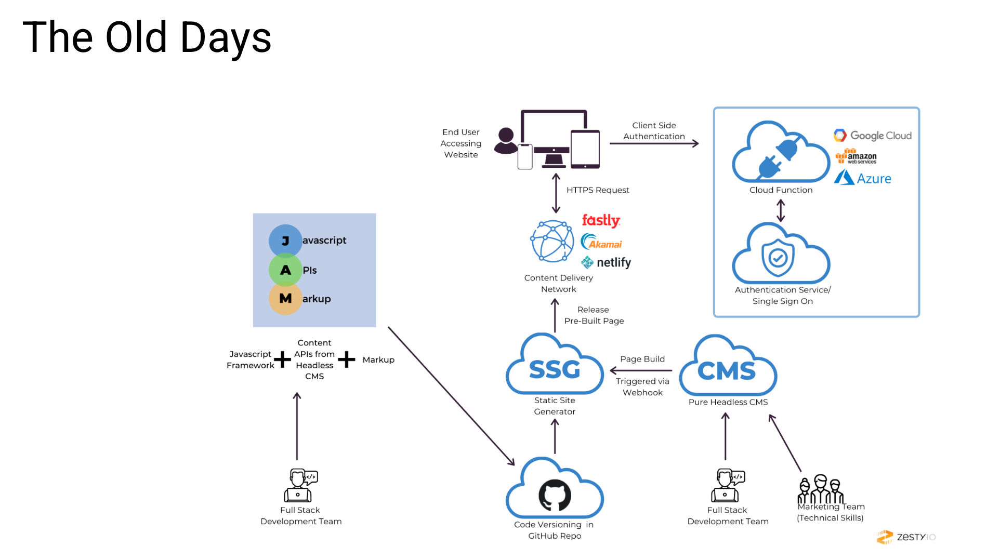
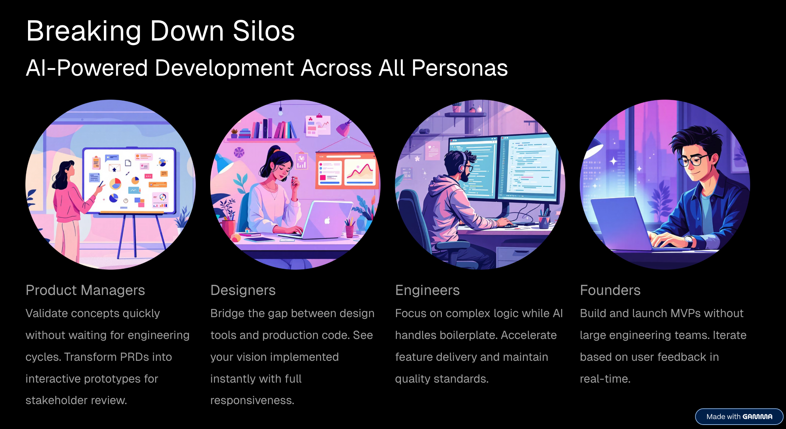
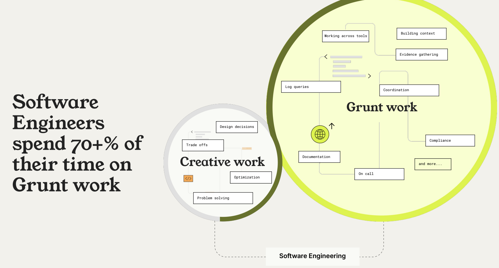

# How Coding Agents Change Coding

For decades, building software was a craft of manual labor. It required a "digital monk" mindset—spending months mastering syntax, memorizing libraries, and debugging missing semicolons. But the tide has shifted. We have moved from building with bricks and mortar to directing a fleet of autonomous construction drones.
 
This isn't a gradual improvement. It's a phase change. And to understand where we're going, you need to see where we came from.
 
 
## The Old World: The Age of Stacks and Gatekeeping
 
Before the AI explosion, software development was defined by the "stack"—a specific layer of technologies that dictated how an app functioned. Choosing the wrong stack was an expensive, sometimes fatal, mistake.
 
| Stack          | Core Technologies             | The Vibe                                                                   |
| :------------- | :---------------------------- | :------------------------------------------------------------------------- |
| **LAMP**       | Linux, Apache, MySQL, PHP     | The "Old Reliable." The foundation of the early web (WordPress, Facebook). |
| **MERN**       | MongoDB, Express, React, Node | The "Modern Standard." High-speed, interactive single-page apps.           |
| **JAMstack**   | JavaScript, APIs, Markup      | The "Decoupled" approach. Fast, secure, static-first content.              |
| **Serverless** | AWS Lambda, Firebase, Vercel  | The "Cloud-Native" era. No servers to manage; just code on demand.         |

These stacks weren't just technical choices—they were **identity**. Developers spent years specializing, communities formed tribes around them, and hiring decisions revolved around whether a candidate "knew the stack."
 
The consequences were predictable:
 
- **Ideas died in the gap between vision and execution.** A founder with a brilliant product concept but no technical co-founder was stuck. The napkin sketch stayed on the napkin.
- **Timelines were measured in quarters, not days.** Even a simple CRUD app required weeks of boilerplate: database setup, authentication, API routing, frontend scaffolding, deployment configuration, SSL certificates.
- **The talent bottleneck was the real constraint.** Companies didn't fail because their ideas were bad—they failed because they couldn't hire fast enough, or the engineers they had were buried in maintenance work.
- **Knowledge decayed faster than you could learn it.** By the time you mastered a framework, the ecosystem had moved on. React hooks replaced class components. REST gave way to GraphQL. The treadmill never stopped.
 
In the Old World, **knowing how to build** was the moat. If you couldn't write the code yourself—or pay someone who could—your idea simply didn't exist.
 
 
## The New World: Intent Is the New Code
 
The New World doesn't look like a better version of the Old World. It looks like an entirely different activity.
 
### The Builder Profile Has Changed
 
The most important shift isn't technological—it's **who gets to build**. In the Old World, the builder was a specialist: someone who had invested thousands of hours learning a craft. In the New World, the builder is anyone with a clear problem and the ability to describe it.
 
This means the product manager who used to write specs and hand them off? She now ships a working prototype before the sprint planning meeting. The domain expert—the doctor, the teacher, the supply chain analyst—who always knew exactly what software they needed but couldn't build it? They're now dangerous. They can go from frustration to functioning tool in an afternoon.
 
The skill that matters most is no longer syntax. It's **clarity of intent**. Can you articulate what you want, why it matters, and what "good" looks like? If yes, the machine handles the rest.

### The Development Lifecycle Has Collapsed
 

What used to be a relay race across specialized teams is now a single continuous conversation.
 
- **Requirements are conversations, not documents.** Y[ou don't write a 40-page PRD and throw it over the wall.](https://aakashgupta.medium.com/ai-killed-the-10-page-prd-but-the-prd-isnt-dead-8801efe44b36) You describe the problem in plain language—"I need a dashboard that shows me which sales reps are falling behind on follow-ups"—and the AI drafts the spec, asks clarifying questions, and proposes edge cases you hadn't considered.
- **Architecture is suggested, not agonized over.** The AI acts as a Senior Architect on call. It recommends a database schema, proposes a folder structure, and flags tradeoffs—"If you expect more than 10K concurrent users, consider this approach instead." You audit the plan rather than invent it from scratch.
- **Implementation follows intent, not instruction.** You say "I need a login page with Google OAuth," and you get a working login page with Google OAuth. You don't memorize API endpoints. You don't read 30 pages of documentation. You describe the *what*, and the machine handles the *how*.
- **Deployment is invisible.** Servers, SSL certificates, CI/CD pipelines, scaling policies—these have become background tasks. Production is one click away, not a two-week DevOps project.
 
The net effect: what used to take a cross-functional team of five working for three months now takes one person with a clear vision working for a weekend.
 
### The Relationship with Code Has Inverted
 
In the Old World, you **wrote** code. In the New World, you **direct** code—and increasingly, you **review** code.
 
This is a subtle but profound shift. The developer's job is evolving from author to editor. You're no longer staring at a blank file wondering where to start. You're reading AI-generated output and asking: *Is this correct? Is this what I meant? Is there a better way?*
 
This means the skill of **reading code critically** becomes more valuable than the skill of writing it from memory. Understanding system design, recognizing anti-patterns, and knowing when the AI is confidently wrong—these are the new table stakes.
 
### The Tool Landscape Reflects This Shift
 
A new generation of tools has emerged that embodies these principles. Unlike the first wave of no-code (Wix, Webflow)—which was great for visual layouts but collapsed under complex logic—these tools generate and deploy real, production-grade code:

> Coding Products in 2023-2025
 
- **[Base44](https://base44.com/)** — AI-powered programmatic app generation: translates natural language into full-stack applications with complex backend logic.
- **[Lovable](https://lovable.dev)** — Full-stack apps from prompts, with an emphasis on polished UI.
- **[Replit Agent](https://replit.com)** — End-to-end app generation: database, backend, hosting, all handled by the agent.
- **[Vercel v0](https://v0.dev)** — Component-level UI generation in React and Tailwind.
- **[Cursor](https://cursor.com)** — An AI-native code editor for professional engineers who want to move at 10x speed.
 
But the tools are not the point. They're symptoms of a deeper truth: **the interface between human intention and working software has been compressed to nearly zero.** The specific tool names will change. The trajectory won't.
 
### What This World Actually Feels Like
 
If you haven't experienced it yet, here's what building in the New World feels like in practice:
 
- **It feels like having a senior engineering team on call, 24/7, that works for free and never gets tired.** You describe a feature, and minutes later it exists. You spot a bug, describe it in English, and it's fixed. You want to pivot the entire product direction—something that used to mean weeks of refactoring—and the AI restructures the codebase while you get coffee.
- **It feels like the bottleneck has moved.** The constraint is no longer "can we build this?" It's "should we build this?" and "what exactly should it do?" Product thinking, design taste, and domain expertise—the things that were always important but overshadowed by technical complexity—are now the only things that matter.
- **It feels dangerously fast.** You can prototype three different approaches to a problem in a single afternoon and test them against real users by evening. The feedback loop that used to take weeks now takes hours. This speed is exhilarating, but it also demands a new discipline: the ability to slow down and think clearly about *what's worth building* before you build it at light speed.
- **It feels, honestly, a little disorienting.** If you spent years mastering a craft, watching that craft get automated is a complex experience. But the Old World rewarded knowing *how*. The New World rewards knowing *what* and *why*. That's not a demotion—it's an elevation.
 

## What Will Not Change: The Human Element

There is a common fear that engineers are being replaced. In reality, they are being **amplified**. We are transitioning from "Single-threaded Producers" to **"Multi-threaded Orchestrators."**

> **The "Human-in-the-loop" is more important than ever for three reasons:**
> 1. **Intent:** AI can build anything, but it doesn't know *what* is worth building. You provide the "Why."
> 2. **Judgment:** AI can hallucinate or produce "spaghetti code." You act as the Editor-in-Chief, ensuring the output is secure and efficient.
> 3. **Mental Models:** When the abstraction leaks (and it will), you need a foundational understanding of how software works to guide the AI through complex debugging.

The monks aren't obsolete. They've been promoted to abbots. The question is no longer "can you code it?" The question is "do you know what needs to exist?"

> AI has taken over execution. Thinking and decision-making are still yours.
