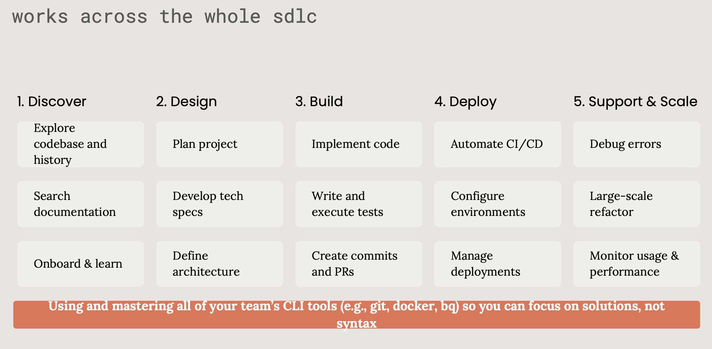

# How to Collaborate with Coding Agents

*A practical guide distilled from the internal workflows of OpenAI and Anthropic teams—and the failure modes that often trip up the uninitiated.*

---

The era of viewing AI as simple code completion is over. Today's coding agents—whether Anthropic’s Claude Code or OpenAI’s Codex—are not just engine-level engines providing line-level suggestions. They can read your files, run commands, modify code, execute tests, and submit PRs. They can live in a cloud sandbox or lurk directly in your terminal. They can work autonomously on a task for hours.

This changes the nature of collaboration. The question is no longer "Can AI write code?" but rather: **How do you collaborate with an agent that can write code autonomously?**

To find the answer, we went straight to the source. Both Anthropic and OpenAI have published detailed accounts of how their internal engineering teams use these tools. At Anthropic, teams use Claude Code for everything from debugging production Kubernetes issues to letting non-technical finance staff generate Excel reports via natural language. OpenAI’s Codex team reports that the tool writes over 90% of their internal application code, and new engineers pair with Codex on day one to ship code to production.

> - [How OpenAI uses Codex](https://cdn.openai.com/pdf/6a2631dc-783e-479b-b1a4-af0cfbd38630/how-openai-uses-codex.pdf)
> - [How Anthropic teams use Claude Code](https://www-cdn.anthropic.com/58284b19e702b49db9302d5b6f135ad8871e7658.pdf)

The patterns emerging from these two organizations are remarkably consistent and overturn many traditional assumptions about AI-assisted development.

---

## The Core Insight: Graduated Autonomy

The single most important principle from Anthropic and OpenAI is deceptively simple:

> **Grant high autonomy for low-risk, repetitive, peripheral work. Maintain tight human oversight for core, business-critical logic.**

This sounds like common sense. In practice, most people get it backwards—they micromanage the easy stuff (staring at the agent as it writes boilerplate) and lack oversight for the hard stuff (rubber-stamping a complex architectural change because the AI "seemed confident").

The correct mental model is a gradient, not an on/off switch.

### High Autonomy Areas

Both companies consistently delegate the following categories to agents running asynchronously in the background with loose supervision:

**Mechanical transformations.** Refactoring, renaming, migrating across files, updating deprecated API calls. OpenAI engineers assign large migration tasks to multiple parallel Codex instances—listing all files needing change and letting agents batch-process them. Anthropic teams report similar patterns for routine data pipeline setup.

**Test generation.** Writing unit tests, expanding edge-case coverage, generating integration tests from function signatures. Anthropic’s research teams report an 80% reduction in research time by letting Claude Code generate the edge-case tests humans typically skip.

**Boilerplate and scaffolding.** Folder structures, module stubs, API route skeletons, config files, telemetry hooks. OpenAI engineers use Codex to scaffold new features early in development and handle "last mile" tasks like writing release scripts.

**Codebase exploration.** Tracing data flows, mapping service dependencies, locating core logic in unfamiliar repos. Anthropic’s data team uses Claude Code instead of traditional data catalog tools—it reads `Claude.md` docs, identifies relevant files, and explains pipeline dependencies to newcomers.

**Internal tools and dashboards.** Anthropic data scientists built 5,000-line TypeScript dashboards without knowing JavaScript. Non-technical marketers generated hundreds of ad variants. Lawyers built phone tree systems. The pattern is clear: agents massively expand the boundary of who can build useful software.

**Repetitive Ops work.** Terraform plans, K8s log analysis, CI/CD debugging, security reviews of infrastructure-as-code. These are excellent candidates for delegation because their scope is narrow, patterns are strong, and risks are low when safely sandboxed.

### Restricted Autonomy Areas

For these categories, the agent should only act as a draft proposer, pair programmer, or design explorer—never the final decision-maker:

- **Core Business Logic** — The algorithms and rules that define what the product *does*.
- **Security-Sensitive Paths** — Auth, authorization, data handling, cryptography.
- **Architectural Decisions** — System boundaries, data model design, API contracts.
- **High Blast-Radius Changes** — Anything expensive, hard to detect, or difficult to roll back.
- **Mission-Critical User Flows** — Core flows affecting trust and revenue.

Anthropic is explicit: **synchronous pairing** is the expected mode for core business logic. The agent explores and proposes; the human decides and validates.

### Decision Framework

| Task Characteristics | Autonomy Level | Working Mode |
|---|---|---|
| Mechanical, repetitive, easy to revert | High | Async loops, batch processing, minimal supervision |
| Exploratory, design-oriented, multiple viable paths | Medium | Best-of-N generation with human selection |
| Core logic, production-critical, security-sensitive | Low | Synchronous pairing, line-by-line diff review |

---

## When Humans Intervene

If the agent handles the "How"—drafting, searching, refactoring—the human must handle the "Why" and "What matters." Intervention isn't about lack of trust; it's about applying human judgment where it's required.

OpenAI and Anthropic converge on four key intervention points:

### 1. Planning and Scoping

Every effective agent workflow begins with a human clearly defining intent. Both companies emphasize starting in "chat" or "ask" mode before switching to code generation. Your prompt should act like a well-written GitHub Issue: clear goal, scope, constraints, relevant references, and style expectations.

OpenAI's best practices recommend a two-step workflow: ask for an **implementation plan** first, then use that plan as the prompt for code generation. This keeps the agent grounded and prevents "hallucinated scope creep."

The more context you encode in persistent memory files (`AGENTS.md` for Codex, `Claude.md` for Claude Code), the better the agent performs. Anthropic's data team found a direct correlation: as their `Claude.md` files grew richer, Claude Code became more reliable for daily tasks. These files turn a stateless tool into a long-term teammate who "knows the rules."

### 2. Core Logic and High-Risk Changes

When work enters the territory of non-negotiable correctness, the collaboration mode must shift from "delegate" back to "pair." Humans should:

- Review every code diff carefully (don't just skim the summary).
- Challenge assumptions—agents can be confidently wrong.
- Simplify over-engineered solutions (agents tend toward complexity).
- Make trade-off decisions that require business context.

OpenAI engineers describe Codex as most effective for tasks that would take a human roughly an hour or a few hundred lines of code. For larger changes, the "plan then generate" pattern is critical to prevent drift.

### 3. Review, Merge, and Selection

This stage is dominated by two patterns:

**Best-of-N Synthesis.** Let the agent generate multiple solutions to the same problem, compare the trade-offs of each, and synthesize the best parts. The diversity of output drastically improves quality for hard problems—this is one of the highest-leverage collaboration modes available today.

**Git Flow with High-Frequency Review.** Commit often, revert easily. Both companies emphasize small, frequent commits to ensure every step is visible and reversible. OpenAI internal teams often run 3-4 entirely independent Codex tasks simultaneously, each producing a checkable output.

Anthropic’s Boris Cherny takes this further with **Reviewing Sub-Agents**: one agent checks style, another reviews project history, a third hunts for bugs—and more agents are tasked with *rebutting* those findings to filter out false positives.

### 4. Uncertainty and Design Trade-offs

Agents are excellent at giving you options and stress-testing your assumptions. But deciding which trade-off to accept—which architectural path fits your product roadmap, your team's capacity, and your organization's risk tolerance—is inherently human.

Use the agent as a **thinking partner**. Ask it to list pros and cons of three approaches. Ask it to find precedents in your codebase. Ask it to identify the irreversible parts of an option. Then, you make the call.

### Responsibility Ownership Model

| Owner | Responsibilities |
|---|---|
| **Humans** | Intent & Objectives · Constraints & Risk Assessment · Product & Business Judgment · Final Merge/Deploy/Rollback Decision |
| **Agents** | Drafting, Searching, Refactoring · Enumerating Options & Trade-offs · Large-scale Batch Repetition · Broadening Scope & Exploration |

---

## 7 Battle-Tested Collaboration Patterns

These patterns appear repeatedly in OpenAI and Anthropic internal usage. They represent hundreds of hours of engineering time distilled into what actually works.

### Pattern 1: Plan First, Then Generate
Start with conversation. Define the scope. Agree on the approach. Only then allow it to switch to bulk code-generation mode. This prevents the most common failure: an incredibly impressive solution to the wrong problem. 

### Pattern 2: Small Tasks, Frequent Checkpoints

This isn't about distrust — it's about maintaining iteration velocity. Small, committed steps mean you can course-correct quickly. Both companies report that this pattern dramatically reduces the cost of agent mistakes, because you're never more than one commit away from a known-good state.

### Pattern 3: Persistent Memory Files

Maintain `AGENTS.md` (Codex) or `Claude.md` (Claude Code) files that encode your project's conventions, rules, constraints, and architectural decisions.

These files transform agents from stateless tools into context-aware collaborators. OpenAI's Codex reads these files before doing any work and supports a hierarchical system — global defaults, repository-level conventions, and directory-specific overrides.

Anthropic teams found this so effective that it replaced traditional data catalogs and discoverability tools for their data infrastructure. Investing time in maintaining these files has outsized returns.

### Pattern 4: Async for Edges, Sync for Core

This is perhaps the most important workflow insight: **match your level of human involvement to the criticality of the task.**

Delegate peripheral work (refactors, tests, chores, internal tools) to async agent loops that run in the background. Save your synchronous attention for core logic, architecture, and critical paths.

OpenAI engineers report merging 4 PRs in a day while spending most of their time in meetings — because Codex was working on well-scoped background tasks the entire time. The key is that these were appropriately scoped tasks, not core logic.

### Pattern 5: Best-of-N Synthesis

For hard problems with multiple valid approaches, generate several solutions and compare them. This leverages the agent's speed while applying human judgment where it matters most.

Ask for three different implementations of the same feature. Ask for the most performant version, the most readable version, and the most maintainable version. Then merge the best ideas from each.

### Pattern 6: Agent as Force Multiplier, Not Oracle

Interrupt the agent. Ask for simpler versions. Adjust scope dynamically. Push back when solutions are overengineered.

The mental model is an iterative collaborator, not a one-shot answer machine. The best results come from treating agent output as a starting draft that gets refined through conversation, not a finished product to accept or reject wholesale.

### Pattern 7: Horizontal Capability Layer

Deploy agents across functions, not just engineering. The most surprising finding from both companies is how broadly these tools are being used by non-engineers.

At Anthropic, designers make large state management changes, marketers generate ad variants, and data scientists build complex dashboards in unfamiliar languages. At OpenAI, the Codex team has built hundreds of reusable skills that span engineering, product, design, data, and operations.

The implication: coding agents aren't just developer productivity tools. They're organizational capability multipliers that let domain experts build what they need without waiting in a development queue.

---

## Common Failure Patterns (and How to Avoid Them)

Knowing the patterns isn't enough. You also need to recognize when things are going wrong — ideally before the damage compounds.

### Requirements Failures

**Unclear requirements.** Telling an agent to build something "good and efficient" without specific scenarios or acceptance criteria is a recipe for wasted cycles. Use the Jobs-to-Be-Done framework: who is the user, what are they trying to accomplish, and how will you know if it's working?

**Feature complexity explosion.** Starting a project with a dozen features instead of a focused MVP. Agents are very willing to build everything you ask for — which makes it tempting to ask for too much. Keep core features to 3-5 and validate before expanding.

**Features disconnected from real tasks.** Starting from a "comprehensive feature list" rather than analyzing actual user workflows and existing alternatives. The agent can build anything; the question is whether it should.

### Technical Failures

**Poor technology choices.** Chasing novel or "cool" technology when mature, well-documented, agent-friendly stacks would serve better. Agents perform best with popular frameworks that have extensive training data. Niche tools often lead to hallucinated APIs and subtle bugs.

**Over-reliance without verification.** The "if AI says it's fine, it's fine" failure mode. Both OpenAI and Anthropic emphasize trust-but-verify as a fundamental operating principle. Build your own judgment framework. Run the tests. Read the diffs.

**Ignoring fundamentals.** Only checking whether code runs, without considering security, performance, or maintainability. Agents can produce code that passes all tests but has SQL injection vulnerabilities, O(n²) complexity where O(n) is trivial, or architectural patterns that will cause pain in six months.

### Adoption Failures

**Targeting too broadly.** "Everyone will use this" is not a user segment. Serve one small group well before expanding.

**Underestimating migration costs.** Assuming users will switch because your solution is technically better. Existing tools have stickiness — workflows, integrations, muscle memory, team training. Map every migration step explicitly.

**Overestimating sustained engagement.** Just because you find a tool useful during the honeymoon period doesn't mean users will stick with it. Test with real users in real workflows over real time periods.

---

## Practical Getting-Started Guide

If you're adopting coding agents for the first time, here's a phased approach based on what works at the companies building these tools:

**Week 1: Explore and learn.** Use the agent in conversational mode to understand your codebase. Ask it the questions you'd ask a senior engineer during onboarding. Map out dependencies, trace data flows, understand architectural decisions.

**Week 2: Delegate peripheral work.** Start with test generation, refactors, and documentation. These are high-value, low-risk tasks that build your confidence in the agent's capabilities and your ability to review its output.

**Week 3: Establish persistent context.** Write your `AGENTS.md` or `Claude.md` files. Encode your coding conventions, testing requirements, architectural boundaries, and domain-specific terminology. This is a one-time investment that pays dividends on every subsequent interaction.

**Week 4+: Scale to parallel workflows.** Begin running multiple agent tasks simultaneously. Develop your personal workflow for reviewing agent output efficiently. Identify the tasks where async delegation saves you the most time, and the tasks where synchronous pairing produces the best results.

Throughout all of this, commit frequently, review carefully, and maintain your own understanding of what the code does and why. The agent is a force multiplier for your judgment — but only if you continue exercising that judgment.

---

## Looking Ahead

The trajectory is clear. OpenAI envisions real-time pairing and asynchronous delegation converging into a unified workflow where developers direct, supervise, and collaborate with agents at scale. Anthropic's teams are already seeing agentic coding expand beyond traditional development into what amounts to an organizational capability layer.

The engineers who thrive in this environment won't be the ones who can prompt most cleverly. They'll be the ones who develop strong taste — the ability to evaluate, select, and refine agent output at speed. They'll be the ones who invest in clear thinking about requirements, constraints, and trade-offs. And they'll be the ones who match their level of involvement to the criticality of the task, instead of either micromanaging everything or blindly trusting everything.

The agent handles the grind. You handle the judgment. That's the collaboration.

---

*Sources: [How OpenAI Uses Codex](https://openai.com/business/guides-and-resources/how-openai-uses-codex/), [How Anthropic Teams Use Claude Code](https://claude.com/blog/how-anthropic-teams-use-claude-code), [Claude Code Best Practices](https://code.claude.com/docs/en/best-practices), [OpenAI Codex Best Practices](https://developers.openai.com/codex/learn/best-practices), [Introducing Codex](https://openai.com/index/introducing-codex/), [How Codex Is Built](https://newsletter.pragmaticengineer.com/p/how-codex-is-built)*