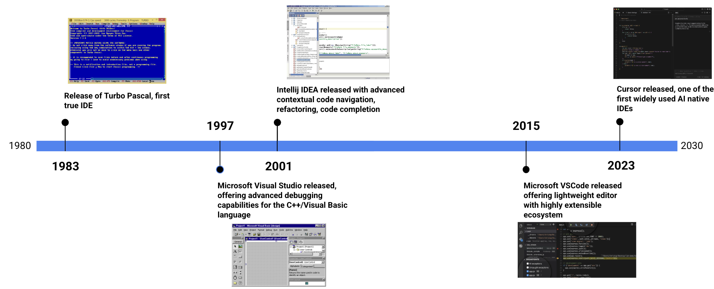
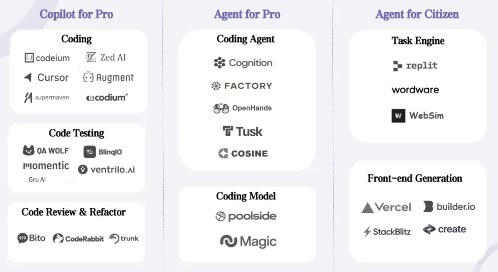

# How Coding Agents Work

> *In [Chapter 1](../01-prompt/README.md), you learned to communicate with coding agents — giving them context, writing clear prompts, and building persistent memory systems. Now, let's look under the hood: what actually happens when you press Enter?*

*From simple autocomplete to autonomous digital engineers — a deep dive into the system architecture, context strategies, and core design patterns powering today's elite AI coding tools.*

---

It wasn't long ago (actually, just yesterday in AI time) that AI-assisted coding meant a spectral gray suggestion appearing after your cursor, offering to complete a `for` loop you were already halfway through. GitHub Copilot launched that era in 2021. For a long while, this "inline autocomplete" seemed like the ceiling of AI programming.

Fast forward to 2026, and the landscape is unrecognizable. Today's tools don't just explore unfamiliar codebases; they plan multi-file refactors, spawn specialized sub-agents for "dirty work," run tests, catch bugs, and independently submit Pull Requests—all from a single, sometimes vague, natural-language instruction. This massive leap from "slightly smarter autocomplete" to "autonomous coding agent" didn't happen overnight, and its underlying architectural logic is far more coherent than you might think.

This post breaks down how modern coding agents actually work — the core components, the context engineering strategies that make them "magically" effective, the design patterns behind tools like Claude Code and Cursor, and the fatal weaknesses you must understand before handing over the keys to your codebase.

---

## The Evolution: From Autocomplete to Agents

The trajectory of AI coding tools follows a clear pattern: **expanding context visibility** and **increasing action autonomy**:

**Inline Completion Era (2021–2023)** — Only a tiny sliver of code around your cursor was sent to the model to predict the next tokens. This was fast and cheap but extremely limited. You got a single line or a function body at most. The model knew almost nothing about your project's macro architecture.

**Chat Assistant Era (2023–2024)** — Led by ChatGPT and early Copilot Chat. They allowed you to ask questions about code, paste snippets for explanation, or request rewrites. Context awareness improved, but the **physical key-pressing work** (navigating files, copying/pasting, running terminal commands) still fell on the human developer.

**Agentic Coding Era (2025–Present)** — The current standard. These tools don't just "talk" (respond to prompts)—they "act" (take actions). They read your local file system, run build commands in your terminal, call remote APIs, maintain their own todo lists, and orchestrate sub-tasks. The developer's role has officially shifted **from "writing code" to "directing an autonomous system that writes code."**

The fundamental difference isn't just smarter models. It's that agents are equipped with a **"Toolbox (Tools)"**—the physical leverage for interacting with the real world—and a **"Strategy Brain"** that decides when to act and how to combine these tools.

---

## The Three Pillars of a Coding Agent

Any industrial-grade coding agent, regardless of its branding, relies on three core pillars:

### 1. System Prompt — The Soul and Boundaries
The system prompt is the foundational instruction set baked into every underlying interaction. It defines who the agent "is," what the absolute "iron rules" are, and how it should decompose tasks.

However, elite agents today **no longer use monolithic, bloated system prompts**. Taking Claude Code as an example, it layers multiple **micro-prompts** throughout a session: one for topic detection, another for classifying bash command safety, and another for task planning. Anthropic’s engineering team calls this **"context scaffolding"**—a dense network of short, sharp instructions injected at the perfect moment, rather than a heavy, static constitution.

Even more impressive is the `<system-reminder>` tag used in Claude Code. These are "short-acting meta-instructions" injected into various cracks in the conversation—before a tool call, after a command output, or inside a tool's result. They act like a constant "whisper" in the model's ear: "Update your todo list!", "Do only what is asked, never add unsolicited logic!". Whether these tags are a hard-trained reflex or simply a statistically prominent token the model has learned to respect remains a mystery.

### 2. Tooling — The Agent's Hands
A lone LLM can only output text. **Tools** give it the "body" to transform the world. Modern elite agents typically hold these cards:

- **File System Control** — Reading, writing, creating, and deleting files across the directory.
- **Terminal/Shell Execution** — Running tests, builds, and even Git operations.
- **Code Radar** — Performing `grep`, `glob`, and high-level semantic search across millions of lines of code.
- **Browser/Web Access** — Crawling the latest documentation or searching for solutions to obscure bugs.
- **Sub-Agent Spawning** — Cloning specialized sub-agents to handle narrow, focused tasks.
- **MCP (Model Context Protocol)** — A standardized "power socket" for plugging external services and custom tools into the agent.

Never underestimate the tool descriptions. A great tool interface includes not just parameter definitions and examples, but also warnings about its own idiosyncrasies. Spotify's engineering team shared a critical insight: whether an autonomous agent can produce a "merge-ready" PR depends **directly and brutally on how well its tool documentation is written.**

### 3. Context Strategy — The Rhythm of Memory and Attention
This is the "deep water" where tech giants compete. Any LLM's context window is finite—currently topping out around 128K to 200K tokens—and everything the agent "knows" during a task must fit inside this pipe. Context strategy determines what enters, what is protected, and what is cold-bloodedly discarded or compressed.

Elite agents use these core tactics:

**RAG (Retrieval-Augmented Generation)** — Code is chunked, vectorized, and stored in a semantic database. When the agent needs to understand a module, the most relevant "fragments" are retrieved and injected into context. Top-tier tools now use Abstract Syntax Trees (AST) to chunk code along its semantic "skeleton" rather than arbitrary line counts.

**JIT (Just-In-Time) Loading** — Modern agents are smart: they no longer try to carry the whole world in their pockets from the start. They maintain lightweight "signposts" (file paths or query histories) and only "dig" for content using `grep` or `glob` when the "combat" actually begins. Claude Code uses a brilliant hybrid: front-loading core "Constitution" files like `CLAUDE.md`, while exploring the rest of the codebase on-demand.

**Auto-Compaction** — When a conversation approaches the context limit, the agent performs "self-surgery": it brutally condenses verbose history into refined summaries. It preserves critical architectural decisions, unresolved bug clues, and key file paths while tossing redundant tool logs. Claude Code triggers this **"auto-compaction" at 95% capacity**, continuing the fight with a lean, compressed history plus the 5 most recently accessed files.

**Sub-Agent Isolation** — For massive, "epic" tasks, the agent splits the burden. It delegates to multiple independent sub-agents, each with a narrow, closed-loop context window. This prevents "hallucination collapse" caused by pouring too much "mud" into a single window. Anthropic's multi-agent research shows that a pack of focused "hunting dogs" (sub-agents) almost always outperforms a single "overloaded commander" trying to digest everything at once.

---

### A Live Case Study: Claude Code

Claude Code, one of the most widely adopted and lauded production-grade agents, perfectly demonstrates these pillars: it has abandoned monolithic system prompts for layered **micro-prompt** scaffolding; it uses a brutal toolset ranging from file manipulation to sub-agent cloning; and it employs an aggressive context strategy that combines front-loaded "House Rules" with JIT exploration and 95%-threshold **auto-compaction**.

To truly understand its inner workings—from "Memory Management" to "Capability Extensions" (Commands, Skills, SubAgents, Hooks) and "Integration" (Headless mode, MCP), see the specialized report: [Claude Code as an AI Agent Framework](../03-power-user/claude-code.md).

---

## The 2026 Tooling Spectrum

Not every AI-branded product is a "Full-stack Agentive System." The ecosystem is a spectrum:

### Cloud-Based "Web" Stream
**Lovable**, **Replit**, and **V0**. You describe, they build. Ideal for rapid prototyping, MVPs, or developers who don't want to touch a local environment. Lovable excels at automated service integration (DB pipes, API auth), while V0 specializes in high-quality React UI with polish.
*The Trade-off:* You give up your "soul." You lose control over the underlying architecture, face vendor lock-in, and they often struggle with existing, complex "legacy" codebases.

### Local "Heavyweight" IDE Masters
**Cursor** and **Trae**. These are deeply embedded into your local dev environment. They have "God-eye" view of your file system and Git history. Cursor is the "beast" favored by professionals for its massive codebase navigation, semantic search, and ability to handle large-scale cross-file refactors.
*The Challenge:* Requires more configuration and solid engineering foundations, but offers the control required for production-critical systems.

### Terminal "Assassins"
**Claude Code** and **OpenAI Codex**. These are "Agent-First" purists. They lurk in your terminal, waiting for a high-level goal. Once released, they autonomously explore, plan, implement, test, and iterate. Ideal for "coding gods" who want to direct complex tasks with massive leverage while carefully reviewing AI-generated diffs.

---

## Future Outlook: Background Agents and Multi-Agent Grids

The next wave is forming. **Background Agents** (asynchronous cloud agents) act as your invisible force multipliers, working on tasks while you sleep or take meetings. Dispatch your task list like snow, and return only to review the spoils of "battle."

**Multi-Agent Grid Warfare** is also maturing. Rather than one agent doing everything, an **Orchestrator** coordinates specialized squads: a "Radar Scout" (logic tracing), a "Blacksmith" (implementation), and a "Disciplinarian" (QA/Review). Information flows between them as distilled "Intelligence Briefings," avoiding context bloat.

**MCP (Model Context Protocol)** is the unified "power strip" for this world, allowing any third-party tool or service to be "hot-swapped" into an agent's arsenal. Explore the total anatomy of this bus: [MCP Standard](../03-power-user/MCP.md).

For the macro-controls and governance of these multi-agent systems, see: [Systematic Thinking & Governance](../03-power-user/systematic-thinking.md).

---

## The Lethal "Death Knells" of Coding Agents

Despite their power, current agents have clear "fatal heels":

**Cross-layer Debugging Traumas** — When a production bug requires correlating dirty database state, fragmented log traces, and complex distributed networking, agents often spin in circles. The only high-level solution: force the agent to output a **"Probable Cause Ranked List,"** choose a direction yourself, and then let the agent resume the hunt.

**Pixel-Perfect UI OCD** — When the requirement is "pixel-perfect" fidelity to a design file, agents often fail to match the nuances. Instead, feed them a well-documented **Component Library & Design Spec** — they perform much better when adhering to "rules" than "painting from a picture."

**Information Lag (Brain Rot)** — Agents will confidently use deprecated APIs or patterns from years ago if not updated. Never trust their "pre-trained wisdom" for cutting-edge libraries. You must aggressively "tube-feed" them the latest documentation via context files like **`CLAUDE.md`**—treat it as your "living Bible" for the agent.

**Structural "Demolition" Decisions** — Agents will confidently decide between Monolith vs. Microservice, or State Management frameworks, without understanding the 5-year maintenance cost. **Iron Rule:** Keep Humans-in-the-Loop for any architectural "bone-setting" decisions.

---

## The New "Eighteen Subduing Dragon Palms" Skillset

The rise of agents doesn't mean the "Old Guard" of coders dies out—it means their "Core Combat Power" is being brutally upgraded. The developer is becoming an **Agent Manager**:

- **Delegation & Multi-threading Orchestration** — Knowing what to hand off, how to cage the scope, and how to run multiple parallel "squads" simultaneously.
- **Reviewing Eye over the Writing Hand** — The ability to read, challenge, and audit AI-generated code will become 10x more valuable than the ability to type it from memory.
- **Strategic Mapping & Architecture Layout** — High-level decisions are the "Divine Realm" agents cannot yet touch.
- **Context Engineering & Information Tutoring** — The art of "packaging" the world so an agent can produce "Single-Shot" gold-tier output.

The survivors won't be those who resist the machines, nor those who blindly follow them. They will be the **"Beast Tamers"** who understand the internal machinery of these monsters and hold the "Chain of Intent" firmly in their hands.

---

*The era of AI coding agents is still in its early chapters. The tools will get smarter, the context windows will get larger, and the architectures will get more sophisticated. But the fundamental pattern — system prompts, tools, and context strategy — is the foundation everything else is built on. Understanding it now is the highest-leverage investment you can make as an engineer.*