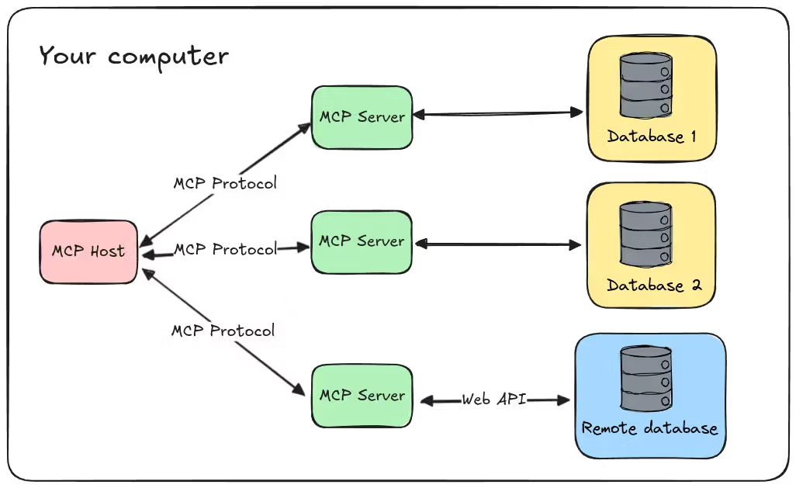

# Tools, MCP, CLI and More

*The great AI tool-integration debate of 2026 — and why the answer isn't as simple as picking a side.*

---

## The USB-C That Sparked a War

When Anthropic open-sourced the Model Context Protocol (MCP) in late 2024, the pitch was irresistible: a "USB-C for AI" that would let any model talk to any external service through one universal protocol. No more bespoke integrations for every API. No more M×N adapter hell. Just M+N.

The industry bought in — hard. OpenAI, Google, Microsoft, Amazon all adopted it. By February 2026, MCP had crossed 97 million monthly SDK downloads and over 5,800 verified servers. In December 2025, Anthropic donated MCP to the Linux Foundation's Agentic AI Foundation, signaling that this wasn't just one company's pet project anymore. It was infrastructure.

Then on March 11, 2026, Perplexity CTO Denis Yarats took the stage at the Ask 2026 conference and said what many AI engineers had been whispering: MCP is too expensive for production agent systems. Perplexity was moving away from MCP internally, replacing it with traditional REST APIs and CLIs. Y Combinator CEO Garry Tan had independently built a CLI-based agent integration instead of using MCP. Cloudflare had already published its "Code Mode" approach months earlier, reducing token usage by 99.9% compared to naive MCP tool-calling.

The headlines were dramatic: "MCP is Dead." "CLI is the New MCP." "Perplexity Ditches MCP."

But the reality, as with most things in engineering, is more nuanced. Let me walk you through what's actually happening, why it matters, and how to think about it if you're building AI agent systems today.

---

## The Core Problem: Context Window Economics

To understand the MCP vs. CLI debate, you need to understand one number: **tokens**.

Every AI model has a finite context window — the total text it can hold in working memory at once. Everything competes for this space: the user's question, the system prompt, retrieved documents, conversation history, and **tool definitions**.

Here's where MCP runs into trouble. When you connect an MCP server, the protocol dumps the full schema of every tool it offers into the agent's context window — tool names, descriptions, parameter definitions, response formats, the works. GitHub's official Copilot MCP server exposes 43 tools. To answer "what language is this repo written in?", the agent needs exactly one of those 43 tools, but carries the definitions for all of them.

Scalekit ran 75 benchmark runs comparing CLI and MCP approaches against identical GitHub tasks. For the simplest query — repo language detection — the CLI agent consumed 1,365 tokens. The MCP agent: 44,026 tokens. That's a 32× difference, and it's almost entirely schema overhead.

At scale, this gets worse. Apideck documented a deployment where three MCP servers (GitHub, Slack, Sentry) consumed 143,000 of 200,000 available tokens — 72% of the context window — before the agent had processed a single user message.

Tokens aren't just a cost metric. They directly determine how much reasoning capacity your agent has left for the actual task. When 40–72% of your context window is eaten by tool definitions, the model has less room to think, plan, and execute.

---

## Why CLI Works So Surprisingly Well

The CLI-as-agent-interface story rests on a coincidence that turns out to be anything but: **LLMs were trained on the internet, and the internet is full of shell commands.**

Models like Claude have seen millions of examples of `git`, `gh`, `kubectl`, `aws`, `curl`, `jq`, and every other common CLI tool in their training data. They know the commands, the flags, the common patterns, the error messages. When you hand an agent a bash shell and say "list the open PRs on this repo," it generates `gh pr list --state open` without needing any schema injection at all. Zero tokens consumed for tool definitions. The model already knows the interface.

This training data advantage compounds in three ways:

**Composability.** Unix pipes are deeply embedded in model weights. A model that has seen `find . -name "*.py" | xargs grep "import"` thousands of times can improvise novel combinations of the same pattern. MCP has no native chaining mechanism — efforts to add tool-to-tool calling and pipeline definitions are essentially redesigning what Unix figured out in the 1970s.

**Self-documentation.** Every CLI ships with `--help`. The agent can discover capabilities at runtime without any upfront schema cost. Need to know what `terraform plan` does? Run `terraform plan --help`. This is progressive disclosure — you pay the token cost for documentation only when you actually need it.

**Ecosystem maturity.** GitHub has `gh`. AWS has `aws`. Kubernetes has `kubectl`. Docker has `docker`. These CLIs are maintained by the service providers themselves, automatically track API changes, handle authentication, pagination, and error handling. They've been battle-tested by millions of developers in production for years, sometimes decades.

---

## But Wait — MCP Isn't Dead

Here's where the discourse goes off the rails. The "MCP is dead" narrative is driven partly by genuine engineering concerns and partly by companies selling alternatives. Apideck sells API integration products. Scalekit sells developer infrastructure. Perplexity is promoting its own Agent API. Their data is real, but their framing has an angle.

Let me steelman MCP's position, because the protocol solves real problems that CLI advocates tend to hand-wave away.

### The Multi-Tenant Problem

When you're a solo developer automating your own workflow, CLI is perfect. Your `~/.aws/credentials` file has your tokens. Your `gh` is authenticated to your GitHub. Your shell runs with your user permissions.

But the moment you cross the boundary from "I'm automating my workflow" to "my product automates workflows for my customers," CLI's advantages become liabilities. Whose credentials do you use? How do you scope permissions per customer? How do you revoke access when a customer churns? How do you audit which tools your agent invoked on whose behalf?

MCP's OAuth 2.0 integration, dynamic client registration, and structured permission model exist precisely because enterprise SaaS deployment requires this infrastructure. A shell with a bearer token doesn't cut it when you need per-user authorization scoping across dozens of third-party services.

### The Non-Developer User

A Sales Director cannot and should not need to interpret stderr tracebacks. CLI interfaces are powerful because they're expressive and composable, but they're also fundamentally developer-centric. MCP's structured tool schemas, while expensive in tokens, provide a clean abstraction layer between the model and the end user. The model knows what each tool does, what parameters it expects, and what it returns — all in a format designed for machine consumption, not human shell wizards.

### The Services Without CLIs

Not every service has a CLI. Many internal enterprise tools, niche SaaS products, and custom business systems only expose REST APIs or proprietary interfaces. For these, MCP provides a standardized way to wrap any API as a tool that any MCP-compatible agent can discover and use. Without MCP (or something like it), you're back to writing one-off integration code for every service.

### Dynamic Discovery

MCP's killer feature isn't the protocol overhead — it's the fact that an agent can connect to a server it has never seen before and immediately understand what tools are available. This dynamic discovery is what makes the ecosystem possible. CLI requires the model to either already know the tool from training data or to explore it via `--help`, which doesn't work for proprietary or custom tools.

---

## The Third Way: Code Mode and Progressive Disclosure

While the MCP-vs-CLI debate rages on social media, practitioners are quietly converging on hybrid approaches that take the best of both worlds.

**Cloudflare's Code Mode** is the most elegant example. Instead of exposing 2,500 API endpoints as individual MCP tools (which would cost ~244,000 tokens), Cloudflare's MCP server exposes just two tools: `search()` and `execute()`. The agent writes JavaScript code against a typed SDK to interact with the API. Total schema cost: ~1,000 tokens. That's a 99.9% reduction while preserving MCP's discovery and connection management benefits.

The key insight: LLMs are much better at writing code than at consuming tool schemas. They've seen far more TypeScript in training data than they've seen MCP tool-calling synthetic examples. Code Mode exploits this by converting the problem from "choose and invoke the right tool" to "write a small program" — something models already excel at.

**Anthropic's own fix** goes in a similar direction. Claude Code shipped Tool Search for lazy-loading — instead of dumping all tool schemas upfront, it loads only the schemas relevant to the current task, achieving a 98.7% token reduction while staying fully within the MCP protocol.

**CLI progressive disclosure**, championed by Apideck, replaces MCP schemas with on-demand `--help` calls, starting from roughly 80 tokens instead of tens of thousands.

The common thread: **the problem isn't MCP as a protocol. The problem is MCP's naive "load everything upfront" default.** Fix that, and the token economics improve dramatically.

---

## A Decision Framework for Practitioners

After digesting all of this, here's how I'd think about tool integration for an AI agent system today:

**Start with CLI if:**
- A mature CLI already exists for the service (GitHub, AWS, Kubernetes, Docker, etc.)
- You're building for developers or internal tooling
- The agent operates with the credentials of a single known user
- You need maximum token efficiency
- Composability via pipes matters for your workflow

**Use MCP if:**
- You need dynamic tool discovery across services the agent hasn't seen before
- You're building multi-tenant products where per-user OAuth and permission scoping are required
- The service has no CLI and only exposes an API
- You need structured, auditable tool invocation with telemetry
- You're in an IDE/desktop environment (Cursor, Claude Desktop, VS Code) where MCP is natively supported

**Consider Code Mode / hybrid if:**
- You need access to large API surfaces (hundreds or thousands of endpoints)
- Token efficiency matters but you still want MCP's discovery and auth benefits
- Your agent is capable of writing and executing code

**The pragmatic default:** Use CLI for everything that has one. Wrap APIs in thin CLI scripts when they don't. Reach for MCP when you need OAuth, multi-tenancy, or dynamic discovery. And regardless of which transport you choose, invest heavily in the quality of your tool interfaces — clear names, precise descriptions, well-scoped parameters. The tool design matters more than the protocol.

---

## What's Next

The MCP spec hasn't shipped a new version since November 2025. The 2026 roadmap lists enterprise readiness as the least defined of its four priorities. Authentication, the most commonly cited pain point, is acknowledged but not yet solved. Meanwhile, the ecosystem continues to fragment: Perplexity's Agent API, Cloudflare's Code Mode, Apideck's CLI approach, and countless teams quietly rolling their own integrations.

But network effects are powerful. When Anthropic, OpenAI, Google, and Microsoft all support the same protocol, developers build for it regardless of its flaws. Nobody uses HTTP because it's the most elegant protocol ever designed. They use it because everything speaks it. MCP may follow the same path — winning not because it's optimal, but because it's ubiquitous.

The smart bet is not to pick a side, but to design your agent architecture so the tool transport layer is pluggable. Make CLI and MCP interchangeable at the integration boundary. Use the right tool for each specific integration. And remember that in six months, the discourse will have moved on to the next thing — but your production system will still need to work.

The Unix philosophy got it right fifty years ago: do one thing well, compose freely, and keep your interfaces simple. Whether those interfaces speak JSON-RPC or stdout, the principle holds.