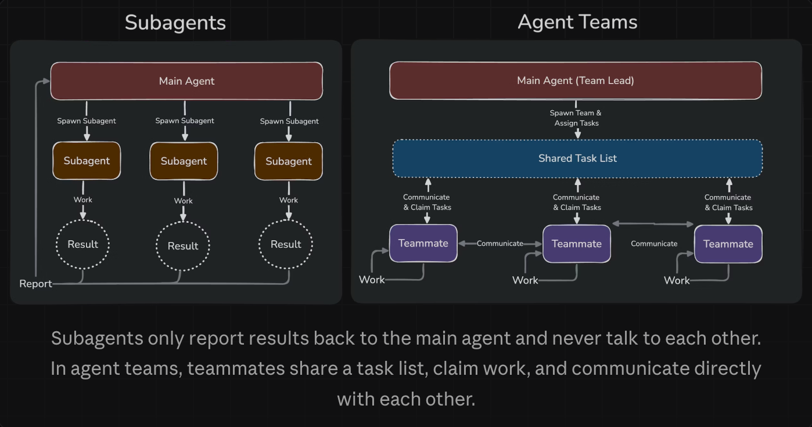

# Agent Teams and Multi-Agent Architecture

**Agent Teams** extend the sub-agent model with direct peer-to-peer communication. Instead of sub-agents only reporting to a supervisor, teammates can send messages to each other, challenge each other's findings, and collaboratively converge on conclusions.

> [Anthropic Agent Teams Documentation](https://code.claude.com/docs/en/agent-teams)

**This is an experimental feature.** Enable by setting `CLAUDE_CODE_EXPERIMENTAL_AGENT_TEAMS=1` in your environment or `settings.json`.

### Core Components

| Component | Role |
|---|---|
| **Team Lead** | Main Claude Code session. Creates the team, generates and assigns tasks, synthesizes results, and closes the team when done. |
| **Teammates** | Independent Claude Code instances with individual context windows. Pick up tasks from the shared task list. |
| **Task List** | Shared queue at `~/.claude/tasks/{team-name}/`. Tasks carry `pending / in_progress / completed` states and can declare dependencies. When a dependency completes, blocked tasks auto-unlock. |
| **Mailbox** | Point-to-point `message` and `broadcast` communication. Broadcasts cost tokens proportional to team size — use sparingly. |

**Important:** Teammates do not inherit the lead's conversation history. They receive only their spawn prompt. Provide all necessary context upfront: project structure, constraints, tools available, target deliverables, and output templates.

### Sub-Agents vs Agent Teams

| | Sub-Agents | Agent Teams |
|---|---|---|
| Communication | Report to supervisor only | Peers can message each other |
| Coordination | Centralized (supervisor) | Distributed (peer-to-peer) |
| Use case | Parallel execution, result reporting | Collaborative investigation, debate |
| Token cost | Moderate | High |
| Complexity | Low | High |
| Best for | Pipeline workflows, noisy operations | Competing hypotheses, multi-angle review |

**One-line decision rule:** Workers don't need to talk to each other → Sub-Agents. Workers need to discuss and challenge → Agent Teams.

---

## Collaboration Patterns

### Competing Hypotheses

**Use when:** Root cause is unclear, multiple theories exist, and single-investigator anchoring bias is a risk.

**How it works:**
- Assign each hypothesis to a separate teammate
- Require teammates to actively try to disprove each other's theories, not just validate their own
- The surviving hypothesis — one that explains all observed symptoms and withstands challenge — becomes the conclusion

**Example:** A cascading failure with three reported symptoms (session loss, API slowdown, data leak) might stem from 4 interconnected bugs: a too-small DB connection pool, Redis session not handling reconnects, an N+1 query in order fetching, and a cache race condition without user isolation. Assign a "session detective," "database detective," "cache detective," and "architecture detective" as teammates. Each investigates independently, shares findings, and challenges the others.

**Why it works:** Avoids the common failure of "find one plausible bug and stop." The debate mechanism filters weak hypotheses and surfaces the complete cascade.

**Best for:** Production incidents, complex performance regressions, any failure with multiple interacting causes.

### Parallel Review (Multi-Angle Code Review)

**Use when:** A PR or code change needs evaluation across independent dimensions.

**Typical setup:**
- Security reviewer: vulnerabilities, input validation, authentication
- Performance reviewer: complexity, resource usage, query efficiency
- Test reviewer: coverage, edge cases, regression risk

Each reviewer works in parallel. Cross-dimension issues (e.g., a security flaw that also degrades performance) surface through teammate communication.

**Why it works:** Single reviewers inevitably weight some dimensions over others. Dedicated reviewers per dimension ensure nothing is systematically ignored.

### Module Ownership

**Use when:** A feature spans multiple modules (frontend, backend, DB, tests) and parallel development would otherwise create conflicts.

**Key mechanisms:**
- **Task dependencies:** Tasks declare prerequisites; downstream tasks unlock only after upstream tasks complete (e.g., tests wait for implementation)
- **File ownership:** Each teammate owns a non-overlapping set of files; shared interface files are handled by a single designated teammate
- **Auto-unlock:** Dependency completion automatically makes blocked tasks available for pickup

**Why it works:** Achieves parallel development without merge conflicts, by separating ownership by file boundary rather than attempting concurrent edits.

### Plan Approval

**Use when:** High-risk tasks — authentication refactor, schema migration, core service rewrite — require design review before implementation.

**Workflow:**
1. Architect teammate produces a plan — documentation and approach, not code
2. Lead evaluates the plan against predefined approval criteria
3. Only approved plans proceed to implementation

**Define approval criteria in the lead's prompt, for example:**
- "Approve only plans that include a test plan."
- "Reject any plan that modifies the database schema."

**Why it works:** Makes "think before you code" a hard constraint, not a suggestion. Prevents a large class of expensive rework caused by wrong-direction implementation.

---

## Best Practices

### Team Design

- **Provide full context upfront.** Teammates start with only their spawn prompt. Include project structure, constraints, available tools, goals, and any output templates they need.
- **Right-size tasks.** Too small: coordination overhead exceeds parallelism benefit. Too large: long "black box" periods with no checkpoints. Target 5–6 tasks per teammate, each with a concrete deliverable (a function, a test file, a report).

### Conflict Control

- **Prevent file conflicts.** Assign non-overlapping file sets. Designate a single owner for shared interface files; establish the interface contract first before parallel implementation begins.
- **Supervise actively.** Don't let teams run unsupervised for long stretches. Check progress, inject new tasks when cross-teammate coordination is needed, and redirect drifting teammates.
- **Pace the lead.** Use explicit instructions when necessary: "Wait until all teammate tasks are complete before synthesizing and proceeding."

### Getting Started

Begin with read-only, no-write scenarios: bug investigation, technical research, PR or design doc review. These have clear boundaries, obvious collaboration value, and no parallel-write conflicts. Graduate to Module Ownership and Plan Approval as your coordination skills develop.

---

## Performance and Cost

Multi-agent systems carry compounding overhead:

| Cost Factor | Impact |
|---|---|
| Token amplification | ~15x vs single-agent conversation |
| Per-dispatch overhead | Context load + execution + result return per agent call |
| Inter-agent communication | Grows with team size and message frequency |
| Debugging complexity | Non-deterministic decisions require full production tracing |
| Deployment risk | Can't stop mid-execution without losing work; requires progressive rollout |

**When the cost is justified:**
- Tasks where parallel exploration has clear quality gains — incident investigation, multi-hypothesis debugging, multi-angle design review
- High-complexity, high-value work where a large quality improvement justifies the token cost
- Organizational separation where teams need independent, maintainable agent capabilities

**Golden rules:**
- Start single agent. Upgrade only on concrete architectural bottlenecks.
- Add tools before adding agents. Tools are the minimum unit of capability extension.
- Choosing the right model beats adding more tokens.
- Multi-agent's core value is **context isolation and parallel execution** — not architectural complexity for its own sake.
- The best architecture is the simplest one that solves the problem.
