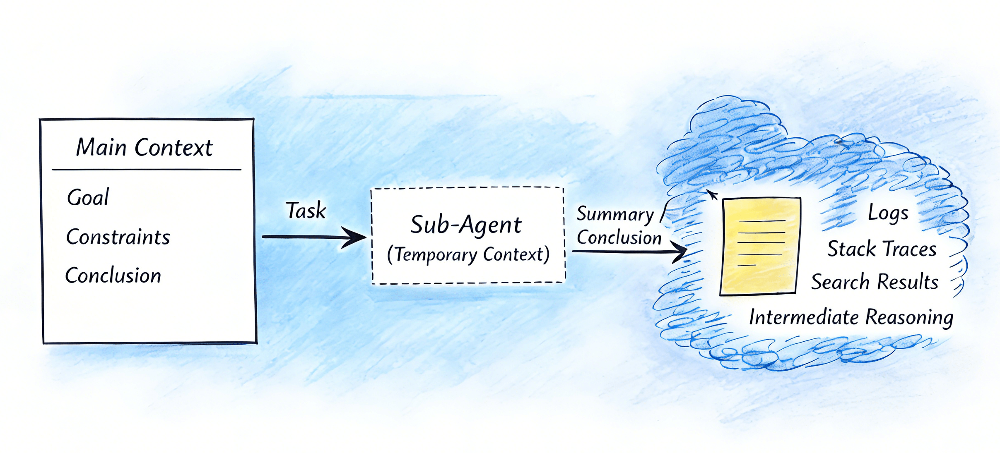

# Claude Code as an AI Agent Framework

> *In [Chapter 2](../02-anatomy/how-agents-work.md), you learned that every coding agent rests on three pillars: a system prompt, tools, and a context strategy. This chapter zooms into one agent — Claude Code — and shows how those pillars become a four-layer, programmable architecture. Why Claude Code specifically? Because it is the most fully-realized open-architecture agent framework available today, and its design maps directly to the general principles: System Prompt → Memory layer, Tools → Extension layer, Context Strategy → the entire stack working together. Master Claude Code's architecture, and you build transferable intuition for any agent system you encounter next.*

This chapter reframes your understanding of Claude Code — not as a chat tool, but as a **programmable, extensible, composable AI agent framework** with a layered technical architecture.

## From User to Operator: A Paradigm Shift

### Not Just an AI Assistant — A Programmable Platform

Most people think of Claude Code as "ChatGPT in a terminal" or "a tool that writes code." That undersells it dramatically.

**The better analogy is VS Code.** On the surface, VS Code is a text editor. In reality, it's an extensible platform — the editor is just the entry point for a universe of extensions, workflows, and integrations. Claude Code works the same way: the conversational interface is the entry point, but underneath lies infrastructure for building **AI-powered engineering workflows**.

Claude Code can read entire repositories, modify code, run tests, operate system tools, and orchestrate automated pipelines — far beyond "writing a few functions."

### Two Paradigms of Interaction

| | **User Paradigm** | **Operator Paradigm** |
|---|---|---|
| **Interaction** | You ask → Claude answers → you execute | You configure the agent → it works autonomously → tasks complete automatically |
| **Essence** | A "fancy calculator" — ask and receive, one-off capability calls | You design rules, workflows, and responsibility boundaries; Claude executes within constraints |
| **Your role** | Questioner | System designer + pilot |

The goal of this chapter: take you from **questioner** to **system designer**.

---

## The Engine Under the Hood: Agentic Loop and Unix-Style Primitives

Before we look at the four-layer architecture, we need to understand the fundamental mechanism that makes Claude Code an *agent* rather than a chatbot.

### The Agentic Loop: From Advisor to Engineer

Without tools, Claude is an advisor — it can analyze, suggest, and explain, but it cannot act. It cannot read your codebase, modify a file, or run a test. Every interaction dead-ends in "now go do this yourself."

Tools transform Claude into an engineer. They create an **Agentic Loop** — a continuous cycle of perception, action, and verification:

1. **Perceive** — Read files, search codebases, gather context (Read, Glob, Grep)
2. **Act** — Modify code, execute commands, create artifacts (Edit, Write, Bash)
3. **Verify** — Run tests, check outputs, assess results (Bash, Read)

A simple bug fix might complete in one cycle. A complex refactor might loop dozens of times — reading a file, editing it, running tests, reading the failure, editing again — with Claude's reasoning driving each transition. The role division is clear:

- **Claude (the model)** — decides what to do next: understands, reasons, decomposes tasks
- **Tools (the primitives)** — execute against the environment: read files, run commands, modify code
- **Claude Code (the harness)** — binds model and tools together, providing the execution environment, context management, permission control, and orchestration infrastructure

That harness is the foundation everything else is built on.

### Five Atomic Operations and the Unix Philosophy

Claude Code does not ship a "refactoring tool," a "debugging tool," and a "deployment tool." Instead, it provides a small set of **primitive operations** — and trusts that complex behaviors will *emerge* from their composition with LLM reasoning.

Every development task decomposes into five atomic operations:

| Operation | What a developer does | Primitive tool |
|-----------|----------------------|----------------|
| **Perceive** | Open a file, read code | Read |
| **Search** | Find definitions, trace call chains | Glob, Grep |
| **Modify** | Fix a bug, refactor, update config | Edit, Write |
| **Execute** | Run tests, build, deploy | Bash |
| **Fetch** | Look up docs, query APIs, check external state | WebFetch, MCP tools |

This is the Unix philosophy applied to AI agents: **small, sharp tools that do one thing well, composed through a universal interface.** In Unix, that interface is text pipes. In Claude Code, it is the LLM's reasoning loop. You do not build a specialized tool for every scenario. You build primitives and let the intelligence layer compose them.

Consider a concrete example — fixing an intermittent login 500 error:

1. Grep for `500` / `error` / `login` → locate relevant log lines and files
2. Read `auth-service.js` → spot a missing null check on line 87
3. Grep for `validateToken` → find all callers to ensure a complete fix
4. Read the caller code → decide to fix at the source
5. Edit the source file → add the null guard
6. Bash `npm test --grep 'auth'` → a test fails
7. Edit the test file → update the expectation
8. Bash `npm test` → all green

Each step is trivially simple — read a file, search for text, change a line, run a command. But composed through reasoning, they form a complete **diagnose → fix → regress** engineering workflow. "Refactoring," "debugging," and "deployment" are not hardcoded capabilities. They are emergent behaviors that arise from primitive composition.

### Bash: The Universal Escape Hatch

In theory, Bash alone could do everything — `cat` for reading, `sed` for editing, `find` for searching. It is Turing-complete. So why keep the specialized primitives?

Three reasons that map directly to systems design principles:

- **Structured interaction** — Read returns content with line numbers and length control, optimized for LLM comprehension. Bash output is raw and noisy.
- **Fine-grained permissions** — You can allow Read but deny Bash, creating a "can look, cannot touch" security posture. Bash is all-or-nothing.
- **Token efficiency** — Specialized tools return exactly the information the model needs. Bash output carries overhead that wastes context window.

The design tension is intentional: **Bash provides capability completeness; primitive tools provide efficiency, structure, and governability.** This is the same trade-off Unix makes between raw syscalls and purpose-built utilities.

### Three Layers of Tool Capability

This primitive-first design extends outward in three concentric layers:

| Layer | What it covers | Design role |
|-------|---------------|-------------|
| **Built-in primitives** | Read, Edit, Bash, Grep, Glob, WebFetch | The foundation — covers most software engineering tasks |
| **Bash-reachable tools** | Any CLI, script, or system utility | The escape hatch — makes the agent Turing-complete |
| **MCP extensions** | Structured interfaces to external systems (databases, Jira, Slack) | The integration layer — structured I/O, tool discovery, and security isolation beyond what raw Bash provides |

Why add MCP when Bash can already `curl` any API? For the same reasons you keep Read instead of using `cat`: **structured input/output** (no parsing raw text), **automatic tool discovery** (connect an MCP server, all its tools register automatically), and **security isolation** (access control lives on the server side, not in a fragile Bash permission rule).

### Tool Risk Levels and the Permission Model

Not all tools carry equal risk. Claude Code classifies tools by their potential blast radius and gates access accordingly:

| Risk level | Tools | Default behavior |
|-----------|-------|-----------------|
| **Low (read-only)** | Read, Glob, Grep | No approval needed — safe to run freely |
| **Medium (local modification)** | Edit, Write | Session-scoped approval — expires when the conversation ends |
| **High (global execution)** | Bash, some MCP tools | Persistent approval with explicit confirmation — because a shell command's blast radius is unbounded |

This graduated model serves three design purposes: it lets you assign **minimal permission sets** to different agents (a code-reviewer gets only read tools), it makes **governance enforceable** (high-risk tools pass through Hooks and approval gates), and it gives the permission prompts **explainability** — you understand *why* some actions require approval and others do not.

The tool layer — its primitives, its risk model, its layered extensibility — is the skeleton on which the four-layer architecture below is built.

---

## The Four-Layer Architecture


Claude Code's technical stack has four distinct layers, each with a clear responsibility:

| Layer | Purpose | Key Components |
|-------|---------|----------------|
| **Foundation** | Persistent memory and context | CLAUDE.md memory system |
| **Extension** | Capability center | Commands, Skills, SubAgents, Hooks |
| **Integration** | Connect to the outside world | Headless mode, MCP |
| **Programming Interface** | Code-level control | Agent SDK |

---

## Layer 1: Foundation — The Memory System (CLAUDE.md)

Think of CLAUDE.md as an **employee handbook for your AI colleague**. Instead of re-explaining project conventions every conversation, you write them down once and Claude reads them automatically at the start of every session.

### What Goes in CLAUDE.md

- **Tech stack** — languages, frameworks, key libraries
- **Code style** — naming conventions, formatting rules
- **Critical rules** — e.g., "never push directly to main," "always run tests before committing"
- **Project context** — architecture decisions, domain knowledge

### Three-Level Memory Hierarchy

| Level | Path | Scope |
|-------|------|-------|
| **Global** | `~/.claude/CLAUDE.md` | Universal rules across all projects |
| **Project** | `<project-root>/CLAUDE.md` | Project-specific constraints and context |
| **Module** | `<project-root>/.claude/rules/*.md` | Fine-grained rules for specific directories or modules |

### Why This Matters

The memory system serves two critical functions:

1. **Externalizes tacit knowledge** — transforms implicit team experience into structured documents, giving Claude a "worldview" before any task begins
2. **Provides a context baseline** — all other components (Commands, Skills, SubAgents, Hooks) build on this shared foundation

But Claude Code's context strategy goes beyond static memory files. It uses **aggressive front-loading** (auto-summarizing prior conversation, detecting topic changes, loading project files) combined with **just-in-time retrieval** — dynamically fetching codebase content via `grep` and `glob` rather than pre-loading everything. When context approaches limits, the system **auto-compacts** — summarizing history while preserving key architectural decisions and recent file paths. This hybrid approach is what makes the Memory layer practical at scale.

---

## Layer 2: Extension — Four Core Components


The extension layer is the **capability center** of Claude Code. It contains four components, each with a different trigger mechanism and use case.

A design principle worth noting: Claude Code doesn't use a single monolithic system prompt. Instead, it layers **micro-prompts** — small `<system-reminder>` tags injected throughout the conversation (before tool calls, after command outputs, inside tool results) — to reinforce constraints at the right moment. Similarly, command safety isn't governed by a hardcoded allowlist — a separate LLM prompt classifies whether each shell command looks suspicious, gating user approval. These implementation choices reflect the same philosophy as the four components below: small, well-timed, composable units rather than one massive configuration.

### Commands (Slash Commands)

**Explicit, deterministic, manually triggered standard procedures.**

- **Invocation**: User types `/command` (e.g., `/commit`, `/review`)
- **Configuration**: Defined in `.claude/commands/*.md`
- **Characteristics**: High determinism, reusable, auditable
- **Best for**: Operations that must execute the same way every time — standardized commit messages, fixed deployment flows, code review checklists

### Skills

**Domain-aware behavioral strategies that Claude activates through semantic reasoning.**

- **Invocation**: User asks a natural language question; Claude **automatically decides** whether to activate a skill based on context
- **Key distinction from Tools**:

| | Tools | Skills |
|---|---|---|
| **Question answered** | "Can I do this?" | "Should I do this? How? To what depth?" |
| **Contains** | External capability interface (read files, call APIs) | Trigger logic + prompt strategy + tool orchestration |
| **Behavior** | Mechanical execution | Expert-level judgment |

- **Best for**: Tasks with strong domain requirements (security, architecture, performance) that need contextual judgment rather than keyword-matching
- **Example**: A `security-review` skill adjusts its inspection focus and depth based on language, context, and risk level


### SubAgents

**Independent execution units dispatched by the primary agent for specialized tasks.**

- **Invocation**: Claude automatically decides to spawn a sub-agent, or the user explicitly requests one
- **Best for**:
  - **High-noise tasks** — extracting anomalies from massive logs, searching through large document sets
  - **Permission isolation** — a sub-agent with access to only specific tools, reducing risk
  - **Parallel execution** — pipeline nodes like `test-runner`, `log-analyzer`, `code-reviewer` running concurrently



### Hooks

**Event-driven automated gatekeepers and auxiliary scripts.**

- **Invocation**: Triggered automatically by specific events (e.g., "before the Edit tool executes")
- **Core purpose**: Insert checks, logging, or supplementary actions before/after specific operations
- **Examples**:
  - **Pre-edit hook**: Run a security scan before code modification; block and alert if sensitive changes are detected
  - Auto-format code, auto-write logs, auto-audit critical operations
- **Best for**: Any "must execute 100% of the time" gatekeeper logic — security reviews, compliance checks, formatting enforcement


> **The "separation of powers" principle**: Commands define behavior, SubAgents execute, Hooks guard — together they form a checks-and-balances system.

---

## Layer 3: Integration — Connecting to the Outside World

### Headless Mode

**Fully automated, zero-interaction execution.**

- **Typical usage**: Call Claude in CI/CD pipelines
  ```bash
  # In a GitHub Actions workflow
  claude --headless "Fix all linting errors in src/"
  ```
- **Use cases**: Automated code review, auto-fix, changelog generation, release notes
- **Key shift**: Claude Code becomes an **intelligent node in your pipeline**, not a manually triggered assistant

### MCP (Model Context Protocol)

**Expose external systems as tool interfaces that Claude can invoke.**

- **Connects to**: Databases, Jira, internal knowledge bases, custom APIs
- **Data flow**: Claude → MCP → External System (query, write, orchestrate)


**Why this matters**: MCP extends Claude's capabilities to **every API-accessible system** in your organization. Combined with Skills, you can build complete workflows with both domain knowledge and real execution power.

---

## Layer 4: Programming Interface — Agent SDK

When configuration-based extensions aren't enough for complex scenarios, the **SDK gives you code-level control**.

```python
# main.py
from claude_sdk import ClaudeSDKClient

client = ClaudeSDKClient()

result = client.query(
    prompt="Review this code for security issues",
    tools=["Read", "Grep"],
    max_turns=10
)
```

**Capabilities**:
- Full control over conversation flow, tool-call strategy, loop count, and context assembly
- Embed Claude as a **component within your own system**, not a standalone application

**Best for**: Custom agent systems, complex multi-stage pipelines, deep business system integration

---

## How to Choose the Right Component

With four extension components, an integration layer, and an SDK, how do you decide what to use when? The quick heuristic:

| Need | Choose |
|------|--------|
| **Must execute identically every time** | **Commands** (explicit) or **Hooks** (automatic) |
| **Semantically intelligent** activation | **Skills** |
| **Isolated, expensive, or parallel** work | **SubAgents** |
| **Connect to external systems** | **MCP** |
| **Unattended CI/CD execution** | **Headless mode** |
| **Code-level orchestration** | **Agent SDK** |

For a deep dive into *how to think about* combining these components — including composition principles, architectural patterns, governance design, and worked examples — see [Systematic Thinking: Combining Skills, SubAgents, and More](systematic-thinking.md).

---

## Key Takeaways

**Claude Code is an AI Agent Framework**, not a simple chat tool. It has a memory system, sub-agents, a skill system, hooks, an integration layer, and an SDK. Its real value lies in letting you **build your own AI workflows and automation systems**.

**The four-layer architecture is modular and composable.** Memory lays the foundation, the extension layer manages capabilities, the integration layer connects to the enterprise world, and the SDK provides code-level control. This layering enables **incremental adoption** — start simple, scale complexity as needed.

**Engineering mindset + component composition = operator-level capability.** You're not stacking configuration files — you're designing an **AI-driven engineering system**. Once you master this architecture and selection framework, you can restructure any AI coding tool into a controllable, agent-powered engineering platform.

---

## Why This Architecture Transfers

Claude Code's four layers are not arbitrary — they map to universal requirements that every agent system must solve:

| Agent Need | Claude Code Layer | You'll Find This In... |
|------------|------------------|----------------------|
| Persistent context across sessions | Foundation (Memory) | Cursor's `.cursorrules`, Codex's project config, any agent with a config file |
| Extensible capabilities beyond base tools | Extension (Commands, Skills, SubAgents, Hooks) | VS Code extensions, Devin's tool integrations, any plugin system |
| Connection to external services | Integration (Headless, MCP) | API connectors, CI/CD hooks, any system that bridges AI to infrastructure |
| Programmatic control for custom workflows | Programming Interface (SDK) | OpenAI Agents SDK, LangChain, any agent framework with a code API |

Once you internalize these four layers in Claude Code, you'll recognize the same architecture — sometimes with different names, sometimes with different boundaries — in every agent system you encounter. The specific tool changes; the structural thinking transfers.

The rest of this chapter explores each layer in depth: [Context Management](context-management.md) deepens the Foundation layer, [Sub-Agents](sub-agents.md) and [Agent Teams](agent-teams.md) expand the Extension layer, [Skills](skills.md), [Hooks](hooks.md), and [Building Tools](building-tools.md) complete the capability picture, and [Systematic Thinking](systematic-thinking.md) ties everything together with composition principles for designing production-grade agent systems.
