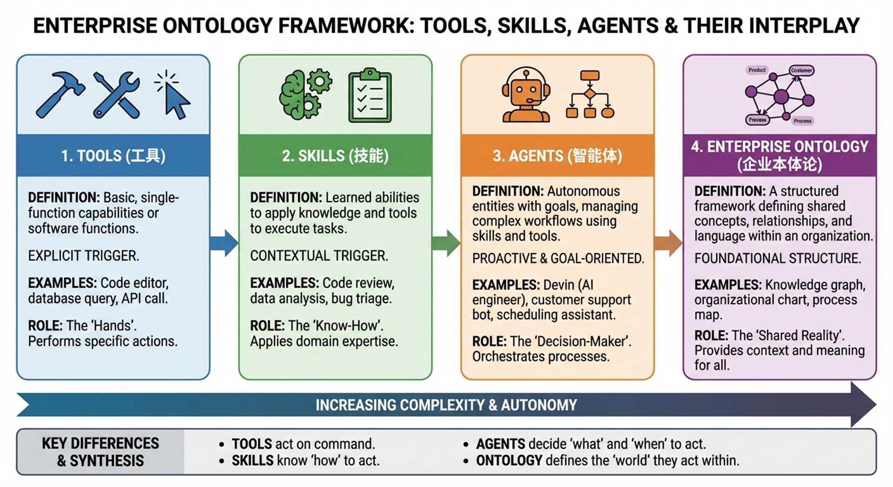

# Agent Skills: The Architecture of Reusable AI Expertise

> How  Skill System Turns General-Purpose Agents into Specialized Teammates

---

## Introduction

As AI agents gain the ability to navigate filesystems, execute code, and interact with full computing environments, a critical gap emerges: general-purpose models are powerful, but real work requires *procedural knowledge* and *organizational context*. An agent might understand what a code review is, but it doesn't know your team's specific review checklist. It might grasp financial concepts, but it doesn't know your quarterly reporting workflow.

Anthropic's answer to this challenge is **Agent Skills** — organized folders of instructions, scripts, and resources that agents can discover and load dynamically to perform better at specific tasks. First introduced in October 2025 and later published as an open standard in December 2025, Skills represent a fundamental shift in how we equip AI agents with domain expertise.

This article provides a comprehensive guide to the design philosophy, architecture, and practical engineering of Agent Skills — drawing from Anthropic's official documentation, the `anthropics/skills` repository, and real-world patterns that have emerged in the ecosystem.

---

## 1. What Are Skills, and Why Do They Matter?

### 1.1 Skills as "Actionable Knowledge"

A skill is not a static document. It is a **semantically triggerable knowledge and capability package** — containing domain knowledge, execution steps, output requirements, and constraints that are loaded into an agent's context on demand.

Consider the difference between a style guide sitting on a wiki page and that same guide packaged as a Skill:

- **A wiki page** is passive. Someone has to know it exists and remember to consult it.
- **A Skill** is active. It has a **trigger condition** (the `description` field tells the model *when* this knowledge is relevant), an **execution flow** (step-by-step instructions in the body), **quality standards** (templates for expected output), **tool constraints** (`allowed-tools` scoping what the agent can and cannot do), and optionally, **automated checks** (hooks that validate output quality).

This transforms knowledge from something that must be manually retrieved into something the model can discover, select, and apply autonomously.

### 1.2 Skills in the Agent Architecture

To understand where Skills fit, it helps to see them alongside the other building blocks of Claude Code's agent system:

| Component | Role | Analogy |
|-----------|------|---------|
| **Tools** | What the agent *can do* — file operations, search, code execution | Hands |
| **SubAgents** | *Who* does a task — isolated workers for focused jobs | Colleagues |
| **Hooks** | *When* to check — event-driven automation (linting after edits, logging before bash) | Quality inspectors |
| **CLAUDE.md** | Persistent context loaded every session — project conventions, culture | Employee handbook |
| **MCP Servers** | External service connections — databases, APIs, third-party tools | Partner integrations |
| **Skills** | *How* and *when to do it* — structured, actionable expertise loaded on demand | Standard Operating Procedures |

The key insight: Skills occupy the **cognitive layer**. They don't add new tools or new agents — they add *knowledge about how to use existing tools and agents effectively* in a specific context. This is why Anthropic describes building a Skill as being like assembling an **onboarding guide for a new hire**.

### 1.3 Skills as Enterprise Ontology

There's a deeper significance here. When an organization encodes its "way of doing things" — its review processes, naming conventions, deployment checklists, domain heuristics — into Skills, something important happens: **institutional knowledge becomes model-inheritable**.



Previously, this knowledge existed in documentation that needed to be read, in the minds of experienced employees, or in scattered process documents. As Skills, it becomes something a model can understand, select, and execute. The mapping is intuitive:

- **Tools** → the organization's tooling infrastructure
- **SubAgents** → job functions and division of labor
- **Hooks** → compliance and quality assurance processes
- **CLAUDE.md** → company culture and baseline rules
- **Skills** → the SOP (Standard Operating Procedure) library

This means Skills are not just a developer convenience — they are a **structured representation of how an organization works**, made available to AI agents.

---

## 2. How Skills Get Activated: Discovery and Progressive Disclosure

### 2.1 Two Activation Modes

Skills can be triggered in two ways:

1. **Explicit invocation**: The user types a slash command like `/review` or `/commit`, directly loading the corresponding Skill.
2. **Semantic auto-detection**: Claude examines the `description` fields of all installed Skills and determines, based on the user's natural language request, which Skill is most relevant. If a user says "help me check this code for issues," Claude might automatically load a code-review Skill without being explicitly asked.

The decision happens inside Claude's forward pass through the transformer — it's not rule-based matching but genuine semantic understanding of when a Skill applies.

### 2.2 Progressive Disclosure: The Core Design Principle

Progressive disclosure is what makes Skills scalable. Like a well-organized manual that starts with a table of contents, then specific chapters, and finally a detailed appendix, Skills let Claude load information only as needed.

The architecture operates in three layers:

| Layer | What Loads | When | Purpose |
|-------|-----------|------|---------|
| **Directory** (description) | Only the `name` and `description` fields | At session start, for all installed Skills | Discovery — lets Claude know what's available |
| **Chapter** (SKILL.md) | The full SKILL.md file | When a Skill is activated | Core instructions, routing, workflow steps |
| **Appendix** (supporting files) | reference/*.md, templates/*.md, scripts/, data/ | Only when explicitly referenced by SKILL.md | Detailed knowledge, templates, executable logic |

This means the amount of context bundled into a Skill is **effectively unbounded** — a Skill can include extensive documentation, reference materials, and scripts without consuming context upfront. Claude reads additional files only when the task requires them.

In typical usage, this approach reduces token consumption by **78–98%** compared to loading everything at once.

### 2.3 Permissions and Priority

Skills can be controlled at a granular level:

- **`disable-model-invocation: true`**: The Skill can only be triggered by the user via slash command — Claude won't auto-load it. Use this for workflows with side effects like `/deploy` or `/commit`.
- **`user-invocable: false`**: Only Claude can invoke the Skill. Use this for background knowledge that isn't meaningful as a user command.

When the same Skill name exists at multiple levels, priority follows: **Enterprise/Managed > Personal/User > Project**. Plugin Skills use namespacing (e.g., `plugin-name:skill-name`) to avoid conflicts.

---

## 3. Anatomy of a Skill: SKILL.md Structure

### 3.1 The Basics

At its simplest, a Skill is a directory containing a `SKILL.md` file. The file has two parts: **YAML frontmatter** (metadata) and **Markdown content** (instructions).

```yaml
---
name: code-review
description: >
  Reviews code for best practices, potential bugs, and style issues.
  Use when reviewing pull requests, checking code quality, or when
  the user asks to review changes.
allowed-tools: [Read, Grep, Glob, "Bash(git diff:*)"]
disable-model-invocation: false
---

# Code Review

## Instructions
1. Identify the files to review (from arguments or current diff)
2. Read each file and analyze for issues
3. Categorize findings as Critical, Warning, or Suggestion
4. Output a structured report

## Output Format
### Summary
[Brief overview of findings]

### Issues
- **Critical**: [file:line] Description
- **Warning**: [file:line] Description
- **Suggestion**: [file:line] Description

### What's Good
[Positive observations]
```

### 3.2 Key Frontmatter Fields

| Field | Purpose |
|-------|---------|
| `name` | Identifier and slash-command name. Use lowercase with hyphens. |
| `description` | **The most critical field.** This is what Claude reads to decide when to activate the Skill. Must specify *what it does*, *how it does it*, and *when to use it*. |
| `allowed-tools` | Fine-grained tool permissions. E.g., `[Read, Grep, Glob]` for read-only, or `[Bash(git:*)]` for git-only bash access. |
| `disable-model-invocation` | If `true`, only user can trigger via slash command. |
| `user-invocable` | If `false`, only Claude can invoke (background knowledge). |
| `argument-hint` | Parameter completion hint, e.g., `[commit message]` |
| `model` | Specify which model to use (e.g., `sonnet` for simpler tasks, `opus` for complex ones). |
| `context: fork` | Run in an isolated sub-agent context for large outputs. |
| `hooks` | Skill-scoped event hooks (e.g., auto-format after edits). |

### 3.3 The 500-Line Rule

Anthropic recommends keeping SKILL.md under **500 lines**. If your content exceeds this, split detailed reference material into separate files and reference them from the main SKILL.md. This keeps the core instructions focused while allowing comprehensive documentation to exist alongside.

### 3.4 Supporting File Organization

```
.claude/skills/my-skill/
├── SKILL.md           # Core: routing, workflow, key rules
├── reference/         # Detailed knowledge, specs, formulas
│   ├── api-patterns.md
│   └── error-codes.md
├── templates/         # Output templates, report formats
│   └── review-report.md
├── scripts/           # Executable logic (deterministic tasks)
│   └── validate.py
├── examples/          # Usage examples, sample inputs/outputs
│   └── sample-review.md
└── data/              # Static reference data, configs
    └── thresholds.json
```

A useful decision tree for where to put content:

- **Every activation needs it?** → Put it in SKILL.md (inline)
- **Deterministic logic with fixed I/O?** → Encapsulate as a script (`scripts/`)
- **Structured output format?** → Put in `templates/`
- **Static reference data?** → Put in `reference/`
- **Usage illustrations?** → Put in `examples/`

---

## 4. Writing Effective Descriptions

The `description` field is the single most important piece of a Skill. It's not user-facing documentation — it's the **trigger signal** that Claude uses to decide whether to load the Skill.

### 4.1 The Formula

A good description follows the pattern: **What it does** + **How it does it** + **When to use it**.

**Bad:**
```yaml
description: Handles PDFs
```
This is vague. Claude can't determine when to activate it.

**Good:**
```yaml
description: >
  Extract text and tables from PDF files, fill forms, merge documents.
  Use when working with PDF files or when the user mentions PDFs,
  forms, or document extraction.
```
This names specific actions, includes likely user keywords, and clearly defines the trigger context.

### 4.2 Avoiding Conflicts

When multiple Skills have overlapping capabilities, the descriptions must establish clear boundaries:

- **unit-testing**: "Write and run unit tests for individual functions and methods. Use for isolated testing, mocking, and functional verification of single components."
- **integration-testing**: "Write and run integration tests for multi-component workflows. Use for API end-to-end testing, database interactions, and cross-service validation."

Without this clarity, Claude may pick the wrong Skill or hesitate between options.

### 4.3 Token Budget

All Skill descriptions are loaded into the system prompt at session start. The total budget for all descriptions is approximately **15,000 characters**. Keep individual descriptions concise but complete — every word should help Claude make better activation decisions.

---

## 5. Two Types of Skills: Reference and Task

### 5.1 Reference-Type Skills

Reference Skills provide **persistent knowledge** that shapes how Claude approaches work. They don't have rigid execution steps — they establish rules, conventions, and domain understanding.

**Characteristics:**
- Model auto-invocation is typically **enabled** (Claude loads them when relevant)
- Tool permissions are usually **read-only** (`[Read, Grep, Glob]`)
- No strict output format — they influence behavior rather than produce reports
- Examples: API design conventions, coding style guides, domain terminology, architectural principles

```yaml
---
name: api-conventions
description: >
  API design patterns and conventions for this project.
  Use when writing or reviewing API endpoints, designing new APIs,
  or making decisions about request/response formats.
allowed-tools: [Read, Grep, Glob]
---

# API Conventions

## URL Naming
- Use plural nouns: `/users`, `/orders`
- Nest resources: `/users/{id}/orders`

## Response Format
- Always include `status`, `data`, and `error` fields
- Use HTTP status codes correctly

## Authentication
- Bearer tokens in Authorization header
- Refresh tokens via `/auth/refresh`
```

### 5.2 Task-Type Skills

Task Skills define **explicit execution workflows** with clear steps and outputs. They are the AI equivalent of a runbook.

**Characteristics:**
- Model auto-invocation is typically **disabled** (`disable-model-invocation: true`)
- Tool permissions are scoped precisely to what the task needs
- Clear input parameters, execution steps, and output format
- Examples: `/commit`, `/review`, `/deploy`, `/pr-create`

```yaml
---
name: commit
description: >
  Create a well-formatted git commit. Analyzes staged changes
  and generates a Conventional Commit message.
disable-model-invocation: true
allowed-tools: ["Bash(git:*)"]
argument-hint: "[optional commit message]"
---

# Smart Commit

## Steps
1. Run `git status` — if nothing staged, inform user and stop
2. If $ARGUMENTS provided, use as commit message
3. Otherwise:
   a. Run `git diff --staged`
   b. Analyze changes
   c. Generate Conventional Commit format message
   d. First line ≤ 72 characters
   e. Include scope and description
4. Execute `git commit -m "<message>"`
5. Report result
```

### 5.3 Combining Both Types

In practice, a mature workflow often combines both:

- A **Reference Skill** provides the coding standards and conventions
- A **Task Skill** executes the review using those standards
- A **SubAgent** handles large-scale reviews across many files in isolated context

---

## 6. Advanced Patterns

### 6.1 Dynamic Context Injection with `!command`

Skills can inject real-time data before Claude processes the request by using shell commands prefixed with `!`. These commands execute and their output replaces the command in the Skill text.

```markdown
## Current State
Branch: !git branch --show-current
Recent commits: !git log origin/main..HEAD --oneline
Changed files: !git diff --stat origin/main
```

When a user invokes the Skill, these commands run first, giving Claude immediate awareness of the current state without additional tool calls. This is especially powerful for PR creation, deployment, and status-reporting workflows.

**Security note:** User input flows through shell execution, so always pair `!command` usage with strict `allowed-tools` constraints.

### 6.2 Skill-Scoped Hooks

Skills can define their own event hooks in frontmatter, scoped only to the Skill's lifecycle:

```yaml
hooks:
  PreToolUse:
    - matcher: Bash
      command: echo "$TOOL_INPUT" >> /tmp/audit.log
  PostToolUse:
    - matcher: Edit
      command: npx prettier --write "$FILE_PATH"
```

| Event | Use Case | Example |
|-------|----------|---------|
| `PreToolUse` + Bash | Audit logging for dangerous operations | Log all bash commands |
| `PostToolUse` + Edit | Auto-formatting after file edits | Run prettier on changed files |
| `PostToolUse` + Write | Validation after file creation | Run a validation script |
| `STOP` | Notification on completion | System notification |

These hooks run only during the Skill's execution and don't affect global behavior.

### 6.3 Parameter Passing

Skills support flexible argument handling:

- **Single parameter**: `$ARGUMENTS` captures everything after the command name
  - `/commit fix login bug` → `$ARGUMENTS = "fix login bug"`
- **Multiple parameters**: `$1`, `$2`, etc. for positional arguments
  - `/pr-create "Add auth" "JWT implementation"` → `$1 = "Add auth"`, `$2 = "JWT implementation"`
- **Session variables**: `${CLAUDE_SESSION_ID}` for logging and tracing

If no parameter variables are used in the Skill, user input is automatically appended as `ARGUMENTS: <input>` to prevent information loss.

### 6.4 Context Isolation with `fork`

For Skills that produce large outputs (e.g., analyzing an entire codebase), use `context: fork` to run in an isolated sub-agent context. The sub-agent processes the heavy work and returns a summary to the main conversation, keeping the primary context clean.

---

## 7. Design Principles and Best Practices

### 7.1 The Seven-Step Design Method

1. **Define the action**: What specific task does this Skill perform? (e.g., commit, deploy, review)
2. **Set trigger permissions**: Should Claude auto-invoke, or user-only?
3. **Scope tool permissions**: Minimum necessary tools, scoped to specific commands
4. **Design startup context**: Use `!command` injection where real-time data helps
5. **Add safety nets**: Configure Skill hooks for logging, validation, formatting
6. **Control output scope**: Use `context: fork` for large outputs
7. **Choose the model**: Simple tasks → haiku/sonnet; complex reasoning → opus

### 7.2 Core Principles

- **Single responsibility**: One Skill, one job. Prefer `/commit` and `/review` over `/git-all-in-one`.
- **Clear naming**: `/deploy:staging` over `/do-stuff`. The name should communicate intent.
- **Permission convergence**: `allowed-tools: [Bash(git status:*)]` over `[Bash(*)]`. Never grant broader access than necessary.
- **Explicit error handling**: Document what should happen when things go wrong. Don't leave Claude to improvise on failure paths.
- **Iterate from minimal**: Start with a bare SKILL.md. Add reference files, templates, and scripts as real usage reveals the need.

### 7.3 CLAUDE.md vs. Skills: Where to Put What

| CLAUDE.md | Skills |
|-----------|--------|
| ≤100 lines of always-loaded global rules | Detailed, domain-specific knowledge |
| Team culture, baseline conventions | Specific workflows and procedures |
| "Every session needs this" | "Only load when relevant" |
| Build commands, test conventions | API documentation, deployment checklists |

If something is important but only relevant in specific contexts, it belongs in a Skill. CLAUDE.md can include a pointer: "For API conventions, see the `api-conventions` Skill."

---

## 8. Team Collaboration and Organization

### 8.1 Scope Hierarchy

- **Project-level** (`.claude/skills/`): Committed to git, shared across the team. Use for team-standard workflows.
- **User-level** (`~/.claude/skills/`): Personal skills available across all projects. Use for individual habits and preferences.
- **Plugin-level**: Installed from marketplaces or repositories, namespaced to avoid conflicts.

### 8.2 Directory Conventions

Skills use the directory name as the identifier. For related Skills, use prefixes:

```
.claude/skills/
├── git-commit/SKILL.md
├── git-review/SKILL.md
├── git-pr-create/SKILL.md
├── api-conventions/SKILL.md
└── deploy-staging/SKILL.md
```

Commands (the older format in `.claude/commands/`) support directory nesting with colon namespaces: `.claude/commands/git/status.md` maps to `/git:status`.

### 8.3 The Accumulation Value

As a team builds and refines Skills over time, something valuable emerges: a **machine-readable library of institutional knowledge**. New team members (human or AI) can leverage the same accumulated expertise. Workflows become standardized without becoming rigid. And because Skills are just folders of markdown and scripts, they version-control naturally with git.


---

## 9. Getting Started

The fastest way to start is with the template from Anthropic's official repository:

```yaml
---
name: my-skill-name
description: A clear description of what this skill does and when to use it
---

# My Skill Name

[Instructions that Claude will follow when this skill is active]

## Examples
- Example usage 1
- Example usage 2

## Guidelines
- Guideline 1
- Guideline 2
```

Place this in `.claude/skills/my-skill-name/SKILL.md` for a project-level Skill, or `~/.claude/skills/my-skill-name/SKILL.md` for a personal one.

For more complex Skills, explore the `anthropics/skills` repository on GitHub, which contains production examples ranging from document creation to frontend design to enterprise communications. You can install them directly as Claude Code plugins:

```bash
/plugin marketplace add anthropics/skills
/plugin install example-skills@anthropic-agent-skills
```

---

## 10. The Bigger Picture

Agent Skills, published as an open standard at [agentskills.io](http://agentskills.io), are designed for cross-platform portability. While Claude Code implements the standard with additional features (invocation control, sub-agent execution, dynamic context injection), the core format — a folder with a SKILL.md file — is intentionally simple and vendor-agnostic.

This simplicity is the point. Skills are not a complex framework requiring special tooling. They are markdown files in folders. They version-control with git. They can be reviewed in pull requests. They can be shared, forked, and iterated upon using the same workflows developers already know.

The paradigm shift is subtle but profound: we move from *humans orchestrating every model action* to *models selecting the right expertise for the task at hand*. The `description` field — just a few lines of text — is what enables this shift. It's the semantic interface through which a model understands not just *what* a capability is, but *when* it should be applied.

For organizations, this means institutional knowledge — the accumulated wisdom of how things are done, what standards matter, what judgments are appropriate — can, for the first time, be structured in a form that AI agents can understand, select, and inherit. Skills don't just make agents more capable. They make organizational expertise composable, portable, and durable.

---

## References

- [Equipping Agents for the Real World with Agent Skills](https://www.anthropic.com/engineering/equipping-agents-for-the-real-world-with-agent-skills) — Anthropic Engineering Blog
- [Extend Claude with Skills](https://code.claude.com/docs/en/skills) — Claude Code Documentation
- [Extend Claude Code](https://code.claude.com/docs/en/features-overview) — Feature Overview
- [Agent Skills API Overview](https://platform.claude.com/docs/en/agents-and-tools/agent-skills/overview) — Claude API Docs
- [anthropics/skills](https://github.com/anthropics/skills) — Official Skills Repository on GitHub
- [Agent Skills Open Standard](http://agentskills.io) — Cross-platform specification