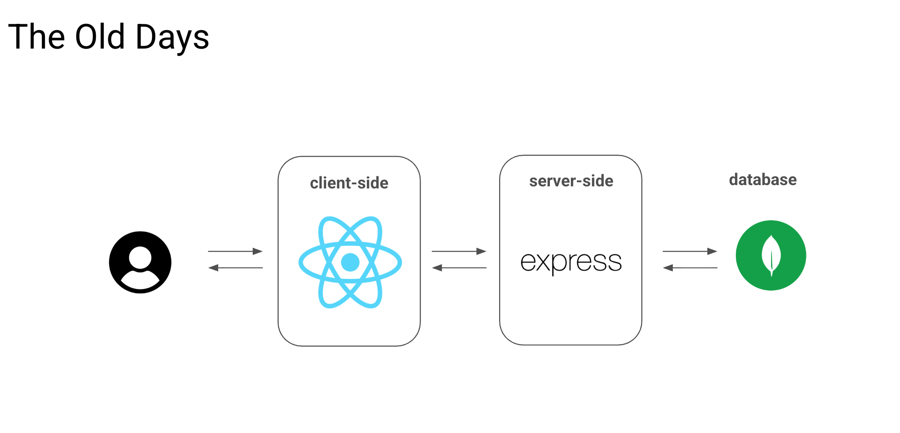
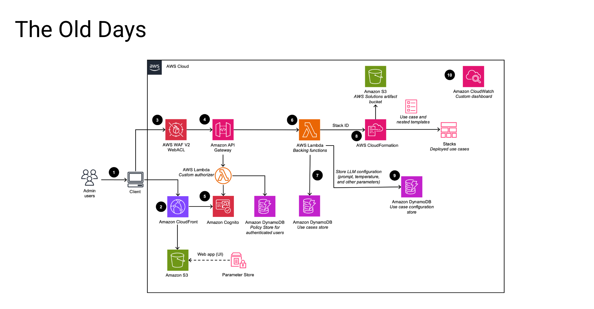

# 编程 Agent 如何改变软件开发

几十年来，构建软件是一门手工劳动的技艺。它需要一种"数字苦行僧"的心态——花数月时间精通语法、记忆函数库、调试缺失的分号。但潮水已经转向。我们已经从用砖和灰浆一砖一瓦地建造，转变为指挥一支自主建造无人机的机队。

这不是渐进式的改善，而是一次相变。要理解我们要去往何处，你需要先看清我们从哪里来。

## 旧世界：技术栈与门槛壁垒的时代

在 AI 爆发之前，软件开发由"技术栈"所定义——一组特定的技术层次，决定了一款应用如何运转。选错技术栈是一个代价高昂、有时甚至是致命的错误。

| 技术栈          | 核心技术                      | 氛围                                                                   |
| :------------- | :---------------------------- | :------------------------------------------------------------------------- |
| **LAMP**       | Linux, Apache, MySQL, PHP     | "老当益壮"。早期 Web 的基石（WordPress、Facebook）。 |
| **MERN**       | MongoDB, Express, React, Node | "现代标准"。高速、交互式单页应用。           |
| **JAMstack**   | JavaScript, APIs, Markup      | "解耦"方案。快速、安全、以静态内容优先。              |
| **Serverless** | AWS Lambda, Firebase, Vercel  | "云原生"时代。无需管理服务器，代码按需执行。         |

这些技术栈不仅仅是技术选型，更是一种**身份认同**。开发者花数年时间深耕某一领域，社区围绕它们形成各自的部落，招聘决策也围绕候选人是否"懂这套栈"来展开。

后果是可以预见的：

- **创意在愿景与执行之间的鸿沟中夭折。** 一个拥有绝妙产品构想却没有技术联合创始人的创业者举步维艰。餐巾纸上的草图只能永远停留在餐巾纸上。
- **时间线以季度而非天数来衡量。** 即便是一个简单的 CRUD 应用，也需要数周的样板工作：数据库搭建、身份验证、API 路由、前端脚手架、部署配置、SSL 证书。
- **人才瓶颈才是真正的制约因素。** 公司的失败不是因为创意不好，而是因为招不到足够快的人，或者现有的工程师被埋在维护工作里喘不过气。
- **知识的衰减速度比你的学习速度还快。** 当你终于掌握一个框架，生态系统已经向前迈进了。React Hooks 取代了 class 组件，REST 让位给了 GraphQL，这条跑步机从未停止。

在旧世界，**知道如何构建**才是护城河。如果你无法自己写代码——或者花钱雇人来写——你的创意就不存在。

## 新世界：意图即代码

新世界看起来不像是旧世界的升级版，而更像是一种全然不同的活动。

### 建造者的画像已经改变

最重要的转变不在于技术，而在于**谁有资格去构建**。在旧世界，构建者是专家——那些投入数千小时磨练技艺的人。在新世界，构建者是任何有明确问题并且能够描述它的人。

这意味着，那位过去只负责写需求文档然后移交出去的产品经理，现在可以在冲刺规划会议开始前就交付一个可运行的原型。那些领域专家——医生、教师、供应链分析师——他们一直清楚自己需要什么样的软件却无从构建，现在变得"危险"了。他们可以在一个下午内从沮丧走向一个能用的工具。

如今最重要的技能不再是语法，而是**意图的清晰度**。你能否清楚地表达你想要什么、为什么它重要，以及"好"是什么样子？如果可以，机器会搞定其余的事。

### 开发生命周期已经压缩

曾经需要在各专业团队之间接力传递的事情，现在变成了一段连续的对话。

- **需求是对话，不是文档。** [你不需要写一份 40 页的 PRD 然后扔过墙去。](https://aakashgupta.medium.com/ai-killed-the-10-page-prd-but-the-prd-isnt-dead-8801efe44b36) 你用自然语言描述问题——"我需要一个能显示哪些销售代表在跟进上落后了的仪表盘"——AI 就会起草规格说明、提出澄清性问题，并指出你没有考虑到的边界情况。
- **架构是被建议的，而不是反复纠结出来的。** AI 充当随叫随到的高级架构师，推荐数据库 Schema，提出目录结构，并标出权衡取舍——"如果你预期超过 1 万个并发用户，请考虑这个方案。"你负责审核方案，而不是从零发明。
- **实现跟随意图，而非指令。** 你说"我需要一个带 Google OAuth 的登录页面"，你就得到一个可以运行的带 Google OAuth 的登录页面。你不需要背 API 端点，不需要阅读 30 页文档。你描述*要什么*，机器负责*怎么做*。
- **部署变得无感知。** 服务器、SSL 证书、CI/CD 流水线、扩容策略——这些都已成为后台任务。上线只需一键，而不是两周的 DevOps 项目。

最终效果：过去需要一个五人跨职能团队工作三个月才能完成的事情，现在一个有清晰愿景的人利用一个周末就能搞定。

### 与代码的关系已经颠倒

在旧世界，你**编写**代码。在新世界，你**指挥**代码——而且越来越多地，你**审查**代码。

这是一个微妙却深刻的转变。开发者的工作正在从作者演变为编辑。你不再盯着一个空白文件发愁从哪里开始，而是阅读 AI 生成的输出，并自问：*这正确吗？这是我想要的吗？有没有更好的方式？*

这意味着**批判性阅读代码**的能力比凭记忆写代码的能力更有价值。理解系统设计、识别反模式、判断 AI 何时自信地犯错——这些是新的入场门槛。

### 工具格局映照出这一转变

一批体现这些原则的新一代工具已经涌现。与第一波无代码工具（Wix、Webflow）不同——那些工具擅长视觉布局，但在复杂逻辑面前便会崩溃——这批工具能生成并部署真正的、可用于生产环境的代码：

> Coding Products in 2023-2025

- **[Base44](https://base44.com/)** — AI 驱动的程序化应用生成：将自然语言转化为具有复杂后端逻辑的全栈应用。
- **[Lovable](https://lovable.dev)** — 从提示词生成全栈应用，强调精美的 UI。
- **[Replit Agent](https://replit.com)** — 端到端的应用生成：数据库、后端、托管，全部由 Agent 处理。
- **[Vercel v0](https://v0.dev)** — 基于 React 和 Tailwind 的组件级 UI 生成。
- **[Cursor](https://cursor.com)** — 面向专业工程师的 AI 原生代码编辑器，助你以 10 倍速前进。

但工具本身不是重点，它们是一个更深层真相的征兆：**人类意图与可运行软件之间的接口已被压缩至近乎为零。** 具体的工具名称会改变，但这条轨迹不会。

### 这个世界实际感受起来是什么样的

如果你还没有亲身体验过，以下是在新世界中构建软件的实际感受：

- **感觉像是有一支随叫随到、全年无休、分文不取且永不疲倦的高级工程团队。** 你描述一个功能，几分钟后它就存在了。你发现一个 bug，用自然语言描述它，它就被修好了。你想调转整个产品方向——这在过去意味着数周的重构——AI 在你去倒杯咖啡的时间里就重新组织好了代码库。
- **感觉瓶颈已经移位。** 制约因素不再是"我们能不能构建这个"，而是"我们应不应该构建这个"以及"它究竟应该做什么"。产品思维、设计品味、领域专业知识——这些一直重要但曾被技术复杂度所遮蔽的东西，现在成了唯一重要的事。
- **感觉快得有些危险。** 你可以在一个下午原型化三种不同的解决方案，当晚就让真实用户来测试。过去需要数周的反馈循环，现在只需数小时。这种速度令人振奋，但它也要求一种新的自律：在以光速构建之前，先放慢脚步，清晰地思考*什么值得被构建*。
- **说实话，感觉有点迷失方向。** 如果你花了多年时间精通一门手艺，眼看着这门手艺被自动化，是一种复杂的体验。但旧世界奖励的是知道*怎么做*，新世界奖励的是知道*做什么*和*为什么做*。这不是降级，而是晋升。

## 不会改变的事：人的因素

有一种常见的恐惧，认为工程师正在被取代。而现实是，他们正在被**放大**。我们正在从"单线程生产者"过渡为**"多线程编排者"**。

> **"人在回路中"比以往任何时候都更重要，原因有三：**
> 1. **意图：** AI 能构建任何东西，但它不知道*什么*值得构建。你提供"为什么"。
> 2. **判断：** AI 可能会产生幻觉或生成"意大利面条式代码"。你充当总编辑，确保输出是安全且高效的。
> 3. **心智模型：** 当抽象层泄漏时（这是必然的），你需要对软件如何运作有基本的理解，才能引导 AI 完成复杂的调试。

苦行僧们并没有过时，他们已被晋升为住持。问题不再是"你能不能写出这段代码"，而是"你知不知道什么东西需要被创造出来"。

> AI 已经接管了执行。思考与决策仍然属于你。
