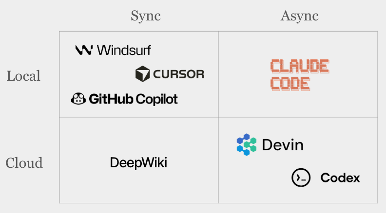

# 编程智能体的工作原理

> *在 [第一章](../01-prompt/README.md) 中，你学习了如何与编程智能体沟通——向它们提供上下文、编写清晰的提示词，以及构建持久化的记忆系统。现在，让我们掀开引擎盖看看底层：当你按下回车键时，究竟发生了什么？*

*从简单的代码补全到自主运转的数字工程师——深入剖析当今顶尖 AI 编程工具背后的系统架构、上下文策略与核心设计模式。*

---

就在不久前（以 AI 的节奏来算，其实只是昨天），所谓的 AI 辅助编程，不过是光标后面幽幽飘出一行灰色建议，试图帮你补全那个已经写了一半的 `for` 循环。GitHub Copilot 在 2021 年开启了那个时代。在相当长的一段时间里，这种"内联补全 (inline autocomplete)"似乎就是 AI 编程的天花板。

时间快进到 2026 年，这个行业已经面目全非。如今的工具不仅能在陌生的代码库中自由探索，还能规划跨文件的重构方案、孵化专门处理"脏活"的子智能体 (sub-agents)、自动跑测试、捕捉 bug，甚至独立提交 Pull Request——这一切只需要你给出一条有时甚至相当模糊的自然语言指令。从"稍聪明一点的自动补全"到"自主编程智能体"，这一跨越并非一夜之间发生，其底层的架构逻辑也远比你想象的更有规律可循。

本文将彻底拆解现代编程智能体的运作方式——核心组件、让它们"神奇"好用的上下文工程策略、Claude Code 和 Cursor 等工具背后的设计模式，以及在你把代码库的控制权完全交出去之前必须了解的那些致命弱点。

---

## 进化史：从自动补全到智能体

AI 编程工具的演进轨迹遵循一个清晰的规律：**不断扩展的上下文视野**与**持续增强的行动自主权**：

**内联补全时代（2021–2023）** — 只有光标周围一小段代码会被发送给模型，用于预测后续 Token。这种方式速度快、成本低，但极为有限。你最多只能得到一行或一个函数体的补全，模型对整个项目的宏观架构几乎一无所知。

**对话助手时代（2023–2024）** — 以 ChatGPT 和早期 Copilot Chat 为代表。它们允许你对代码提问、粘贴代码片段寻求解释，或让它帮你重写。上下文感知能力提升了，但**实际的键盘操作**（在文件间跳转、复制粘贴、运行终端命令等）仍然必须由开发者亲自完成。

**智能体编程时代（2025–至今）** — 也就是当下的主流形态。这些工具不只是"说话（回复提示词）"，还会"行动（采取操作）"。它们能读取本地文件系统、在终端运行构建命令、调用远程 API、维护自己的待办清单，还能像项目经理一样编排子任务。开发者的角色已经正式从"亲自写代码"转变为"指挥一个能自动写代码的系统"。

这其中最本质的区别，并不仅仅是底层模型变得更聪明了。关键在于：智能体配备了**"工具箱 (tools)"**——这是它们与真实工程环境产生物理交互的实际手段——以及**"策略大脑 (strategies)"**，用于决定何时行动、如何组合使用这些工具。

---

## 编程智能体的三大支柱

任何一款达到工业生产级别的编程智能体，无论品牌如何，底层都依赖三个核心支柱：

### 1. 系统提示词（System Prompt）——智能体的灵魂与边界

系统提示词是烙印在每次底层交互中的基础指令集。它定义了智能体"是谁"、哪些是绝对不可逾越的铁律，以及应该如何拆解任务。

然而，当今的顶级智能体**早已不再使用单一臃肿的系统提示词**。以 Claude Code 为例，它会在整个会话过程中穿插注入大量**微型提示词 (micro-prompts)**：一个用于检测话题类型，一个用于判断 bash 命令的安全级别，另一个用于任务规划。Anthropic 的工程团队将这种做法称为**"上下文脚手架 (context scaffolding)"**——这是一张由短小精悍、在最恰当时机注入的指令编织而成的网络，而不是一部沉重、静态的系统宪法。

更令人称道的是 Claude Code 中使用的 `<system-reminder>` 标记。这些是"短效元指令 (meta-instructions)"，会被注入对话链的各个缝隙——在工具调用之前、命令输出之后，或者夹在工具返回结果的内部。它们就像不断在模型耳边低语："去更新你的 todo 清单！"、"只做被要求的事，绝不擅自添加逻辑！"。这些标记究竟是经过硬训练的条件反射，还是模型在统计上学会了重视这些显眼的 Token，至今仍是个谜。

### 2. 工具库（Tools）——智能体伸向现实的双手

单独一个 LLM 只能输出文本。**工具**赋予了它改变世界的"实体"。现代顶级编程智能体通常掌握以下能力：

- **文件系统控制** — 在目录中自由读取、写入、创建和删除文件
- **终端/Shell 执行** — 运行测试、构建，乃至 Git 操作
- **代码雷达** — 在数百万行代码中执行 `grep`、`glob` 及高级语义搜索
- **浏览器/网页访问** — 抓取最新文档或搜索疑难 bug 的解决方案
- **子智能体孵化** — 克隆出专门处理特定窄域任务的子智能体
- **MCP（Model Context Protocol）** — 一个标准化的"电源插座"，用于将外部服务和自定义工具接入智能体

切勿低估工具描述本身的重要性。一个优秀的工具接口，不仅包含参数定义和使用示例，还会注明该工具自身的各种"怪癖"与注意事项。Spotify 工程团队曾分享过一个关键洞见：一个自主运行的编程智能体能否产出"可直接合并"的 PR，**直接且残酷地取决于其工具文档写得有多好。**

### 3. 上下文策略（Context Strategy）——记忆与注意力的节奏

这才是各大技术公司真正激烈竞争的深水区。任何 LLM 的上下文窗口都是有限的——目前上限约为 128K 到 200K Token——而智能体在整个任务过程中"知道"的一切都必须塞进这个管道里。上下文策略决定了哪些内容进入、哪些内容被保护，以及哪些内容会被冷酷地丢弃或压缩。

顶级智能体普遍采用以下核心策略：

**RAG（检索增强生成，Retrieval-Augmented Generation）** — 代码被切分成块，向量化后存入语义数据库。当智能体需要理解某个模块时，最相关的"片段"会被检索出来注入上下文。一流工具现在甚至使用抽象语法树（AST）沿着代码的语义"骨架"进行切分，而不是按任意行数硬切。

**JIT（即时加载，Just-In-Time Loading）** — 现代智能体已经变聪明了：它们不再从一开始就把所有内容都装进口袋。它们只维护轻量级的"路标"（文件路径或查询历史），等到真正需要时才通过 `grep` 或 `glob` 去现场挖掘内容。Claude Code 采用的是一套精妙的混合策略：先把 `CLAUDE.md` 这类核心"家规"文件放在最前面强制加载，剩余代码库则按需探查。

**自动压缩（Auto-Compaction）** — 当对话即将撑爆上下文限制时，智能体会进行"自我手术"：将冗长的历史记录强行压缩成精炼的摘要。它会死守那些具有决定性意义的架构决策、尚未修复的 bug 线索以及关键文件路径，同时丢弃那些冗余的工具调用日志。Claude Code 会在容量达到 95% 时自动触发这套**"自动压缩 (auto-compaction)"机制**，随后带着极简压缩后的历史记忆，加上最近访问过的 5 个文件，继续投入战斗。

**子智能体隔离（Sub-Agent Isolation）** — 面对规模庞大的"史诗级"任务，智能体会分兵出击：将任务拆分委派给多个独立运行、各自拥有窄域闭环上下文窗口的子智能体。这有效防止了因向单个窗口塞入过多"杂质"而引发"幻觉崩溃"。Anthropic 的多智能体研究表明：一群专注于各自窄域的"猎犬"（子智能体）协同推进，在大多数情况下都能压倒性地优于一个试图独自消化所有全局信息的"过载指挥官"。

---

### 鲜活案例：Claude Code

作为目前采用率最高、口碑最好的生产级智能体之一，Claude Code 完美体现了上述三大支柱：它抛弃了单体系统提示词，转而采用分层的**微型提示词**脚手架；拥有从文件操作到子智能体孵化的强悍工具集；并采用激进的上下文策略，将"家规"前置加载与 JIT 探查相结合，辅以 95% 阈值触发的**自动压缩**机制。

如果想真正理解其内部运作——从"记忆管理"到"能力扩展"（Commands、Skills、SubAgents、Hooks）再到"集成方式"（Headless 模式、MCP），请参阅专题报告：[将 Claude Code 作为 AI 智能体框架](../03-power-user/claude-code.md)。

---

## 2026 年工具生态全景

并非市面上所有打着 AI 旗号的产品都算得上"全栈智能体系统"。整个生态是一条连续的光谱：

### 云端"Web"流派

**Lovable**、**Replit** 和 **V0**。你来描述，它们来构建。适合快速原型验证、MVP 开发，或者不想接触本地环境的开发者。Lovable 擅长自动化服务集成（数据库管道、API 认证），V0 则专注于产出高质量、有质感的 React UI 组件。

*代价：* 你失去了"主权"。你会丧失对底层架构的掌控权，面临供应商锁定风险，而且它们往往难以应对已有的复杂"遗留"代码库。

### 本地"重量级"IDE 宗师

**Cursor** 和 **Trae**。这类工具深度嵌入你的本地开发环境，拥有对文件系统和 Git 历史的"上帝视角"。Cursor 是专业开发者偏爱的"猛兽"，以其强大的大型代码库导航、语义搜索以及处理大规模跨文件重构的能力著称。

*挑战：* 需要更多配置和扎实的工程基础，但为生产关键系统提供了所需的控制力。

### 终端"刺客"

**Claude Code** 和 **OpenAI Codex**。这是"智能体优先"路线的纯粹主义者。它们潜伏在你的终端中，等待一个高层级目标。一旦释放，便会自主完成探索、规划、实现、测试和迭代的完整闭环。适合那些希望以极高杠杆率驾驭复杂任务、同时仔细审查 AI 生成代码差异的"高阶玩家"。

---

## 未来展望：后台智能体与多智能体集群

下一波浪潮正在成形。**后台智能体（Background Agents）**（异步云端智能体）是你无形的效能倍增器，在你睡觉或开会时默默处理任务。把任务清单如雪片般分发下去，回来只需审阅"战果"。

**多智能体集群协作**也在逐渐成熟。不再是一个智能体包揽一切，而是由一个**编排器（Orchestrator）**协调专属分队：一个"雷达侦察员"（逻辑追踪）、一个"铁匠"（代码实现）和一个"纪律官"（QA/审查）。各方之间传递的是经过提炼的"情报简报"，而非冗余的上下文历史，从而避免上下文膨胀。

**MCP（Model Context Protocol）** 是这个世界统一的"插排"，允许任何第三方工具或服务"热插拔"进智能体的工具库。深入了解这条总线的完整解剖：[MCP 标准](../03-power-user/MCP.md)。

关于多智能体系统的宏观管控与治理框架，参见：[系统化思维与治理](../03-power-user/systematic-thinking.md)。

---

## 编程智能体的致命软肋

尽管能力强大，当前智能体仍存在明显的"阿喀琉斯之踵"：

**跨层调试的噩梦** — 当一个生产 bug 需要同时关联脏数据库状态、碎片化日志链路和复杂分布式网络时，智能体往往会陷入死循环。唯一可行的高阶破局方案：强制智能体输出一份**"可能原因排序清单（Probable Cause Ranked List）"**，由你自己选定方向，再让它继续追查。

**像素级 UI 还原的困境** — 当需求是对设计稿进行"像素级"还原时，智能体往往难以把握细节差异。替代方案：给它一套完整的**组件库与设计规范文档**——遵守"规则"比"临摹图片"更能发挥它的优势。

**信息滞后（知识老化）** — 如果没有实时更新，智能体会自信地使用几年前已废弃的 API 或模式。永远不要相信它对前沿库的"预训练知识"。你必须通过 **`CLAUDE.md`** 等上下文文件主动"喂入"最新文档，把它当作智能体的"活体圣经"随时维护。

**架构层面的"拆迁"决策** — 智能体会自信地在单体架构与微服务、状态管理框架之间做出选择，却完全不理解其中隐含的 5 年维护成本。**铁律：** 任何涉及架构层面的"骨架"决策，必须保持人在回路（Humans-in-the-Loop）。

---

## 开发者的新型核心能力

智能体的崛起并不意味着传统开发者走向消亡——而是他们的"核心战斗力"正在被彻底升级。开发者正在进化为**智能体管理者（Agent Manager）**：

- **委派与并发编排** — 知道什么可以交出去、如何精确划定智能体的工作边界，以及如何同时并行运行多个"分队"。
- **审查眼胜于打字手** — 阅读、质疑和审计 AI 生成代码的能力，将比靠记忆敲出代码的能力重要 10 倍。
- **战略规划与架构设计** — 高层决策是智能体尚无法触碰的"神圣领域"。
- **上下文工程与信息调教** — 把世界"打包"成智能体所需形态的艺术，让它能在关键的第一次尝试中就产出顶级输出。

最终活下来并在新时代站稳脚跟的，不是那些抗拒机器的人，也不是盲目跟随机器的人。他们将是**"驯兽师"**——真正理解这些怪物内部运作机制，并始终牢牢握住"意图之链"的人。

---

*AI 编程智能体的时代仍处于早期章节。工具会更聪明，上下文窗口会更大，架构会更复杂。但系统提示词、工具和上下文策略这一基本模式，是一切的基石。现在就理解它，是你作为工程师所能做出的最高杠杆率的投资。*
