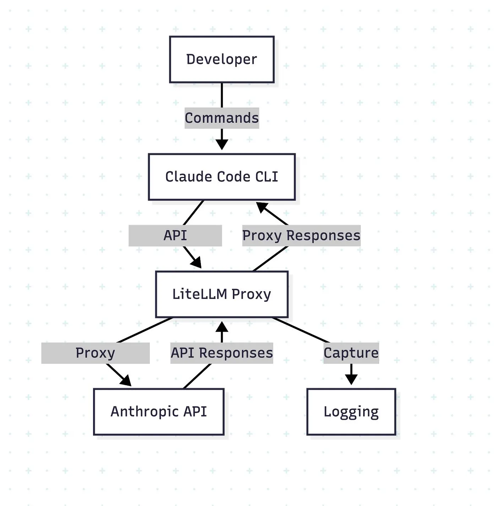
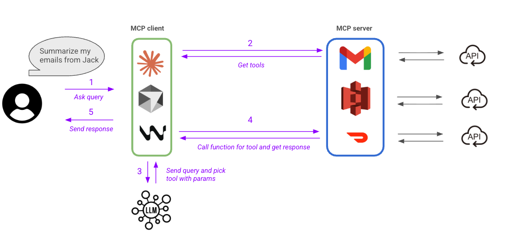

# Claude Code 作为 AI 智能体框架

> *在[第二章](../02-anatomy/how-agents-work.md)中，你了解到每个编程智能体都建立在三大支柱之上：系统提示词、工具和上下文策略。本章聚焦于一个智能体——Claude Code——展示这些支柱如何演变为一个可编程的四层架构。为什么偏偏选 Claude Code？因为它是目前最成熟、最开放架构的智能体框架，其设计与通用原则直接对应：系统提示词 → 内存层，工具 → 扩展层，上下文策略 → 整个技术栈协同运作。掌握 Claude Code 的架构，能为你理解下一个智能体系统建立可迁移的直觉。*

本章将重新定义你对 Claude Code 的理解——它不是一个聊天工具，而是一个具有分层技术架构的**可编程、可扩展、可组合的 AI 智能体框架**。

## 从用户到运营者：一次范式转变

### 不只是 AI 助手——一个可编程平台

大多数人认为 Claude Code 是"终端里的 ChatGPT"或"一个写代码的工具"。这严重低估了它。

**更恰当的类比是 VS Code。** 表面上，VS Code 是一个文本编辑器。实际上，它是一个可扩展的平台——编辑器只是通往扩展、工作流和集成宇宙的入口。Claude Code 的工作方式如出一辙：对话界面是入口，但其底层蕴含着构建 **AI 驱动的工程工作流**的基础设施。

Claude Code 能读取整个代码库、修改代码、运行测试、操作系统工具，并编排自动化流水线——远超"写几个函数"的范畴。

### 两种交互范式

| | **用户范式** | **运营者范式** |
|---|---|---|
| **交互方式** | 你提问 → Claude 回答 → 你执行 | 你配置智能体 → 它自主工作 → 任务自动完成 |
| **本质** | "花哨的计算器"——一次性能力调用，问一答一 | 你设计规则、工作流和责任边界；Claude 在约束内执行 |
| **你的角色** | 提问者 | 系统设计者 + 飞行员 |

本章的目标：带你从**提问者**转变为**系统设计者**。

---

## 引擎盖下的机制：智能体循环与 Unix 风格的原语

在了解四层架构之前，我们需要理解使 Claude Code 成为*智能体*而非聊天机器人的根本机制。

### 智能体循环：从顾问到工程师

没有工具，Claude 只是一个顾问——它能分析、建议和解释，但无法行动。它无法读取你的代码库、修改文件或运行测试。每次交互都止步于"现在去自己做吧"。

工具将 Claude 转变为工程师。它们创造了一个**智能体循环**——一个感知、行动、验证的持续循环：

1. **感知** — 读取文件、搜索代码库、收集上下文（Read、Glob、Grep）
2. **行动** — 修改代码、执行命令、创建制品（Edit、Write、Bash）
3. **验证** — 运行测试、检查输出、评估结果（Bash、Read）

一个简单的 bug 修复可能一个循环就能完成。一次复杂的重构可能需要循环数十次——读取文件、编辑它、运行测试、读取失败信息、再次编辑——由 Claude 的推理驱动每次转换。分工清晰：

- **Claude（模型）** — 决定下一步做什么：理解、推理、分解任务
- **工具（原语）** — 在环境中执行：读取文件、运行命令、修改代码
- **Claude Code（运行框架）** — 将模型与工具绑定在一起，提供执行环境、上下文管理、权限控制和编排基础设施

这个运行框架是一切的基础。

### 五种原子操作与 Unix 哲学

Claude Code 没有预置"重构工具"、"调试工具"和"部署工具"。相反，它提供一组**原子操作**原语——并相信复杂行为将*涌现*于这些原语与 LLM 推理的组合。

每项开发任务都分解为五种原子操作：

| 操作 | 开发者做什么 | 原语工具 |
|-----------|----------------------|----------------|
| **感知** | 打开文件、阅读代码 | Read |
| **搜索** | 查找定义、追踪调用链 | Glob、Grep |
| **修改** | 修复 bug、重构、更新配置 | Edit、Write |
| **执行** | 运行测试、构建、部署 | Bash |
| **获取** | 查阅文档、查询 API、检查外部状态 | WebFetch、MCP 工具 |

这是应用于 AI 智能体的 Unix 哲学：**小巧、专注、各司其职的工具，通过通用接口组合**。在 Unix 中，这个接口是文本管道；在 Claude Code 中，是 LLM 的推理循环。你不需要为每种场景构建专用工具，只需构建原语，让智能层去组合它们。

一个具体的例子——修复间歇性登录 500 错误：

1. Grep 搜索 `500` / `error` / `login` → 定位相关日志行和文件
2. Read `auth-service.js` → 发现第 87 行缺少 null 检查
3. Grep 搜索 `validateToken` → 找到所有调用者以确保修复完整
4. Read 调用者代码 → 决定在源头修复
5. Edit 源文件 → 添加 null 守卫
6. Bash `npm test --grep 'auth'` → 一个测试失败
7. Edit 测试文件 → 更新断言
8. Bash `npm test` → 全部通过

每一步都极其简单——读取文件、搜索文本、改一行、运行命令。但通过推理的组合，它们形成了一个完整的**诊断 → 修复 → 回归**工程工作流。"重构"、"调试"和"部署"不是硬编码的能力，而是从原语组合中涌现出的行为。

### Bash：万能的逃生通道

理论上，Bash 可以做一切——`cat` 读取、`sed` 编辑、`find` 搜索。它是图灵完备的。那为什么还要保留这些专用原语？

三个原因，直接对应系统设计原则：

- **结构化交互** — Read 返回带有行号和长度控制的内容，针对 LLM 理解进行了优化。Bash 的输出是原始的、有噪音的。
- **细粒度权限** — 你可以允许 Read 但拒绝 Bash，创造"可看不可动"的安全姿态。Bash 是要么全有要么全无。
- **Token 效率** — 专用工具精确返回模型所需的信息。Bash 输出带有浪费上下文窗口的冗余信息。

这种设计张力是刻意为之的：**Bash 提供能力完备性；原语工具提供效率、结构和可治理性。** 这与 Unix 在原始系统调用与专用工具之间所做的取舍如出一辙。

### 工具能力的三个层次

这种原语优先的设计向外延伸为三个同心层：

| 层次 | 覆盖范围 | 设计角色 |
|-------|---------------|-------------|
| **内置原语** | Read、Edit、Bash、Grep、Glob、WebFetch | 基础层——覆盖大多数软件工程任务 |
| **Bash 可达工具** | 任何 CLI、脚本或系统工具 | 逃生通道——使智能体图灵完备 |
| **MCP 扩展** | 与外部系统（数据库、Jira、Slack）的结构化接口 | 集成层——提供超越原始 Bash 的结构化 I/O、工具发现和安全隔离 |

既然 Bash 已经可以 `curl` 任何 API，为什么还要 MCP？原因与保留 Read 而不用 `cat` 相同：**结构化输入/输出**（无需解析原始文本）、**自动工具发现**（连接一个 MCP 服务器，其所有工具自动注册）以及**安全隔离**（访问控制在服务器端，而非脆弱的 Bash 权限规则中）。

### 工具风险级别与权限模型

并非所有工具的风险相同。Claude Code 按潜在影响范围对工具分类，并相应控制访问权限：

| 风险级别 | 工具 | 默认行为 |
|-----------|-------|-----------------|
| **低（只读）** | Read、Glob、Grep | 无需批准——可自由运行 |
| **中（本地修改）** | Edit、Write | 会话范围批准——对话结束时失效 |
| **高（全局执行）** | Bash、部分 MCP 工具 | 需要明确确认的持久批准——因为 Shell 命令的影响范围无界 |

这种分级模型服务于三个设计目的：让你能为不同智能体分配**最小权限集**（代码审查者只获得只读工具），使**治理可执行**（高风险工具通过 Hooks 和批准门），并赋予权限提示**可解释性**——你能理解*为什么*某些操作需要批准而其他不需要。

工具层——其原语、风险模型、分层可扩展性——是以下四层架构所构建的骨架。

---

## 四层架构


Claude Code 的技术栈有四个清晰的层次，每层都有明确的职责：

| 层次 | 用途 | 关键组件 |
|-------|---------|----------------|
| **基础层** | 持久内存与上下文 | CLAUDE.md 内存系统 |
| **扩展层** | 能力中心 | 命令、技能、子智能体、Hooks |
| **集成层** | 连接外部世界 | 无头模式、MCP |
| **编程接口层** | 代码级控制 | 智能体 SDK |

---

## 第一层：基础——内存系统（CLAUDE.md）

将 CLAUDE.md 视为**给你 AI 同事的员工手册**。无需在每次对话中重新解释项目规范，一次写好，Claude 就会在每次会话开始时自动读取。

### CLAUDE.md 中写什么

- **技术栈** — 语言、框架、关键库
- **代码风格** — 命名规范、格式规则
- **关键规则** — 例如"永远不要直接推送到 main"、"提交前必须运行测试"
- **项目上下文** — 架构决策、领域知识

### 三级内存层次结构

| 级别 | 路径 | 范围 |
|-------|------|-------|
| **全局** | `~/.claude/CLAUDE.md` | 跨所有项目的通用规则 |
| **项目** | `<project-root>/CLAUDE.md` | 项目特定的约束和上下文 |
| **模块** | `<project-root>/.claude/rules/*.md` | 针对特定目录或模块的细粒度规则 |

### 为什么这很重要

内存系统具有两个关键功能：

1. **将隐性知识外显化** — 将团队的隐性经验转化为结构化文档，在任何任务开始之前为 Claude 建立"世界观"
2. **提供上下文基线** — 所有其他组件（命令、技能、子智能体、Hooks）都建立在这一共享基础之上

但 Claude Code 的上下文策略不止于静态内存文件。它使用**激进的预加载**（自动汇总之前的对话、检测话题变化、加载项目文件），结合**即时检索**——通过 `grep` 和 `glob` 动态获取代码库内容，而非预先加载所有内容。当上下文接近限制时，系统会**自动压缩**——汇总历史记录，同时保留关键架构决策和最近访问的文件路径。这种混合方式使内存层在规模化场景中切实可行。

---

## 第二层：扩展——四个核心组件



扩展层是 Claude Code 的**能力中心**。它包含四个组件，每个组件都有不同的触发机制和使用场景。

值得注意的设计原则：Claude Code 不使用单一的整体系统提示词。相反，它分层使用**微提示词**——在整个对话过程中（工具调用前、命令输出后、工具结果内）注入小型 `<system-reminder>` 标签，在恰当时机强化约束。类似地，命令安全不由硬编码的白名单管理——而是由一个单独的 LLM 提示词对每条 Shell 命令进行分类，判断其是否可疑，从而决定是否需要用户批准。这些实现选择体现了与以下四个组件相同的理念：小巧、适时、可组合的单元，而非一个庞大的配置。

### 命令（斜杠命令）

**明确、确定性、手动触发的标准流程。**

- **触发方式**：用户输入 `/命令`（如 `/commit`、`/review`）
- **配置方式**：定义在 `.claude/commands/*.md`
- **特点**：高确定性、可复用、可审计
- **最适合**：每次必须以相同方式执行的操作——标准化的提交信息、固定的部署流程、代码审查清单

### 技能

**通过语义推理激活的领域感知行为策略。**

- **触发方式**：用户提出自然语言问题；Claude **自动决定**是否根据上下文激活技能
- **与工具的关键区别**：

| | 工具 | 技能 |
|---|---|---|
| **回答的问题** | "我能做这件事吗？" | "我应该做吗？如何做？深入到什么程度？" |
| **包含什么** | 外部能力接口（读取文件、调用 API） | 触发逻辑 + 提示词策略 + 工具编排 |
| **行为方式** | 机械执行 | 专家级判断 |

- **最适合**：具有强烈领域要求（安全、架构、性能）且需要情境判断而非关键词匹配的任务
- **示例**：`security-review` 技能根据语言、上下文和风险级别调整检查重点和深度


### 子智能体

**由主智能体派遣用于专项任务的独立执行单元。**

- **触发方式**：Claude 自动决定生成子智能体，或用户明确请求
- **最适合**：
  - **高噪音任务** — 从海量日志中提取异常、搜索大型文档集
  - **权限隔离** — 只能访问特定工具的子智能体，降低风险
  - **并行执行** — 同时运行 `test-runner`、`log-analyzer`、`code-reviewer` 等流水线节点


### Hooks

**事件驱动的自动化守门员和辅助脚本。**

- **触发方式**：由特定事件自动触发（例如"Edit 工具执行之前"）
- **核心用途**：在特定操作前后插入检查、日志记录或补充动作
- **示例**：
  - **预编辑 Hook**：在代码修改前运行安全扫描；检测到敏感变更时阻止并告警
  - 自动格式化代码、自动写入日志、自动审计关键操作
- **最适合**：任何"必须 100% 执行"的守门逻辑——安全审查、合规检查、格式化执行


> **"权力分立"原则**：命令定义行为，子智能体执行，Hooks 守卫——共同构成一个相互制衡的系统。

---

## 第三层：集成——连接外部世界

### 无头模式

**完全自动化、零交互执行。**

- **典型用法**：在 CI/CD 流水线中调用 Claude
  ```bash
  # 在 GitHub Actions 工作流中
  claude --headless "Fix all linting errors in src/"
  ```
- **用例**：自动代码审查、自动修复、变更日志生成、发布说明
- **关键转变**：Claude Code 成为**流水线中的智能节点**，而非手动触发的助手

### MCP（模型上下文协议）

**将外部系统暴露为 Claude 可调用的工具接口。**

- **连接对象**：数据库、Jira、内部知识库、自定义 API
- **数据流向**：Claude → MCP → 外部系统（查询、写入、编排）



**为什么重要**：MCP 将 Claude 的能力扩展至组织内**每一个可通过 API 访问的系统**。结合技能，你可以构建同时具备领域知识和真实执行能力的完整工作流。

---

## 第四层：编程接口——智能体 SDK

当基于配置的扩展不足以应对复杂场景时，**SDK 为你提供代码级控制**。

```python
# main.py
from claude_sdk import ClaudeSDKClient

client = ClaudeSDKClient()

result = client.query(
    prompt="Review this code for security issues",
    tools=["Read", "Grep"],
    max_turns=10
)
```

**能力**：
- 完全控制对话流程、工具调用策略、循环次数和上下文组装
- 将 Claude 作为**你自己系统中的一个组件**嵌入，而非独立应用

**最适合**：自定义智能体系统、复杂多阶段流水线、深度业务系统集成

---

## 如何选择合适的组件

面对四个扩展组件、一个集成层和一个 SDK，如何决定何时用什么？快速判断法则：

| 需求 | 选择 |
|------|--------|
| **每次必须完全相同地执行** | **命令**（显式）或 **Hooks**（自动） |
| **语义智能**激活 | **技能** |
| **隔离、耗费资源或并行**工作 | **子智能体** |
| **连接外部系统** | **MCP** |
| **无人值守的 CI/CD 执行** | **无头模式** |
| **代码级编排** | **智能体 SDK** |

如需深入了解*如何思考*这些组件的组合——包括组合原则、架构模式、治理设计和实际示例——请参阅[系统性思维：组合技能、子智能体等](systematic-thinking.md)。

---

## 核心要点

**Claude Code 是一个 AI 智能体框架**，而非简单的聊天工具。它拥有内存系统、子智能体、技能系统、Hooks、集成层和 SDK。其真正价值在于让你**构建自己的 AI 工作流和自动化系统**。

**四层架构是模块化且可组合的。** 内存奠定基础，扩展层管理能力，集成层连接企业世界，SDK 提供代码级控制。这种分层使得**渐进式采用**成为可能——从简单开始，按需扩展复杂度。

**工程思维 + 组件组合 = 运营者级别的能力。** 你不是在堆砌配置文件——你是在设计一个 **AI 驱动的工程系统**。一旦你掌握了这个架构和选择框架，就能将任何 AI 编程工具重构为一个可控的、智能体驱动的工程平台。

---

## 为何这一架构具有迁移价值

Claude Code 的四层架构并非随意设计——它映射到每个智能体系统都必须解决的通用需求：

| 智能体需求 | Claude Code 层次 | 你将在以下系统中看到... |
|------------|------------------|----------------------|
| 跨会话的持久上下文 | 基础层（内存） | Cursor 的 `.cursorrules`、Codex 的项目配置、任何带配置文件的智能体 |
| 超越基础工具的可扩展能力 | 扩展层（命令、技能、子智能体、Hooks） | VS Code 扩展、Devin 的工具集成、任何插件系统 |
| 连接外部服务 | 集成层（无头模式、MCP） | API 连接器、CI/CD hooks、任何将 AI 与基础设施桥接的系统 |
| 用于自定义工作流的程序化控制 | 编程接口层（SDK） | OpenAI Agents SDK、LangChain、任何带代码 API 的智能体框架 |

一旦你在 Claude Code 中内化了这四个层次，你就会在遇到的每一个智能体系统中认出同样的架构——有时名称不同，有时边界不同。具体工具会变，结构性思维会延续。

本章其余部分将深入探讨每一层：[上下文管理](context-management.md)深化基础层，[子智能体](sub-agents.md)和[智能体团队](agent-teams.md)扩展扩展层，[技能](skills.md)、[Hooks](hooks.md)和[构建工具](building-tools.md)完善能力图景，[系统性思维](systematic-thinking.md)以设计生产级智能体系统的组合原则将一切融会贯通。
